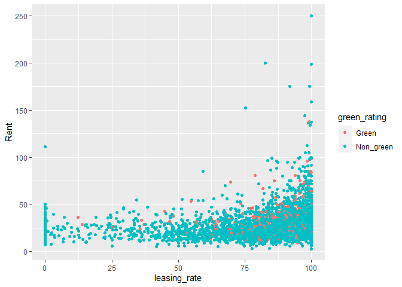

**\#Question 1 : Case on Green Buildings**

Do you agree with the conclusions of her on-staff stats guru? If so,
point to evidence supporting his case. If not, explain specifically
where and why the analysis goes wrong, and how it can be improved. (For
example, do you see the possibility of confounding variables for the
relationship between rent and green status?) Tell your story mainly in
pictures, with appropriate introductory and supporting text.

\#\#Approach

First, several set of parameters were looked into and their correlations
and their effect on the rent for the property was looked by different
graphs. First few graphs were plotted to see the overall distribution of
the data. Few additional columns were created to combine multiple
redundant columns and convert zeros and ones to categorical
    variables.

    ## -- Attaching packages ----------------------------------- tidyverse 1.2.1 --

    ## v ggplot2 3.2.0     v purrr   0.3.2
    ## v tibble  2.1.3     v dplyr   0.8.3
    ## v tidyr   0.8.3     v stringr 1.4.0
    ## v readr   1.3.1     v forcats 0.4.0

    ## -- Conflicts -------------------------------------- tidyverse_conflicts() --
    ## x dplyr::filter() masks stats::filter()
    ## x dplyr::lag()    masks stats::lag()

    ## Loading required package: lattice

    ## Loading required package: ggformula

    ## Loading required package: ggstance

    ## 
    ## Attaching package: 'ggstance'

    ## The following objects are masked from 'package:ggplot2':
    ## 
    ##     geom_errorbarh, GeomErrorbarh

    ## 
    ## New to ggformula?  Try the tutorials: 
    ##  learnr::run_tutorial("introduction", package = "ggformula")
    ##  learnr::run_tutorial("refining", package = "ggformula")

    ## Loading required package: mosaicData

    ## Loading required package: Matrix

    ## 
    ## Attaching package: 'Matrix'

    ## The following object is masked from 'package:tidyr':
    ## 
    ##     expand

    ## Registered S3 method overwritten by 'mosaic':
    ##   method                           from   
    ##   fortify.SpatialPolygonsDataFrame ggplot2

    ## 
    ## The 'mosaic' package masks several functions from core packages in order to add 
    ## additional features.  The original behavior of these functions should not be affected by this.
    ## 
    ## Note: If you use the Matrix package, be sure to load it BEFORE loading mosaic.

    ## 
    ## Attaching package: 'mosaic'

    ## The following object is masked from 'package:Matrix':
    ## 
    ##     mean

    ## The following objects are masked from 'package:dplyr':
    ## 
    ##     count, do, tally

    ## The following object is masked from 'package:purrr':
    ## 
    ##     cross

    ## The following object is masked from 'package:ggplot2':
    ## 
    ##     stat

    ## The following objects are masked from 'package:stats':
    ## 
    ##     binom.test, cor, cor.test, cov, fivenum, IQR, median,
    ##     prop.test, quantile, sd, t.test, var

    ## The following objects are masked from 'package:base':
    ## 
    ##     max, mean, min, prod, range, sample, sum

<!-- --><!-- --><!-- -->
\#\#categorization of continous vairables

Categorization of few continous variables like Age, electricity price
and the total days above/below outside temperature for us to use them
for visualization

\#\#Data Analysis and Visualization

\#\#\#Distribution of Green Buidlings across different
categories

<!-- --><!-- --><!-- --><!-- -->

Note that the `echo = FALSE` parameter was added to the code chunk to
prevent printing of the R code that generated the plot.
<!-- --><!-- -->
From the graphs it is evident that there is no considerable increase in
Medianrent for the non-green building to green building for any of the
classes and age groups. So this negates the conclusion of the Stats
person at the company, Though his observation was right, it was due to
higher share of Class A buildings and recent buildings in green rated
buildings than merely because of it being a green building. So for the
stats guru to improve his suggestion, he should sub-divide the analysis
across the class of building and age group for him to improve his
suggestion

\#\#\#Net Contract Level Analysis

<!-- --> Analysis was
done to figure out if there is any relation between the contract type
charges and the green buildings, the underlying phenomenean being that
green building reduce the consumption power, due to their design, so
should ideally have lesser difference between Net contract level and Non
net Contract. However this was not observed.

\#\#\#Net Contract Level Analysis with relation to Electricity Prices

<!-- --> The underlying
assumption was to compare Net Contract to Non Net contract and
understand if there is any correlation between the electricity charges
with the difference between the contract and non contract type.This is
done to look into option of non net contract offering which can help
over the years in competitive pricing as the electricity and gas prices
hike and green building usually consume lesser electricity and gas. As
it can be observed from graphs above that the difference of rent between
the net and non net is higher for Non\_green buildings, in higher
electricity rate bracket of (.03 to .05).

\#\#\#Degree Days with Contract rent with Medianrent Comparison
<!-- --> From the graphs
it is evident that the usual difference across contracts is higher for
Non green buildings, which might emphasize that the green rated building
are usually less maintanence and the construction company is passing the
benefit to the tenants by charging them only a minimal amount.

### GreenRating Vs Medianrent per Sqft

<!-- --> These graphs
indicate the medianrent for different greenrating of Energy star and
LEED, It is evident that the Energystar type of GreenRated buildings
would earn a higher rent than the LEED in general. Hence if decided to
go ahead with greenbuilding aim should be get an Energy star rating for
the green building.

\#Liner Regression Model on Variables

    ## 
    ## Call:
    ## lm(formula = Rent ~ ., data = d1)
    ## 
    ## Residuals:
    ##     Min      1Q  Median      3Q     Max 
    ## -53.715  -3.676  -0.495   2.598 172.451 
    ## 
    ## Coefficients: (5 not defined because of singularities)
    ##                         Estimate Std. Error t value Pr(>|t|)    
    ## (Intercept)           -1.411e+01  4.636e+00  -3.043 0.002348 ** 
    ## CS_PropertyID          2.534e-07  1.719e-07   1.474 0.140499    
    ## cluster                7.432e-04  2.978e-04   2.496 0.012586 *  
    ## size                   7.055e-06  6.817e-07  10.349  < 2e-16 ***
    ## empl_gr                5.228e-02  1.991e-02   2.625 0.008676 ** 
    ## leasing_rate           1.089e-02  5.716e-03   1.906 0.056754 .  
    ## stories               -4.152e-02  1.722e-02  -2.411 0.015946 *  
    ## age                   -3.183e-02  7.361e-03  -4.324 1.55e-05 ***
    ## renovated              3.297e-02  2.835e-01   0.116 0.907423    
    ## class_a                2.891e+00  4.787e-01   6.039 1.63e-09 ***
    ## class_b                1.348e+00  3.787e-01   3.559 0.000375 ***
    ## LEED                   1.768e+00  3.581e+00   0.494 0.621477    
    ## Energystar            -1.062e+00  3.840e+00  -0.276 0.782181    
    ## green_ratingNon_green -1.544e+00  3.861e+00  -0.400 0.689346    
    ## netNon_Net             2.475e+00  6.155e-01   4.021 5.84e-05 ***
    ## amenities              7.526e-01  2.698e-01   2.790 0.005288 ** 
    ## cd_total_07            2.650e-04  3.608e-04   0.734 0.462787    
    ## hd_total07             8.725e-04  2.892e-04   3.017 0.002565 ** 
    ## total_dd_07                   NA         NA      NA       NA    
    ## Precipitation          2.267e-02  2.230e-02   1.016 0.309445    
    ## Gas_Costs             -1.645e+02  1.632e+02  -1.008 0.313410    
    ## Electricity_Costs      3.438e+02  6.237e+01   5.512 3.67e-08 ***
    ## cluster_rent           1.007e+00  1.717e-02  58.633  < 2e-16 ***
    ## classClass B                  NA         NA      NA       NA    
    ## classClass C                  NA         NA      NA       NA    
    ## greentypeEnergystar           NA         NA      NA       NA    
    ## greentypeLEED                 NA         NA      NA       NA    
    ## agecat(15,30]          9.668e-01  4.785e-01   2.021 0.043358 *  
    ## agecat(30,100]         1.284e+00  5.932e-01   2.165 0.030402 *  
    ## elecat(0.02,0.03]     -1.912e+00  5.653e-01  -3.383 0.000721 ***
    ## elecat(0.03,0.05]     -3.903e+00  1.139e+00  -3.427 0.000614 ***
    ## elecat(0.05,0.1]      -1.051e+01  4.187e+00  -2.510 0.012087 *  
    ## td(4e+03,6e+03]       -1.050e+00  1.008e+00  -1.042 0.297536    
    ## td(6e+03,8e+03]       -1.149e+00  1.397e+00  -0.823 0.410735    
    ## ---
    ## Signif. codes:  0 '***' 0.001 '**' 0.01 '*' 0.05 '.' 0.1 ' ' 1
    ## 
    ## Residual standard error: 9.392 on 7035 degrees of freedom
    ## Multiple R-squared:  0.6051, Adjusted R-squared:  0.6036 
    ## F-statistic:   385 on 28 and 7035 DF,  p-value: < 2.2e-16

A simple Linear model was fit on to all the variables to include and see
if the majorly contributing factors to Rent, and from the output of the
model it is implied that the stastically significant variables are class
of the building, Net contract type, electricity category, size of the
building. The green rating of the building has a very high p value
compared to others, implying that it has relatively lesser influence
than the other variables.

\#Conclusion

In conclusion that just a green building might not be enough for it to
be a profittable, it needs to be a Energystar green rating and it should
be rented out as a Non net contract and should be charged for utilities
at the market rates for the company to make it profitable.This ensures
as the electricity and gas prices increase over the period of time, the
company could make money on the utilities charge and compensate for the
initial investment over time.

**\#Q2: Flights at ABIA**

1)First, let us try to look at the proportions of delayed flights with
respect to flights with no delay on a month basis.

Note: Variables used(Origin, Month, DayOfWeek, Delay)

2)Just considering the flights Taking off from Austin

3)So, creating a dummy variable for delays with two options, Either
“Delayed” or “No Delay”.

4)Removing the NA and plotting a bar chart with month as the x-axis,
with number of flights as count in the y-axis.

5)The goal here is to look for months where the number of flights that
get delayed is less.

    ## 
    ## Attaching package: 'gridExtra'

    ## The following object is masked from 'package:dplyr':
    ## 
    ##     combine

    ## 
    ## Attaching package: 'reshape2'

    ## The following object is masked from 'package:tidyr':
    ## 
    ##     smiths

<!-- --> 6)Now Bar
Chart on a standalone basis is not enough to give a actual picture, so
converting it to percentage of delayed flights is a better idea.

7)Here, “1” represents January and “12” represents
December.

|       |                                                                                                   Percentage of flights delayed in each month |
| ----- | --------------------------------------------------------------------------------------------------------------------------------------------: |
| 1     |                                                                                                                                          34.9 |
| 2     |                                                                                                                                          38.3 |
| 3     |                                                                                                                                          44.5 |
| 4     |                                                                                                                                          34.2 |
| 5     |                                                                                                                                          38.9 |
| 6     |                                                                                                                                          43.1 |
| 7     |                                                                                                                                          36.7 |
| 8     |                                                                                                                                          36.1 |
| 9     |                                                                                                                                          25.2 |
| 10    |                                                                                                                                          27.5 |
| 11    |                                                                                                                                          28.2 |
| 12    |                                                                                                                                          45.2 |
| 8)Goi | ng in further, and exploring the days where the flights gets relatively delayed more in the days of the week and calculating it’s perecntage. |

9)Here “1” represents Monday and “7” represents SUnday
<!-- -->

|   | Percentage of flights delayed by day |
| - | -----------------------------------: |
| 1 |                                 38.1 |
| 2 |                                 32.7 |
| 3 |                                 34.1 |
| 4 |                                 39.9 |
| 5 |                                 41.3 |
| 6 |                                 31.5 |
| 7 |                                 35.5 |

10)Conclusion: The plots are intuitive by themselves. It is clear that:

\-\>Month to avoid travelling: December

\-\>Day to avoid traveling: Friday

\-\>Best month to travel: September

\-\>Best day to travel: Saturday

This is just the general trend, for a particular year. So the insights
from this dataset should be taken with a grain of salt and not be
dependent on it completely. Other factors, which are unpredictable might
also play a part.

**\#Q3: Portfolio modeling**

In the following, bootstrap resampling will be used to estimate the
4-week (20-trading day) value at risk of 3 portfolios at the 5% level.

I have decided to go with evenly split portfolio, the seconf is a safe
portfolio and the final one is an aggressive portfolio.

These portfolios will be composed of 5 ETFs - SPY, TLT, LQD, EEM, and
VNQ at different weights based on the type of the portfolio.

    ## 'getSymbols' currently uses auto.assign=TRUE by default, but will
    ## use auto.assign=FALSE in 0.5-0. You will still be able to use
    ## 'loadSymbols' to automatically load data. getOption("getSymbols.env")
    ## and getOption("getSymbols.auto.assign") will still be checked for
    ## alternate defaults.
    ## 
    ## This message is shown once per session and may be disabled by setting 
    ## options("getSymbols.warning4.0"=FALSE). See ?getSymbols for details.

<!-- -->

    ##                ClCl.SPYa    ClCl.TLTa     ClCl.LQDa    ClCl.EEMa
    ## 2014-01-02            NA           NA            NA           NA
    ## 2014-01-03 -0.0001640007  0.000000000  0.0014858666 -0.001741727
    ## 2014-01-06 -0.0028979059  0.004208672  0.0021818816 -0.009471511
    ## 2014-01-07  0.0061416703  0.002534142 -0.0007838021  0.004277755
    ## 2014-01-08  0.0002180510 -0.002722137 -0.0042705073 -0.003257354
    ## 2014-01-09  0.0006538524  0.005849074  0.0022757287 -0.005279010
    ##               ClCl.VNQa
    ## 2014-01-02           NA
    ## 2014-01-03  0.005575345
    ## 2014-01-06  0.005082427
    ## 2014-01-07  0.004443779
    ## 2014-01-08 -0.004881769
    ## 2014-01-09  0.000000000

<!-- -->

<!-- -->

<!-- -->

<!-- -->

<!-- -->

<!-- -->

    ##            SPY.Open SPY.High  SPY.Low SPY.Close SPY.Volume SPY.Adjusted
    ## 2014-01-02 165.0890 165.1698 163.7430  164.1379  119636900     164.1379
    ## 2014-01-03 164.4160 164.7481 163.8776  164.1109   81390600     164.1109
    ## 2014-01-06 164.6493 164.7122 163.3841  163.6354  108028200     163.6354
    ## 2014-01-07 164.2904 164.9185 164.1648  164.6404   86144200     164.6404
    ## 2014-01-08 164.6134 164.9544 164.1109  164.6763   96582300     164.6762
    ## 2014-01-09 165.2057 165.2236 164.0302  164.7839   90683400     164.7839

    ##                ClCl.SPYa    ClCl.TLTa     ClCl.LQDa    ClCl.EEMa
    ## 2014-01-02            NA           NA            NA           NA
    ## 2014-01-03 -0.0001640007  0.000000000  0.0014858666 -0.001741727
    ## 2014-01-06 -0.0028979059  0.004208672  0.0021818816 -0.009471511
    ## 2014-01-07  0.0061416703  0.002534142 -0.0007838021  0.004277755
    ## 2014-01-08  0.0002180510 -0.002722137 -0.0042705073 -0.003257354
    ## 2014-01-09  0.0006538524  0.005849074  0.0022757287 -0.005279010
    ##               ClCl.VNQa
    ## 2014-01-02           NA
    ## 2014-01-03  0.005575345
    ## 2014-01-06  0.005082427
    ## 2014-01-07  0.004443779
    ## 2014-01-08 -0.004881769
    ## 2014-01-09  0.000000000

<!-- -->

    ## [1] 0.0004343371

    ## [1] 0.008338843

    ## [1] 0.0003825454

    ## [1] 0.007377203

    ## [1] 0.0002164548

    ## [1] 0.002973489

    ## [1] 0.0001375375

    ## [1] 0.0117614

    ## [1] 0.0004475514

    ## [1] 0.009055812

The portfolio EEM is the highest risk portfolio among everyone as it has
the highest standard deviation. Then the VNQ, SPY, TLT lies in the
middle and they can be classified as medium risk portfolio. Then LQD can
be classified as a safe portfolio based on it’s standard deviation
value.

4 weeks of return is simulated using bootstrap for an evenly split
portfolio - 20% weight in each ETF

    ## [1] 100285.8

<!-- --> In a medium
risk portfolio: 40% is alloted in SPY, 30% in TLT and 30% in VNQ

    ## [1] 101428.7

<!-- --> In a high risk
portfolio- 25% is alloted in SPY, 50% in EEM and 25% in VNQ

    ## [1] 104915.1

<!-- -->

    ## [1] 100670.4

    ## [1] 100925.2

    ## [1] 100626.8

<!-- --> Plotting the
average 4-week returns for each portfolio type reveals that the safe
portfolio yields the highest return on average followed by the even
split portfolio and the aggressive portfolio.

Calculating value at risk at the 5% level for each portfolio

    ##        5% 
    ## -3111.907

    ##        5% 
    ## -3175.164

    ##       5% 
    ## -5697.63

the 4-week value at risk at the 5% level is $-3191.472 for the even
split portfolio, $-3179.721 for the medium risk portfolio, and
$-6037.401 for the risky portfolio.

Thus, in this case going with aggressive portfolio will prove to a bad
choice. Instead one can opt for a safer or a medium risk portfolio.
<!-- -->

<!-- -->

<!-- -->

Conclusion: Thus, in this case going with aggressive portfolio will
prove to be a bad choice. Instead one can opt for a safer or a medium
risk portfolio. The safer portfolio was the one which ranked first. Then
the medium risk portfolio is the second best one among all the three.

**\#Q4: Market Segmentation - **

\#\#Step1: Import and scale the data

\#\#Step2: Elbow Method for finding the optimal number of clusters

Plotting
    wss

    ##  [1] 224580.0 214481.4 205922.7 198062.2 191432.1 184936.3 180158.6
    ##  [8] 176755.6 172721.5 169583.7 167343.3

<!-- -->

Plotting
    bss

    ##  [1]  59136.04  69234.64  77793.33  85653.77  92283.93  98779.68 103557.37
    ##  [8] 106960.45 110994.49 114132.28 116372.75

<!-- -->

The plot does not give us any decisive results but k= 8-10 look like
viable results, so taking an estimate of k=8

\*\#\#Step 3: Analyse the clusters

Looking at
cluster1

|    | X         | chatter | current\_events | travel | photo\_sharing | uncategorized | tv\_film | sports\_fandom | politics | food | family | home\_and\_garden | music | news | online\_gaming | shopping | health\_nutrition | college\_uni | sports\_playing | cooking | eco | computers | business | outdoors | crafts | automotive | art | religion | beauty | parenting | dating | school | personal\_fitness | fashion | small\_business | spam | adult |
| -- | :-------- | ------: | --------------: | -----: | -------------: | ------------: | -------: | -------------: | -------: | ---: | -----: | ----------------: | ----: | ---: | -------------: | -------: | ----------------: | -----------: | --------------: | ------: | --: | --------: | -------: | -------: | -----: | ---------: | --: | -------: | -----: | --------: | -----: | -----: | ----------------: | ------: | --------------: | ---: | ----: |
| 2  | clk1m5w8s |       3 |               3 |      2 |              1 |             1 |        1 |              4 |        1 |    2 |      2 |                 1 |     0 |    0 |              0 |        0 |                 0 |            0 |               1 |       0 |   0 |         0 |        1 |        0 |      2 |          0 |   0 |        0 |      0 |         0 |      1 |      4 |                 0 |       0 |               0 |    0 |     0 |
| 4  | 3oeb4hiln |       1 |               5 |      2 |              2 |             0 |        1 |              0 |        1 |    0 |      1 |                 0 |     0 |    0 |              0 |        0 |                 0 |            1 |               0 |       0 |   0 |         0 |        1 |        0 |      3 |          0 |   2 |        0 |      1 |         0 |      0 |      0 |                 0 |       0 |               0 |    0 |     0 |
| 5  | fd75x1vgk |       5 |               2 |      0 |              6 |             1 |        0 |              0 |        2 |    0 |      1 |                 0 |     0 |    0 |              3 |        2 |                 0 |            4 |               0 |       1 |   0 |         1 |        0 |        1 |      0 |          0 |   0 |        0 |      0 |         0 |      0 |      0 |                 0 |       0 |               1 |    0 |     0 |
| 14 | zm8kt97ic |       1 |               0 |      0 |              1 |             0 |        0 |              2 |        0 |    1 |      0 |                 3 |     0 |    0 |              1 |        0 |                 1 |            0 |               0 |       1 |   1 |         0 |        1 |        0 |      0 |          0 |   0 |        2 |      1 |         1 |      0 |      0 |                 0 |       2 |               1 |    0 |     0 |
| 15 | 4odi1h6wq |       3 |               4 |      1 |              2 |             1 |        1 |              0 |        0 |    0 |      0 |                 0 |     0 |    2 |              0 |        1 |                 4 |            0 |               0 |       3 |   1 |         1 |        0 |        2 |      0 |          0 |   1 |        0 |      0 |         0 |      1 |      0 |                 5 |       0 |               0 |    0 |     0 |
| 16 | 6vyz8cwje |       9 |               0 |      0 |              2 |             0 |        0 |              0 |        1 |    0 |      2 |                 0 |     1 |    2 |              5 |        2 |                 0 |            2 |               1 |       2 |   0 |         1 |        0 |        0 |      0 |          3 |   0 |        0 |      0 |         1 |      0 |      1 |                 0 |       0 |               0 |    0 |     0 |
| 19 | 3pifxrgs1 |       3 |               0 |      0 |              2 |             0 |        1 |              1 |        1 |    2 |      0 |                 0 |     1 |    0 |              0 |        0 |                 0 |            0 |               0 |       0 |   2 |         0 |        0 |        0 |      0 |          0 |   0 |        0 |      0 |         0 |      0 |      1 |                 0 |       0 |               0 |    0 |     0 |
| 24 | znu9lvmbw |       4 |               0 |      0 |              1 |             0 |        0 |              0 |        0 |    1 |      0 |                 0 |     1 |    2 |              0 |        3 |                 0 |            1 |               1 |       0 |   0 |         0 |        0 |        0 |      1 |          0 |   1 |        0 |      0 |         0 |      0 |      0 |                 0 |       0 |               0 |    0 |     0 |
| 25 | 64qgjkp2c |       0 |               1 |      2 |              1 |             1 |        0 |              1 |        0 |    0 |      0 |                 0 |     1 |    2 |              0 |        1 |                 0 |            1 |               0 |       0 |   0 |         1 |        0 |        0 |      0 |          1 |   1 |        0 |      0 |         0 |      0 |      0 |                 0 |       0 |               0 |    0 |     0 |
| 26 | rk1fcwuay |       3 |               1 |      0 |              0 |             1 |        1 |              4 |        0 |    6 |      1 |                 0 |     0 |    0 |              0 |        1 |                 0 |            0 |               0 |       0 |   0 |         0 |        0 |        1 |      1 |          0 |   0 |        1 |      0 |         2 |      1 |      1 |                 0 |       0 |               0 |    0 |     0 |

Absolute numbers might be misleading because these are small counts,
where it might be the case that one category in general gets tweeted
about the most/least So looking at scaled data’s cluster centers to make
inferences about these clusters

|                   |           x |
| ----------------- | ----------: |
| chatter           | \-0.3512291 |
| current\_events   | \-0.1808160 |
| travel            | \-0.2333520 |
| photo\_sharing    | \-0.4139265 |
| uncategorized     | \-0.1803600 |
| tv\_film          | \-0.1759444 |
| sports\_fandom    | \-0.3010094 |
| politics          | \-0.2746318 |
| food              | \-0.3617810 |
| family            | \-0.2884243 |
| home\_and\_garden | \-0.1994168 |
| music             | \-0.2183488 |
| news              | \-0.2431396 |
| online\_gaming    | \-0.2349665 |
| shopping          | \-0.3737662 |
| health\_nutrition | \-0.3185324 |
| college\_uni      | \-0.2604205 |
| sports\_playing   | \-0.2645829 |
| cooking           | \-0.3356532 |
| eco               | \-0.2784846 |
| computers         | \-0.2679388 |
| business          | \-0.2592382 |
| outdoors          | \-0.3136976 |
| crafts            | \-0.2894580 |
| automotive        | \-0.2316922 |
| art               | \-0.1937077 |
| religion          | \-0.2991396 |
| beauty            | \-0.2785233 |
| parenting         | \-0.3203909 |
| dating            | \-0.1932228 |
| school            | \-0.3194634 |
| personal\_fitness | \-0.3364145 |
| fashion           | \-0.2990030 |
| small\_business   | \-0.2124695 |
| spam              | \-0.0776873 |
| adult             | \-0.0263622 |

Cluster1 is negative centres for almost all the categories which might
be people who in general tweet less

|                   |           x |
| ----------------- | ----------: |
| chatter           | \-0.0601766 |
| current\_events   |   0.0897888 |
| travel            |   1.8962603 |
| photo\_sharing    | \-0.1565924 |
| uncategorized     | \-0.0599490 |
| tv\_film          |   0.0240682 |
| sports\_fandom    |   0.2058784 |
| politics          |   2.4817780 |
| food              |   0.0399354 |
| family            |   0.0271813 |
| home\_and\_garden |   0.0984304 |
| music             | \-0.0520977 |
| news              |   2.0044934 |
| online\_gaming    | \-0.1356006 |
| shopping          | \-0.1158006 |
| health\_nutrition | \-0.2061872 |
| college\_uni      | \-0.0945594 |
| sports\_playing   | \-0.0122492 |
| cooking           | \-0.2173179 |
| eco               |   0.0882398 |
| computers         |   1.6689345 |
| business          |   0.3156832 |
| outdoors          |   0.1033071 |
| crafts            |   0.0986420 |
| automotive        |   1.0534548 |
| art               | \-0.0757985 |
| religion          | \-0.0108902 |
| beauty            | \-0.1734107 |
| parenting         |   0.0422828 |
| dating            |   0.1895042 |
| school            | \-0.0431968 |
| personal\_fitness | \-0.1961505 |
| fashion           | \-0.1869345 |
| small\_business   |   0.2162597 |
| spam              | \-0.0776873 |
| adult             | \-0.1071164 |

Cluster2 Politics, news, travel, Computers, automotive have the centres
: The aware, urban poulation

|                   |           x |
| ----------------- | ----------: |
| chatter           | \-0.0345563 |
| current\_events   |   0.1889994 |
| travel            | \-0.0384715 |
| photo\_sharing    |   1.2128710 |
| uncategorized     |   0.4789393 |
| tv\_film          | \-0.0482482 |
| sports\_fandom    | \-0.1873870 |
| politics          | \-0.1096930 |
| food              | \-0.1854414 |
| family            |   0.0393047 |
| home\_and\_garden |   0.1267221 |
| music             |   0.5290238 |
| news              | \-0.0505128 |
| online\_gaming    | \-0.0312837 |
| shopping          |   0.2201161 |
| health\_nutrition | \-0.0541920 |
| college\_uni      | \-0.0268349 |
| sports\_playing   |   0.1700538 |
| cooking           |   2.7779173 |
| eco               |   0.0131354 |
| computers         |   0.0545816 |
| business          |   0.2361450 |
| outdoors          |   0.0281895 |
| crafts            |   0.1178027 |
| automotive        |   0.0275086 |
| art               |   0.1030768 |
| religion          | \-0.1159962 |
| beauty            |   2.5561090 |
| parenting         | \-0.0754424 |
| dating            |   0.0233268 |
| school            |   0.1544852 |
| personal\_fitness | \-0.0356917 |
| fashion           |   2.6469317 |
| small\_business   |   0.1875052 |
| spam              | \-0.0776873 |
| adult             | \-0.0031229 |

Cluster3 Fashion, beauty, cooking, photo sharing has the highest centres
(Beauty and lifestyle bloggers)

|                   |           x |
| ----------------- | ----------: |
| chatter           | \-0.1320929 |
| current\_events   | \-0.0172535 |
| travel            | \-0.1401577 |
| photo\_sharing    | \-0.0978632 |
| uncategorized     |   0.1584722 |
| tv\_film          | \-0.0973140 |
| sports\_fandom    | \-0.1905392 |
| politics          | \-0.1740972 |
| food              |   0.4448057 |
| family            | \-0.0682967 |
| home\_and\_garden |   0.1541042 |
| music             |   0.0168541 |
| news              | \-0.0182031 |
| online\_gaming    | \-0.1167268 |
| shopping          | \-0.0434016 |
| health\_nutrition |   2.1937620 |
| college\_uni      | \-0.2103460 |
| sports\_playing   | \-0.0217324 |
| cooking           |   0.4099985 |
| eco               |   0.5265472 |
| computers         | \-0.0845820 |
| business          |   0.0450463 |
| outdoors          |   1.7197451 |
| crafts            |   0.0776363 |
| automotive        | \-0.1185450 |
| art               | \-0.0104020 |
| religion          | \-0.1619668 |
| beauty            | \-0.2047910 |
| parenting         | \-0.0930903 |
| dating            |   0.1615238 |
| school            | \-0.1690768 |
| personal\_fitness |   2.1597033 |
| fashion           | \-0.1107885 |
| small\_business   | \-0.1300757 |
| spam              | \-0.0776873 |
| adult             |   0.0130373 |

Cluster4 health\_nutrition, personal fitness, outdoors has highest
centres (Health bloggers)

|                   |           x |
| ----------------- | ----------: |
| chatter           | \-0.1351589 |
| current\_events   |   0.1233563 |
| travel            | \-0.0960074 |
| photo\_sharing    | \-0.0910477 |
| uncategorized     | \-0.0783291 |
| tv\_film          | \-0.0080708 |
| sports\_fandom    |   2.0679074 |
| politics          | \-0.2080878 |
| food              |   1.8422809 |
| family            |   1.5030332 |
| home\_and\_garden |   0.1756382 |
| music             |   0.0420850 |
| news              | \-0.0666884 |
| online\_gaming    | \-0.0713537 |
| shopping          | \-0.0304540 |
| health\_nutrition | \-0.1451444 |
| college\_uni      | \-0.1199413 |
| sports\_playing   |   0.1088644 |
| cooking           | \-0.1064807 |
| eco               |   0.1771310 |
| computers         |   0.0804446 |
| business          |   0.0933970 |
| outdoors          | \-0.0719969 |
| crafts            |   0.7163354 |
| automotive        |   0.1547313 |
| art               |   0.0868148 |
| religion          |   2.2590238 |
| beauty            |   0.3173796 |
| parenting         |   2.1499150 |
| dating            |   0.0105869 |
| school            |   1.6727291 |
| personal\_fitness | \-0.0915685 |
| fashion           |   0.0127653 |
| small\_business   |   0.0887244 |
| spam              | \-0.0776873 |
| adult             | \-0.0137561 |

Cluster5 religion, parenting, sports, food, school has the highest
centres(Young parents)

|                   |           x |
| ----------------- | ----------: |
| chatter           | \-0.0898905 |
| current\_events   | \-0.0828020 |
| travel            | \-0.0146020 |
| photo\_sharing    | \-0.0312517 |
| uncategorized     |   0.0285112 |
| tv\_film          |   0.2312042 |
| sports\_fandom    | \-0.1176990 |
| politics          | \-0.1687361 |
| food              | \-0.0815353 |
| family            |   0.2065751 |
| home\_and\_garden |   0.1157856 |
| music             |   0.0106291 |
| news              | \-0.1702727 |
| online\_gaming    |   3.4986812 |
| shopping          | \-0.1341347 |
| health\_nutrition | \-0.1817650 |
| college\_uni      |   3.2723183 |
| sports\_playing   |   2.1777265 |
| cooking           | \-0.1278276 |
| eco               | \-0.0477613 |
| computers         | \-0.0687938 |
| business          | \-0.0539780 |
| outdoors          | \-0.1281142 |
| crafts            |   0.0870390 |
| automotive        |   0.0688412 |
| art               |   0.2989370 |
| religion          | \-0.1661941 |
| beauty            | \-0.2220229 |
| parenting         | \-0.1417605 |
| dating            |   0.0097628 |
| school            | \-0.2229995 |
| personal\_fitness | \-0.1909777 |
| fashion           | \-0.0605470 |
| small\_business   |   0.1460729 |
| spam              | \-0.0776873 |
| adult             | \-0.0171175 |

Cluster6 Online gaming, college uni has the highest centres : College
Students

|                   |           x |
| ----------------- | ----------: |
| chatter           |   0.0720588 |
| current\_events   |   0.2768471 |
| travel            |   0.2887270 |
| photo\_sharing    | \-0.0907183 |
| uncategorized     |   0.1125985 |
| tv\_film          | \-0.1161910 |
| sports\_fandom    |   0.1406567 |
| politics          |   0.1505274 |
| food              |   0.0404942 |
| family            | \-0.0599956 |
| home\_and\_garden |   0.2351019 |
| music             |   0.0141826 |
| news              | \-0.0006902 |
| online\_gaming    |   0.0893591 |
| shopping          | \-0.2378226 |
| health\_nutrition |   0.0508606 |
| college\_uni      |   0.1273275 |
| sports\_playing   | \-0.1112904 |
| cooking           | \-0.0589822 |
| eco               |   0.4479995 |
| computers         |   0.2975329 |
| business          | \-0.3460090 |
| outdoors          |   0.2978031 |
| crafts            |   0.2179337 |
| automotive        |   0.1245356 |
| art               |   0.3316754 |
| religion          |   0.1207018 |
| beauty            | \-0.1007020 |
| parenting         |   0.1865841 |
| dating            | \-0.0095282 |
| school            |   0.0924482 |
| personal\_fitness |   0.1218324 |
| fashion           | \-0.0204499 |
| small\_business   |   0.3142883 |
| spam              |  12.4188645 |
| adult             |   3.7502222 |

Cluster7 Spam, adult has the highest centres: Bot

|                   |           x |
| ----------------- | ----------: |
| chatter           |   1.2094136 |
| current\_events   |   0.3429413 |
| travel            | \-0.1167754 |
| photo\_sharing    |   0.8714549 |
| uncategorized     |   0.2721846 |
| tv\_film          |   0.5044661 |
| sports\_fandom    | \-0.1761409 |
| politics          | \-0.1232787 |
| food              | \-0.2083452 |
| family            | \-0.0668202 |
| home\_and\_garden |   0.2231048 |
| music             |   0.3863014 |
| news              | \-0.1739231 |
| online\_gaming    | \-0.1667744 |
| shopping          |   1.1076373 |
| health\_nutrition | \-0.2373682 |
| college\_uni      |   0.0329296 |
| sports\_playing   |   0.0058472 |
| cooking           | \-0.2357067 |
| eco               |   0.2990850 |
| computers         | \-0.0643056 |
| business          |   0.4270130 |
| outdoors          | \-0.2011598 |
| crafts            |   0.2369964 |
| automotive        |   0.0911065 |
| art               |   0.3974194 |
| religion          | \-0.2138992 |
| beauty            | \-0.1455980 |
| parenting         | \-0.1891923 |
| dating            |   0.3300998 |
| school            |   0.0960996 |
| personal\_fitness | \-0.2078212 |
| fashion           | \-0.0588478 |
| small\_business   |   0.3934205 |
| spam              | \-0.0776873 |
| adult             | \-0.0131224 |

Notes: Cluster8 Chatter, shopping, photosharing has the highest centres

**\#Question 5:Author attribution**

\#\#\#Overview

The aim was to predict the author of the document, It requires us to
read the documents, apply few corrections and cleaning of text files and
then create TFIDF matrix for each of the documents and then use any of
supervised learning methods to predict the author for the new document
from the test set.

\#\#\#Reading of Training set documents

    ## Loading required package: NLP

    ## 
    ## Attaching package: 'NLP'

    ## The following object is masked from 'package:ggplot2':
    ## 
    ##     annotate

    ## 
    ## Attaching package: 'tm'

    ## The following object is masked from 'package:mosaic':
    ## 
    ##     inspect

    ## 
    ## Attaching package: 'magrittr'

    ## The following object is masked from 'package:purrr':
    ## 
    ##     set_names

    ## The following object is masked from 'package:tidyr':
    ## 
    ##     extract

    ## 
    ## Attaching package: 'proxy'

    ## The following object is masked from 'package:Matrix':
    ## 
    ##     as.matrix

    ## The following objects are masked from 'package:stats':
    ## 
    ##     as.dist, dist

    ## The following object is masked from 'package:base':
    ## 
    ##     as.matrix

    ## Loaded glmnet 2.0-18

    ## 
    ## Attaching package: 'MLmetrics'

    ## The following object is masked from 'package:base':
    ## 
    ##     Recall

    ## 
    ## Attaching package: 'caret'

    ## The following objects are masked from 'package:MLmetrics':
    ## 
    ##     MAE, RMSE

    ## The following object is masked from 'package:mosaic':
    ## 
    ##     dotPlot

    ## The following object is masked from 'package:purrr':
    ## 
    ##     lift

    ##  [1] "C:/Users/saqib/OneDrive/Desktop/MSBA/Predictive Modeling/PM(Unsupervised)/PM Assignment Unsupervised/PMUnsupervisedAssignment/ReutersC50/ReutersC50/C50train/AaronPressman"    
    ##  [2] "C:/Users/saqib/OneDrive/Desktop/MSBA/Predictive Modeling/PM(Unsupervised)/PM Assignment Unsupervised/PMUnsupervisedAssignment/ReutersC50/ReutersC50/C50train/AlanCrosby"       
    ##  [3] "C:/Users/saqib/OneDrive/Desktop/MSBA/Predictive Modeling/PM(Unsupervised)/PM Assignment Unsupervised/PMUnsupervisedAssignment/ReutersC50/ReutersC50/C50train/AlexanderSmith"   
    ##  [4] "C:/Users/saqib/OneDrive/Desktop/MSBA/Predictive Modeling/PM(Unsupervised)/PM Assignment Unsupervised/PMUnsupervisedAssignment/ReutersC50/ReutersC50/C50train/BenjaminKangLim"  
    ##  [5] "C:/Users/saqib/OneDrive/Desktop/MSBA/Predictive Modeling/PM(Unsupervised)/PM Assignment Unsupervised/PMUnsupervisedAssignment/ReutersC50/ReutersC50/C50train/BernardHickey"    
    ##  [6] "C:/Users/saqib/OneDrive/Desktop/MSBA/Predictive Modeling/PM(Unsupervised)/PM Assignment Unsupervised/PMUnsupervisedAssignment/ReutersC50/ReutersC50/C50train/BradDorfman"      
    ##  [7] "C:/Users/saqib/OneDrive/Desktop/MSBA/Predictive Modeling/PM(Unsupervised)/PM Assignment Unsupervised/PMUnsupervisedAssignment/ReutersC50/ReutersC50/C50train/DarrenSchuettler" 
    ##  [8] "C:/Users/saqib/OneDrive/Desktop/MSBA/Predictive Modeling/PM(Unsupervised)/PM Assignment Unsupervised/PMUnsupervisedAssignment/ReutersC50/ReutersC50/C50train/DavidLawder"      
    ##  [9] "C:/Users/saqib/OneDrive/Desktop/MSBA/Predictive Modeling/PM(Unsupervised)/PM Assignment Unsupervised/PMUnsupervisedAssignment/ReutersC50/ReutersC50/C50train/EdnaFernandes"    
    ## [10] "C:/Users/saqib/OneDrive/Desktop/MSBA/Predictive Modeling/PM(Unsupervised)/PM Assignment Unsupervised/PMUnsupervisedAssignment/ReutersC50/ReutersC50/C50train/EricAuchard"      
    ## [11] "C:/Users/saqib/OneDrive/Desktop/MSBA/Predictive Modeling/PM(Unsupervised)/PM Assignment Unsupervised/PMUnsupervisedAssignment/ReutersC50/ReutersC50/C50train/FumikoFujisaki"   
    ## [12] "C:/Users/saqib/OneDrive/Desktop/MSBA/Predictive Modeling/PM(Unsupervised)/PM Assignment Unsupervised/PMUnsupervisedAssignment/ReutersC50/ReutersC50/C50train/GrahamEarnshaw"   
    ## [13] "C:/Users/saqib/OneDrive/Desktop/MSBA/Predictive Modeling/PM(Unsupervised)/PM Assignment Unsupervised/PMUnsupervisedAssignment/ReutersC50/ReutersC50/C50train/HeatherScoffield" 
    ## [14] "C:/Users/saqib/OneDrive/Desktop/MSBA/Predictive Modeling/PM(Unsupervised)/PM Assignment Unsupervised/PMUnsupervisedAssignment/ReutersC50/ReutersC50/C50train/JanLopatka"       
    ## [15] "C:/Users/saqib/OneDrive/Desktop/MSBA/Predictive Modeling/PM(Unsupervised)/PM Assignment Unsupervised/PMUnsupervisedAssignment/ReutersC50/ReutersC50/C50train/JaneMacartney"    
    ## [16] "C:/Users/saqib/OneDrive/Desktop/MSBA/Predictive Modeling/PM(Unsupervised)/PM Assignment Unsupervised/PMUnsupervisedAssignment/ReutersC50/ReutersC50/C50train/JimGilchrist"     
    ## [17] "C:/Users/saqib/OneDrive/Desktop/MSBA/Predictive Modeling/PM(Unsupervised)/PM Assignment Unsupervised/PMUnsupervisedAssignment/ReutersC50/ReutersC50/C50train/JoWinterbottom"   
    ## [18] "C:/Users/saqib/OneDrive/Desktop/MSBA/Predictive Modeling/PM(Unsupervised)/PM Assignment Unsupervised/PMUnsupervisedAssignment/ReutersC50/ReutersC50/C50train/JoeOrtiz"         
    ## [19] "C:/Users/saqib/OneDrive/Desktop/MSBA/Predictive Modeling/PM(Unsupervised)/PM Assignment Unsupervised/PMUnsupervisedAssignment/ReutersC50/ReutersC50/C50train/JohnMastrini"     
    ## [20] "C:/Users/saqib/OneDrive/Desktop/MSBA/Predictive Modeling/PM(Unsupervised)/PM Assignment Unsupervised/PMUnsupervisedAssignment/ReutersC50/ReutersC50/C50train/JonathanBirt"     
    ## [21] "C:/Users/saqib/OneDrive/Desktop/MSBA/Predictive Modeling/PM(Unsupervised)/PM Assignment Unsupervised/PMUnsupervisedAssignment/ReutersC50/ReutersC50/C50train/KarlPenhaul"      
    ## [22] "C:/Users/saqib/OneDrive/Desktop/MSBA/Predictive Modeling/PM(Unsupervised)/PM Assignment Unsupervised/PMUnsupervisedAssignment/ReutersC50/ReutersC50/C50train/KeithWeir"        
    ## [23] "C:/Users/saqib/OneDrive/Desktop/MSBA/Predictive Modeling/PM(Unsupervised)/PM Assignment Unsupervised/PMUnsupervisedAssignment/ReutersC50/ReutersC50/C50train/KevinDrawbaugh"   
    ## [24] "C:/Users/saqib/OneDrive/Desktop/MSBA/Predictive Modeling/PM(Unsupervised)/PM Assignment Unsupervised/PMUnsupervisedAssignment/ReutersC50/ReutersC50/C50train/KevinMorrison"    
    ## [25] "C:/Users/saqib/OneDrive/Desktop/MSBA/Predictive Modeling/PM(Unsupervised)/PM Assignment Unsupervised/PMUnsupervisedAssignment/ReutersC50/ReutersC50/C50train/KirstinRidley"    
    ## [26] "C:/Users/saqib/OneDrive/Desktop/MSBA/Predictive Modeling/PM(Unsupervised)/PM Assignment Unsupervised/PMUnsupervisedAssignment/ReutersC50/ReutersC50/C50train/KouroshKarimkhany"
    ## [27] "C:/Users/saqib/OneDrive/Desktop/MSBA/Predictive Modeling/PM(Unsupervised)/PM Assignment Unsupervised/PMUnsupervisedAssignment/ReutersC50/ReutersC50/C50train/LydiaZajc"        
    ## [28] "C:/Users/saqib/OneDrive/Desktop/MSBA/Predictive Modeling/PM(Unsupervised)/PM Assignment Unsupervised/PMUnsupervisedAssignment/ReutersC50/ReutersC50/C50train/LynneO'Donnell"   
    ## [29] "C:/Users/saqib/OneDrive/Desktop/MSBA/Predictive Modeling/PM(Unsupervised)/PM Assignment Unsupervised/PMUnsupervisedAssignment/ReutersC50/ReutersC50/C50train/LynnleyBrowning"  
    ## [30] "C:/Users/saqib/OneDrive/Desktop/MSBA/Predictive Modeling/PM(Unsupervised)/PM Assignment Unsupervised/PMUnsupervisedAssignment/ReutersC50/ReutersC50/C50train/MarcelMichelson"  
    ## [31] "C:/Users/saqib/OneDrive/Desktop/MSBA/Predictive Modeling/PM(Unsupervised)/PM Assignment Unsupervised/PMUnsupervisedAssignment/ReutersC50/ReutersC50/C50train/MarkBendeich"     
    ## [32] "C:/Users/saqib/OneDrive/Desktop/MSBA/Predictive Modeling/PM(Unsupervised)/PM Assignment Unsupervised/PMUnsupervisedAssignment/ReutersC50/ReutersC50/C50train/MartinWolk"       
    ## [33] "C:/Users/saqib/OneDrive/Desktop/MSBA/Predictive Modeling/PM(Unsupervised)/PM Assignment Unsupervised/PMUnsupervisedAssignment/ReutersC50/ReutersC50/C50train/MatthewBunce"     
    ## [34] "C:/Users/saqib/OneDrive/Desktop/MSBA/Predictive Modeling/PM(Unsupervised)/PM Assignment Unsupervised/PMUnsupervisedAssignment/ReutersC50/ReutersC50/C50train/MichaelConnor"    
    ## [35] "C:/Users/saqib/OneDrive/Desktop/MSBA/Predictive Modeling/PM(Unsupervised)/PM Assignment Unsupervised/PMUnsupervisedAssignment/ReutersC50/ReutersC50/C50train/MureDickie"       
    ## [36] "C:/Users/saqib/OneDrive/Desktop/MSBA/Predictive Modeling/PM(Unsupervised)/PM Assignment Unsupervised/PMUnsupervisedAssignment/ReutersC50/ReutersC50/C50train/NickLouth"        
    ## [37] "C:/Users/saqib/OneDrive/Desktop/MSBA/Predictive Modeling/PM(Unsupervised)/PM Assignment Unsupervised/PMUnsupervisedAssignment/ReutersC50/ReutersC50/C50train/PatriciaCommins"  
    ## [38] "C:/Users/saqib/OneDrive/Desktop/MSBA/Predictive Modeling/PM(Unsupervised)/PM Assignment Unsupervised/PMUnsupervisedAssignment/ReutersC50/ReutersC50/C50train/PeterHumphrey"    
    ## [39] "C:/Users/saqib/OneDrive/Desktop/MSBA/Predictive Modeling/PM(Unsupervised)/PM Assignment Unsupervised/PMUnsupervisedAssignment/ReutersC50/ReutersC50/C50train/PierreTran"       
    ## [40] "C:/Users/saqib/OneDrive/Desktop/MSBA/Predictive Modeling/PM(Unsupervised)/PM Assignment Unsupervised/PMUnsupervisedAssignment/ReutersC50/ReutersC50/C50train/RobinSidel"       
    ## [41] "C:/Users/saqib/OneDrive/Desktop/MSBA/Predictive Modeling/PM(Unsupervised)/PM Assignment Unsupervised/PMUnsupervisedAssignment/ReutersC50/ReutersC50/C50train/RogerFillion"     
    ## [42] "C:/Users/saqib/OneDrive/Desktop/MSBA/Predictive Modeling/PM(Unsupervised)/PM Assignment Unsupervised/PMUnsupervisedAssignment/ReutersC50/ReutersC50/C50train/SamuelPerry"      
    ## [43] "C:/Users/saqib/OneDrive/Desktop/MSBA/Predictive Modeling/PM(Unsupervised)/PM Assignment Unsupervised/PMUnsupervisedAssignment/ReutersC50/ReutersC50/C50train/SarahDavison"     
    ## [44] "C:/Users/saqib/OneDrive/Desktop/MSBA/Predictive Modeling/PM(Unsupervised)/PM Assignment Unsupervised/PMUnsupervisedAssignment/ReutersC50/ReutersC50/C50train/ScottHillis"      
    ## [45] "C:/Users/saqib/OneDrive/Desktop/MSBA/Predictive Modeling/PM(Unsupervised)/PM Assignment Unsupervised/PMUnsupervisedAssignment/ReutersC50/ReutersC50/C50train/SimonCowell"      
    ## [46] "C:/Users/saqib/OneDrive/Desktop/MSBA/Predictive Modeling/PM(Unsupervised)/PM Assignment Unsupervised/PMUnsupervisedAssignment/ReutersC50/ReutersC50/C50train/TanEeLyn"         
    ## [47] "C:/Users/saqib/OneDrive/Desktop/MSBA/Predictive Modeling/PM(Unsupervised)/PM Assignment Unsupervised/PMUnsupervisedAssignment/ReutersC50/ReutersC50/C50train/TheresePoletti"   
    ## [48] "C:/Users/saqib/OneDrive/Desktop/MSBA/Predictive Modeling/PM(Unsupervised)/PM Assignment Unsupervised/PMUnsupervisedAssignment/ReutersC50/ReutersC50/C50train/TimFarrand"       
    ## [49] "C:/Users/saqib/OneDrive/Desktop/MSBA/Predictive Modeling/PM(Unsupervised)/PM Assignment Unsupervised/PMUnsupervisedAssignment/ReutersC50/ReutersC50/C50train/ToddNissen"       
    ## [50] "C:/Users/saqib/OneDrive/Desktop/MSBA/Predictive Modeling/PM(Unsupervised)/PM Assignment Unsupervised/PMUnsupervisedAssignment/ReutersC50/ReutersC50/C50train/WilliamKazer"

The steps involve reading the different documents in the test folder and
store each of them as row element with the entire text of the document,
loading the name of the author from the names of the folders and assign
them at a row level to map to the documents followed by correction of
text files by removing any punctuation marks, converting it to lower
case and stripping any white spaces etc.

### Creation of TFIDF from DocumentTermMatrix

This step creates the TDIDF Matrix with all the words with percentile
greater than 95

### Creation of Principal Compponents from TFIDF

    ##    Min. 1st Qu.  Median    Mean 3rd Qu.    Max. 
    ##   0.000   3.212   4.356   4.899   5.891  20.616

The TFIDF matrix created has around 890 terms with all the words, to
reduce the computational load, Principal components analysis was done
and the top 100 principal components were taken for analysis. X\_train
and Y\_train were created using the PCA

#### Reading the test data

This step looks into the test set and creates the test set for measuring
the accuracy of the model. This works till the step to create, tfidf
matrix for the test set

\#Modification of Test tfidf to include only those words of trainset

This step converts the tfidf function from the test set and modifies it
accordingly to the words of the train tfidf, this is necessary to ensure
that the columns match if both the test set and the train set for the
model to predict. So in this set only those columns of the test set
which are present in the train set and created an test.data for
validation

\#\#\#Random Forest Model

    ## randomForest 4.6-14

    ## Type rfNews() to see new features/changes/bug fixes.

    ## 
    ## Attaching package: 'randomForest'

    ## The following object is masked from 'package:gridExtra':
    ## 
    ##     combine

    ## The following object is masked from 'package:dplyr':
    ## 
    ##     combine

    ## The following object is masked from 'package:ggplot2':
    ## 
    ##     margin

    ## The Accuracy of the model is  0.5244

    ##     Class: AaronPressman        Class: AlanCrosby    Class: AlexanderSmith 
    ##                0.8679592                0.7891837                0.7461224 
    ##   Class: BenjaminKangLim     Class: BernardHickey       Class: BradDorfman 
    ##                0.6348980                0.6971429                0.7524490 
    ##  Class: DarrenSchuettler       Class: DavidLawder     Class: EdnaFernandes 
    ##                0.5875510                0.5377551                0.5783673 
    ##       Class: EricAuchard    Class: FumikoFujisaki    Class: GrahamEarnshaw 
    ##                0.6348980                0.8969388                0.8663265 
    ##  Class: HeatherScoffield     Class: JaneMacartney        Class: JanLopatka 
    ##                0.6426531                0.6769388                0.6369388 
    ##      Class: JimGilchrist          Class: JoeOrtiz      Class: JohnMastrini 
    ##                0.9477551                0.7044898                0.7746939 
    ##      Class: JonathanBirt    Class: JoWinterbottom       Class: KarlPenhaul 
    ##                0.8338776                0.8375510                0.9034694 
    ##         Class: KeithWeir    Class: KevinDrawbaugh     Class: KevinMorrison 
    ##                0.8638776                0.7375510                0.7940816 
    ##     Class: KirstinRidley Class: KouroshKarimkhany         Class: LydiaZajc 
    ##                0.7671429                0.8377551                0.8100000 
    ##    Class: LynneO'Donnell   Class: LynnleyBrowning   Class: MarcelMichelson 
    ##                0.8875510                0.9385714                0.7571429 
    ##      Class: MarkBendeich        Class: MartinWolk      Class: MatthewBunce 
    ##                0.7277551                0.6683673                0.9077551 
    ##     Class: MichaelConnor        Class: MureDickie         Class: NickLouth 
    ##                0.7781633                0.6236735                0.8440816 
    ##   Class: PatriciaCommins     Class: PeterHumphrey        Class: PierreTran 
    ##                0.6557143                0.9189796                0.7857143 
    ##        Class: RobinSidel      Class: RogerFillion       Class: SamuelPerry 
    ##                0.8671429                0.7871429                0.7816327 
    ##      Class: SarahDavison       Class: ScottHillis       Class: SimonCowell 
    ##                0.7244898                0.5153061                0.7848980 
    ##          Class: TanEeLyn    Class: TheresePoletti        Class: TimFarrand 
    ##                0.6281633                0.7371429                0.8022449 
    ##        Class: ToddNissen      Class: WilliamKazer 
    ##                0.7820408                0.6053061

With Randomforest the accuracy of the model obtained is 52%, this can be
attributed to few writers whose writing style is similar to multiple
others in the group. The confusion matrix shows at an author level what
is the accuracy.

\#\#\#Model: Logistics
    LASSO

    ## The accuracy of the model is  0.416

    ##     Class: AaronPressman        Class: AlanCrosby    Class: AlexanderSmith 
    ##                0.8646939                0.6275510                0.7381633 
    ##   Class: BenjaminKangLim     Class: BernardHickey       Class: BradDorfman 
    ##                0.6642857                0.5804082                0.5848980 
    ##  Class: DarrenSchuettler       Class: DavidLawder     Class: EdnaFernandes 
    ##                0.6559184                0.5442857                0.5379592 
    ##       Class: EricAuchard    Class: FumikoFujisaki    Class: GrahamEarnshaw 
    ##                0.5838776                0.9234694                0.8342857 
    ##  Class: HeatherScoffield     Class: JaneMacartney        Class: JanLopatka 
    ##                0.6414286                0.5079592                0.6738776 
    ##      Class: JimGilchrist          Class: JoeOrtiz      Class: JohnMastrini 
    ##                0.8969388                0.5385714                0.6646939 
    ##      Class: JonathanBirt    Class: JoWinterbottom       Class: KarlPenhaul 
    ##                0.7410204                0.8328571                0.8065306 
    ##         Class: KeithWeir    Class: KevinDrawbaugh     Class: KevinMorrison 
    ##                0.6473469                0.6020408                0.5973469 
    ##     Class: KirstinRidley Class: KouroshKarimkhany         Class: LydiaZajc 
    ##                0.6871429                0.8185714                0.8087755 
    ##    Class: LynneO'Donnell   Class: LynnleyBrowning   Class: MarcelMichelson 
    ##                0.8826531                0.9434694                0.7746939 
    ##      Class: MarkBendeich        Class: MartinWolk      Class: MatthewBunce 
    ##                0.7132653                0.5461224                0.9053061 
    ##     Class: MichaelConnor        Class: MureDickie         Class: NickLouth 
    ##                0.7442857                0.7285714                0.8212245 
    ##   Class: PatriciaCommins     Class: PeterHumphrey        Class: PierreTran 
    ##                0.6161224                0.8557143                0.6955102 
    ##        Class: RobinSidel      Class: RogerFillion       Class: SamuelPerry 
    ##                0.9026531                0.8065306                0.6055102 
    ##      Class: SarahDavison       Class: ScottHillis       Class: SimonCowell 
    ##                0.6883673                0.5195918                0.6057143 
    ##          Class: TanEeLyn    Class: TheresePoletti        Class: TimFarrand 
    ##                0.5634694                0.6202041                0.7871429 
    ##        Class: ToddNissen      Class: WilliamKazer 
    ##                0.6620408                0.5089796

With Logistic Lasso, the accuracy obtained is 41.6%, which is less than
of Randomforest which was run earlier

\#\#\#Model :
    Boosting

    ## Loaded gbm 2.1.5

    ##     Class: AaronPressman        Class: AlanCrosby    Class: AlexanderSmith 
    ##                0.8736446                0.8490978                0.6595384 
    ##   Class: BenjaminKangLim     Class: BernardHickey       Class: BradDorfman 
    ##                0.5910931                0.5884966                0.6031391 
    ##  Class: DarrenSchuettler       Class: DavidLawder     Class: EdnaFernandes 
    ##                0.6923077                0.5976899                0.6323187 
    ##       Class: EricAuchard    Class: FumikoFujisaki    Class: GrahamEarnshaw 
    ##                0.6247195                0.8709350                0.7053498 
    ##  Class: HeatherScoffield     Class: JaneMacartney        Class: JanLopatka 
    ##                0.6022150                0.5848770                0.7879888 
    ##      Class: JimGilchrist          Class: JoeOrtiz      Class: JohnMastrini 
    ##                0.8709350                0.5875980                0.6836735 
    ##      Class: JonathanBirt    Class: JoWinterbottom       Class: KarlPenhaul 
    ##                0.6623152                0.8368374                0.6919192 
    ##         Class: KeithWeir    Class: KevinDrawbaugh     Class: KevinMorrison 
    ##                0.6846550                0.6009555                0.7441009 
    ##     Class: KirstinRidley Class: KouroshKarimkhany         Class: LydiaZajc 
    ##                0.6124157                0.7367471                0.9805257 
    ##    Class: LynneO'Donnell   Class: LynnleyBrowning   Class: MarcelMichelson 
    ##                0.8464003                0.6765988                0.7323232 
    ##      Class: MarkBendeich        Class: MartinWolk      Class: MatthewBunce 
    ##                0.7065996                0.5982297                0.8708868 
    ##     Class: MichaelConnor        Class: MureDickie         Class: NickLouth 
    ##                0.7976990                0.5747689                0.6775956 
    ##   Class: PatriciaCommins     Class: PeterHumphrey        Class: PierreTran 
    ##                0.6422764                0.6661021                0.7230306 
    ##        Class: RobinSidel      Class: RogerFillion       Class: SamuelPerry 
    ##                0.7503152                0.8248928                0.6530612 
    ##      Class: SarahDavison       Class: ScottHillis       Class: SimonCowell 
    ##                0.7089666                0.5698564                0.6635384 
    ##          Class: TanEeLyn    Class: TheresePoletti        Class: TimFarrand 
    ##                0.6417004                0.6189983                0.7153831 
    ##        Class: ToddNissen      Class: WilliamKazer 
    ##                0.6661279                0.5378124

    ## The accuracy of the model is  0.3652

Boosting Model was applied to model using the train set and test set was
used to predict the author. This Model gave the result with the accuracy
of 35.24%. However this can be fine tuned by running multiple iterations
of varied depths, number of tress and shrinkage parameters.

Note that the `echo = FALSE` parameter was added to the code chunk to
prevent printing of the R code that generated the plot.

**\#Q6: Association Rule mining**

\#\#Import

| x                   |
| :------------------ |
| citrus fruit        |
| margarine           |
| ready soups         |
| semi-finished bread |

| x              |
| :------------- |
| coffee         |
| tropical fruit |
| yogurt         |

| x          |
| :--------- |
| whole milk |

| x            |
| :----------- |
| cream cheese |
| meat spreads |
| pip fruit    |
| yogurt       |

| x                        |
| :----------------------- |
| condensed milk           |
| long life bakery product |
| other vegetables         |
| whole milk               |

| x                |
| :--------------- |
| abrasive cleaner |
| butter           |
| rice             |
| whole milk       |
| yogurt           |

\#Frequency Plot

    ## Eclat
    ## 
    ## parameter specification:
    ##  tidLists support minlen maxlen            target   ext
    ##     FALSE    0.07      1     15 frequent itemsets FALSE
    ## 
    ## algorithmic control:
    ##  sparse sort verbose
    ##       7   -2    TRUE
    ## 
    ## Absolute minimum support count: 688 
    ## 
    ## create itemset ... 
    ## set transactions ...[169 item(s), 9835 transaction(s)] done [0.01s].
    ## sorting and recoding items ... [18 item(s)] done [0.00s].
    ## creating sparse bit matrix ... [18 row(s), 9835 column(s)] done [0.00s].
    ## writing  ... [19 set(s)] done [0.00s].
    ## Creating S4 object  ... done [0.00s].

<!-- -->

Starting with high support and high confidence to get strongest rules
Support = 0.0045, confidence = 0.5

    ## Apriori
    ## 
    ## Parameter specification:
    ##  confidence minval smax arem  aval originalSupport maxtime support minlen
    ##         0.5    0.1    1 none FALSE            TRUE       5  0.0045      1
    ##  maxlen target   ext
    ##      10  rules FALSE
    ## 
    ## Algorithmic control:
    ##  filter tree heap memopt load sort verbose
    ##     0.1 TRUE TRUE  FALSE TRUE    2    TRUE
    ## 
    ## Absolute minimum support count: 44 
    ## 
    ## set item appearances ...[0 item(s)] done [0.00s].
    ## set transactions ...[169 item(s), 9835 transaction(s)] done [0.03s].
    ## sorting and recoding items ... [121 item(s)] done [0.00s].
    ## creating transaction tree ... done [0.01s].
    ## checking subsets of size 1 2 3 4 5 done [0.03s].
    ## writing ... [157 rule(s)] done [0.05s].
    ## creating S4 object  ... done [0.00s].

|     | rules                                                                  |   support | confidence |     lift | count |
| --- | :--------------------------------------------------------------------- | --------: | ---------: | -------: | ----: |
| 38  | {curd,tropical fruit} =\> {yogurt}                                     | 0.0052872 |  0.5148515 | 3.690645 |    52 |
| 144 | {citrus fruit,root vegetables,whole milk} =\> {other vegetables}       | 0.0057956 |  0.6333333 | 3.273165 |    57 |
| 138 | {pip fruit,root vegetables,whole milk} =\> {other vegetables}          | 0.0054906 |  0.6136364 | 3.171368 |    54 |
| 146 | {root vegetables,tropical fruit,yogurt} =\> {other vegetables}         | 0.0049822 |  0.6125000 | 3.165495 |    49 |
| 91  | {pip fruit,whipped/sour cream} =\> {other vegetables}                  | 0.0055923 |  0.6043956 | 3.123610 |    55 |
| 8   | {onions,root vegetables} =\> {other vegetables}                        | 0.0056940 |  0.6021505 | 3.112008 |    56 |
| 114 | {citrus fruit,root vegetables} =\> {other vegetables}                  | 0.0103711 |  0.5862069 | 3.029608 |   102 |
| 20  | {chicken,yogurt} =\> {other vegetables}                                | 0.0048805 |  0.5853659 | 3.025262 |    48 |
| 149 | {root vegetables,tropical fruit,whole milk} =\> {other vegetables}     | 0.0070158 |  0.5847458 | 3.022057 |    69 |
| 119 | {root vegetables,tropical fruit} =\> {other vegetables}                | 0.0123030 |  0.5845411 | 3.020999 |   121 |
| 62  | {butter,whipped/sour cream} =\> {other vegetables}                     | 0.0057956 |  0.5700000 | 2.945849 |    57 |
| 136 | {pip fruit,tropical fruit,whole milk} =\> {other vegetables}           | 0.0047789 |  0.5662651 | 2.926546 |    47 |
| 97  | {tropical fruit,whipped/sour cream} =\> {other vegetables}             | 0.0078292 |  0.5661765 | 2.926088 |    77 |
| 35  | {curd,domestic eggs} =\> {whole milk}                                  | 0.0047789 |  0.7343750 | 2.874086 |    47 |
| 68  | {butter,tropical fruit} =\> {other vegetables}                         | 0.0054906 |  0.5510204 | 2.847759 |    54 |
| 88  | {fruit/vegetable juice,root vegetables} =\> {other vegetables}         | 0.0066090 |  0.5508475 | 2.846865 |    65 |
| 142 | {citrus fruit,tropical fruit,whole milk} =\> {other vegetables}        | 0.0049822 |  0.5505618 | 2.845389 |    49 |
| 132 | {root vegetables,whipped/sour cream,whole milk} =\> {other vegetables} | 0.0051856 |  0.5483871 | 2.834150 |    51 |
| 10  | {onions,whole milk} =\> {other vegetables}                             | 0.0066090 |  0.5462185 | 2.822942 |    65 |
| 34  | {butter,curd} =\> {whole milk}                                         | 0.0048805 |  0.7164179 | 2.803808 |    48 |
| 11  | {hamburger meat,rolls/buns} =\> {other vegetables}                     | 0.0046772 |  0.5411765 | 2.796884 |    46 |
| 95  | {sausage,whipped/sour cream} =\> {other vegetables}                    | 0.0048805 |  0.5393258 | 2.787320 |    48 |
| 155 | {root vegetables,whole milk,yogurt} =\> {other vegetables}             | 0.0078292 |  0.5384615 | 2.782853 |    77 |
| 130 | {fruit/vegetable juice,whole milk,yogurt} =\> {other vegetables}       | 0.0050839 |  0.5376344 | 2.778578 |    50 |
| 111 | {pastry,root vegetables} =\> {other vegetables}                        | 0.0058973 |  0.5370370 | 2.775491 |    58 |
| 128 | {domestic eggs,root vegetables,whole milk} =\> {other vegetables}      | 0.0045755 |  0.5357143 | 2.768655 |    45 |
| 59  | {margarine,root vegetables} =\> {other vegetables}                     | 0.0058973 |  0.5321101 | 2.750028 |    58 |
| 140 | {pip fruit,whole milk,yogurt} =\> {other vegetables}                   | 0.0050839 |  0.5319149 | 2.749019 |    50 |
| 147 | {root vegetables,tropical fruit,yogurt} =\> {whole milk}               | 0.0056940 |  0.7000000 | 2.739554 |    56 |
| 27  | {frozen vegetables,root vegetables} =\> {other vegetables}             | 0.0061007 |  0.5263158 | 2.720082 |    60 |
| 18  | {chicken,root vegetables} =\> {other vegetables}                       | 0.0056940 |  0.5233645 | 2.704829 |    56 |
| 93  | {citrus fruit,whipped/sour cream} =\> {other vegetables}               | 0.0056940 |  0.5233645 | 2.704829 |    56 |
| 105 | {pip fruit,root vegetables} =\> {other vegetables}                     | 0.0081342 |  0.5228758 | 2.702304 |    80 |
| 74  | {newspapers,root vegetables} =\> {other vegetables}                    | 0.0059990 |  0.5221239 | 2.698418 |    59 |
| 116 | {root vegetables,shopping bags} =\> {other vegetables}                 | 0.0066090 |  0.5158730 | 2.666112 |    65 |
| 21  | {chicken,rolls/buns} =\> {other vegetables}                            | 0.0049822 |  0.5157895 | 2.665680 |    49 |
| 47  | {pork,root vegetables} =\> {other vegetables}                          | 0.0070158 |  0.5149254 | 2.661214 |    69 |
| 39  | {curd,tropical fruit} =\> {other vegetables}                           | 0.0052872 |  0.5148515 | 2.660833 |    52 |
| 134 | {whipped/sour cream,whole milk,yogurt} =\> {other vegetables}          | 0.0055923 |  0.5140187 | 2.656529 |    55 |
| 70  | {butter,root vegetables} =\> {other vegetables}                        | 0.0066090 |  0.5118110 | 2.645119 |    65 |
| 137 | {other vegetables,pip fruit,root vegetables} =\> {whole milk}          | 0.0054906 |  0.6750000 | 2.641713 |    54 |
| 83  | {domestic eggs,root vegetables} =\> {other vegetables}                 | 0.0073208 |  0.5106383 | 2.639058 |    72 |
| 77  | {domestic eggs,whipped/sour cream} =\> {other vegetables}              | 0.0050839 |  0.5102041 | 2.636814 |    50 |
| 41  | {curd,root vegetables} =\> {other vegetables}                          | 0.0054906 |  0.5046729 | 2.608228 |    54 |
| 152 | {tropical fruit,whole milk,yogurt} =\> {other vegetables}              | 0.0076258 |  0.5033557 | 2.601421 |    75 |
| 124 | {rolls/buns,root vegetables} =\> {other vegetables}                    | 0.0122013 |  0.5020921 | 2.594890 |   120 |
| 64  | {butter,citrus fruit} =\> {other vegetables}                           | 0.0045755 |  0.5000000 | 2.584078 |    45 |
| 99  | {root vegetables,whipped/sour cream} =\> {other vegetables}            | 0.0085409 |  0.5000000 | 2.584078 |    84 |
| 122 | {root vegetables,yogurt} =\> {other vegetables}                        | 0.0129131 |  0.5000000 | 2.584078 |   127 |
| 63  | {butter,whipped/sour cream} =\> {whole milk}                           | 0.0067107 |  0.6600000 | 2.583008 |    66 |
| 92  | {pip fruit,whipped/sour cream} =\> {whole milk}                        | 0.0059990 |  0.6483516 | 2.537421 |    59 |
| 153 | {rolls/buns,root vegetables,yogurt} =\> {whole milk}                   | 0.0046772 |  0.6478873 | 2.535604 |    46 |
| 72  | {butter,yogurt} =\> {whole milk}                                       | 0.0093543 |  0.6388889 | 2.500387 |    92 |
| 71  | {butter,root vegetables} =\> {whole milk}                              | 0.0082359 |  0.6377953 | 2.496107 |    81 |
| 40  | {curd,tropical fruit} =\> {whole milk}                                 | 0.0065074 |  0.6336634 | 2.479936 |    64 |
| 145 | {citrus fruit,other vegetables,yogurt} =\> {whole milk}                | 0.0047789 |  0.6266667 | 2.452553 |    47 |
| 127 | {domestic eggs,other vegetables,root vegetables} =\> {whole milk}      | 0.0045755 |  0.6250000 | 2.446031 |    45 |
| 139 | {other vegetables,pip fruit,yogurt} =\> {whole milk}                   | 0.0050839 |  0.6250000 | 2.446031 |    50 |
| 79  | {domestic eggs,pip fruit} =\> {whole milk}                             | 0.0053889 |  0.6235294 | 2.440275 |    53 |
| 37  | {curd,pip fruit} =\> {whole milk}                                      | 0.0048805 |  0.6233766 | 2.439677 |    48 |
| 69  | {butter,tropical fruit} =\> {whole milk}                               | 0.0062023 |  0.6224490 | 2.436047 |    61 |
| 58  | {domestic eggs,margarine} =\> {whole milk}                             | 0.0051856 |  0.6219512 | 2.434099 |    51 |
| 61  | {butter,domestic eggs} =\> {whole milk}                                | 0.0059990 |  0.6210526 | 2.430582 |    59 |
| 151 | {other vegetables,tropical fruit,yogurt} =\> {whole milk}              | 0.0076258 |  0.6198347 | 2.425816 |    75 |
| 129 | {fruit/vegetable juice,other vegetables,yogurt} =\> {whole milk}       | 0.0050839 |  0.6172840 | 2.415833 |    50 |
| 1   | {rice} =\> {whole milk}                                                | 0.0046772 |  0.6133333 | 2.400371 |    46 |
| 82  | {domestic eggs,tropical fruit} =\> {whole milk}                        | 0.0069141 |  0.6071429 | 2.376144 |    68 |
| 131 | {other vegetables,root vegetables,whipped/sour cream} =\> {whole milk} | 0.0051856 |  0.6071429 | 2.376144 |    51 |
| 154 | {other vegetables,root vegetables,yogurt} =\> {whole milk}             | 0.0078292 |  0.6062992 | 2.372842 |    77 |
| 67  | {bottled water,butter} =\> {whole milk}                                | 0.0053889 |  0.6022727 | 2.357084 |    53 |
| 31  | {beef,tropical fruit} =\> {whole milk}                                 | 0.0045755 |  0.6000000 | 2.348189 |    45 |
| 84  | {domestic eggs,root vegetables} =\> {whole milk}                       | 0.0085409 |  0.5957447 | 2.331536 |    84 |
| 76  | {domestic eggs,fruit/vegetable juice} =\> {whole milk}                 | 0.0047789 |  0.5949367 | 2.328374 |    47 |
| 44  | {curd,rolls/buns} =\> {whole milk}                                     | 0.0058973 |  0.5858586 | 2.292845 |    58 |
| 13  | {other vegetables,sugar} =\> {whole milk}                              | 0.0063040 |  0.5849057 | 2.289115 |    62 |
| 43  | {curd,yogurt} =\> {whole milk}                                         | 0.0100661 |  0.5823529 | 2.279125 |    99 |
| 94  | {citrus fruit,whipped/sour cream} =\> {whole milk}                     | 0.0063040 |  0.5794393 | 2.267722 |    62 |
| 106 | {pip fruit,root vegetables} =\> {whole milk}                           | 0.0089476 |  0.5751634 | 2.250988 |    88 |
| 45  | {curd,other vegetables} =\> {whole milk}                               | 0.0098627 |  0.5739645 | 2.246296 |    97 |
| 73  | {butter,other vegetables} =\> {whole milk}                             | 0.0114896 |  0.5736041 | 2.244885 |   113 |
| 98  | {tropical fruit,whipped/sour cream} =\> {whole milk}                   | 0.0079309 |  0.5735294 | 2.244593 |    78 |
| 78  | {domestic eggs,whipped/sour cream} =\> {whole milk}                    | 0.0056940 |  0.5714286 | 2.236371 |    56 |
| 148 | {other vegetables,root vegetables,tropical fruit} =\> {whole milk}     | 0.0070158 |  0.5702479 | 2.231750 |    69 |
| 42  | {curd,root vegetables} =\> {whole milk}                                | 0.0062023 |  0.5700935 | 2.231146 |    61 |
| 120 | {root vegetables,tropical fruit} =\> {whole milk}                      | 0.0119980 |  0.5700483 | 2.230969 |   118 |
| 26  | {frozen vegetables,tropical fruit} =\> {whole milk}                    | 0.0049822 |  0.5697674 | 2.229870 |    49 |
| 5   | {sliced cheese,yogurt} =\> {whole milk}                                | 0.0045755 |  0.5696203 | 2.229294 |    45 |
| 36  | {curd,whipped/sour cream} =\> {whole milk}                             | 0.0058973 |  0.5631068 | 2.203802 |    58 |
| 123 | {root vegetables,yogurt} =\> {whole milk}                              | 0.0145399 |  0.5629921 | 2.203354 |   143 |
| 96  | {sausage,whipped/sour cream} =\> {whole milk}                          | 0.0050839 |  0.5617978 | 2.198679 |    50 |
| 54  | {bottled beer,yogurt} =\> {whole milk}                                 | 0.0051856 |  0.5604396 | 2.193364 |    51 |
| 56  | {brown bread,root vegetables} =\> {whole milk}                         | 0.0056940 |  0.5600000 | 2.191644 |    56 |
| 143 | {citrus fruit,other vegetables,root vegetables} =\> {whole milk}       | 0.0057956 |  0.5588235 | 2.187039 |    57 |
| 150 | {rolls/buns,tropical fruit,yogurt} =\> {whole milk}                    | 0.0048805 |  0.5581395 | 2.184362 |    48 |
| 46  | {pork,whipped/sour cream} =\> {whole milk}                             | 0.0045755 |  0.5555556 | 2.174250 |    45 |
| 65  | {butter,citrus fruit} =\> {whole milk}                                 | 0.0050839 |  0.5555556 | 2.174250 |    50 |
| 53  | {frankfurter,yogurt} =\> {whole milk}                                  | 0.0062023 |  0.5545455 | 2.170296 |    61 |
| 100 | {root vegetables,whipped/sour cream} =\> {whole milk}                  | 0.0094560 |  0.5535714 | 2.166484 |    93 |
| 66  | {butter,sausage} =\> {whole milk}                                      | 0.0047789 |  0.5529412 | 2.164018 |    47 |
| 86  | {domestic eggs,other vegetables} =\> {whole milk}                      | 0.0123030 |  0.5525114 | 2.162336 |   121 |
| 19  | {chicken,root vegetables} =\> {whole milk}                             | 0.0059990 |  0.5514019 | 2.157993 |    59 |
| 141 | {citrus fruit,other vegetables,tropical fruit} =\> {whole milk}        | 0.0049822 |  0.5505618 | 2.154706 |    49 |
| 133 | {other vegetables,whipped/sour cream,yogurt} =\> {whole milk}          | 0.0055923 |  0.5500000 | 2.152507 |    55 |
| 50  | {pork,rolls/buns} =\> {whole milk}                                     | 0.0062023 |  0.5495495 | 2.150744 |    61 |
| 80  | {citrus fruit,domestic eggs} =\> {whole milk}                          | 0.0056940 |  0.5490196 | 2.148670 |    56 |
| 51  | {frankfurter,tropical fruit} =\> {whole milk}                          | 0.0051856 |  0.5483871 | 2.146195 |    51 |
| 22  | {chicken,rolls/buns} =\> {whole milk}                                  | 0.0052872 |  0.5473684 | 2.142208 |    52 |
| 30  | {frozen vegetables,other vegetables} =\> {whole milk}                  | 0.0096594 |  0.5428571 | 2.124552 |    95 |
| 12  | {hygiene articles,other vegetables} =\> {whole milk}                   | 0.0051856 |  0.5425532 | 2.123363 |    51 |
| 89  | {fruit/vegetable juice,root vegetables} =\> {whole milk}               | 0.0065074 |  0.5423729 | 2.122657 |    64 |
| 24  | {white bread,yogurt} =\> {whole milk}                                  | 0.0048805 |  0.5393258 | 2.110732 |    48 |
| 85  | {domestic eggs,yogurt} =\> {whole milk}                                | 0.0077275 |  0.5390071 | 2.109485 |    76 |
| 60  | {margarine,rolls/buns} =\> {whole milk}                                | 0.0079309 |  0.5379310 | 2.105273 |    78 |
| 3   | {butter milk,yogurt} =\> {whole milk}                                  | 0.0045755 |  0.5357143 | 2.096598 |    45 |
| 28  | {frozen vegetables,root vegetables} =\> {whole milk}                   | 0.0062023 |  0.5350877 | 2.094146 |    61 |
| 102 | {rolls/buns,whipped/sour cream} =\> {whole milk}                       | 0.0078292 |  0.5347222 | 2.092715 |    77 |
| 16  | {long life bakery product,other vegetables} =\> {whole milk}           | 0.0056940 |  0.5333333 | 2.087280 |    56 |
| 55  | {brown bread,tropical fruit} =\> {whole milk}                          | 0.0056940 |  0.5333333 | 2.087280 |    56 |
| 81  | {bottled water,domestic eggs} =\> {whole milk}                         | 0.0048805 |  0.5333333 | 2.087280 |    48 |
| 17  | {cream cheese,yogurt} =\> {whole milk}                                 | 0.0066090 |  0.5327869 | 2.085141 |    65 |
| 107 | {pip fruit,yogurt} =\> {whole milk}                                    | 0.0095577 |  0.5310734 | 2.078435 |    94 |
| 101 | {whipped/sour cream,yogurt} =\> {whole milk}                           | 0.0108795 |  0.5245098 | 2.052747 |   107 |
| 15  | {long life bakery product,yogurt} =\> {whole milk}                     | 0.0045755 |  0.5232558 | 2.047840 |    45 |
| 23  | {tropical fruit,white bread} =\> {whole milk}                          | 0.0045755 |  0.5232558 | 2.047840 |    45 |
| 125 | {rolls/buns,root vegetables} =\> {whole milk}                          | 0.0127097 |  0.5230126 | 2.046888 |   125 |
| 2   | {baking powder} =\> {whole milk}                                       | 0.0092527 |  0.5229885 | 2.046794 |    91 |
| 4   | {ham,other vegetables} =\> {whole milk}                                | 0.0047789 |  0.5222222 | 2.043795 |    47 |
| 157 | {other vegetables,rolls/buns,yogurt} =\> {whole milk}                  | 0.0059990 |  0.5221239 | 2.043410 |    59 |
| 32  | {beef,yogurt} =\> {whole milk}                                         | 0.0061007 |  0.5217391 | 2.041904 |    60 |
| 25  | {coffee,yogurt} =\> {whole milk}                                       | 0.0050839 |  0.5208333 | 2.038359 |    50 |
| 104 | {pip fruit,sausage} =\> {whole milk}                                   | 0.0055923 |  0.5188679 | 2.030667 |    55 |
| 112 | {pastry,root vegetables} =\> {whole milk}                              | 0.0056940 |  0.5185185 | 2.029300 |    56 |
| 117 | {sausage,tropical fruit} =\> {whole milk}                              | 0.0072191 |  0.5182482 | 2.028242 |    71 |
| 108 | {other vegetables,pip fruit} =\> {whole milk}                          | 0.0135231 |  0.5175097 | 2.025351 |   133 |
| 121 | {tropical fruit,yogurt} =\> {whole milk}                               | 0.0151500 |  0.5173611 | 2.024770 |   149 |
| 113 | {pastry,yogurt} =\> {whole milk}                                       | 0.0091510 |  0.5172414 | 2.024301 |    90 |
| 115 | {citrus fruit,root vegetables} =\> {whole milk}                        | 0.0091510 |  0.5172414 | 2.024301 |    90 |
| 118 | {root vegetables,sausage} =\> {whole milk}                             | 0.0077275 |  0.5170068 | 2.023383 |    76 |
| 126 | {other vegetables,yogurt} =\> {whole milk}                             | 0.0222674 |  0.5128806 | 2.007235 |   219 |
| 14  | {rolls/buns,waffles} =\> {whole milk}                                  | 0.0046772 |  0.5111111 | 2.000310 |    46 |
| 49  | {pork,yogurt} =\> {whole milk}                                         | 0.0048805 |  0.5106383 | 1.998459 |    48 |
| 7   | {oil,other vegetables} =\> {whole milk}                                | 0.0050839 |  0.5102041 | 1.996760 |    50 |
| 156 | {other vegetables,rolls/buns,root vegetables} =\> {whole milk}         | 0.0062023 |  0.5083333 | 1.989438 |    61 |
| 110 | {pastry,tropical fruit} =\> {whole milk}                               | 0.0067107 |  0.5076923 | 1.986930 |    66 |
| 103 | {other vegetables,whipped/sour cream} =\> {whole milk}                 | 0.0146416 |  0.5070423 | 1.984385 |   144 |
| 6   | {other vegetables,sliced cheese} =\> {whole milk}                      | 0.0045755 |  0.5056180 | 1.978811 |    45 |
| 90  | {fruit/vegetable juice,yogurt} =\> {whole milk}                        | 0.0094560 |  0.5054348 | 1.978094 |    93 |
| 9   | {onions,root vegetables} =\> {whole milk}                              | 0.0047789 |  0.5053763 | 1.977866 |    47 |
| 135 | {other vegetables,pip fruit,tropical fruit} =\> {whole milk}           | 0.0047789 |  0.5053763 | 1.977866 |    47 |
| 75  | {newspapers,root vegetables} =\> {whole milk}                          | 0.0057956 |  0.5044248 | 1.974141 |    57 |
| 29  | {frozen vegetables,rolls/buns} =\> {whole milk}                        | 0.0050839 |  0.5000000 | 1.956824 |    50 |
| 33  | {beef,rolls/buns} =\> {whole milk}                                     | 0.0068124 |  0.5000000 | 1.956824 |    67 |
| 48  | {pork,root vegetables} =\> {whole milk}                                | 0.0068124 |  0.5000000 | 1.956824 |    67 |
| 52  | {frankfurter,root vegetables} =\> {whole milk}                         | 0.0050839 |  0.5000000 | 1.956824 |    50 |
| 57  | {brown bread,other vegetables} =\> {whole milk}                        | 0.0093543 |  0.5000000 | 1.956824 |    92 |
| 87  | {fruit/vegetable juice,pip fruit} =\> {whole milk}                     | 0.0047789 |  0.5000000 | 1.956824 |    47 |
| 109 | {citrus fruit,pastry} =\> {whole milk}                                 | 0.0048805 |  0.5000000 | 1.956824 |    48 |

\#\#\#First set of rules A lot of high support rules involve whole milk
and other vegetables on rhs because we can see from eclat that whole
milk and other vegetables are sold the most 157 rules with support \>
0.0045 and confidence 0.5 involve only whole milk and other vegetables
in rhs, so if we look at only high support rules, we won’t get rules
involving other products First step to extract rules from here would be,
for support\>0.0045, get very high confidence and lift rules. Conf of
0.6 and lift of 2.5 These gives us all the important rules where rhs is
whole milk or other vegetables. (Produces 13 rules) All these rules look
like a general vegetarian diary/vegetable/fruit grocery trip.

    ## Apriori
    ## 
    ## Parameter specification:
    ##  confidence minval smax arem  aval originalSupport maxtime support minlen
    ##         0.6    0.1    1 none FALSE            TRUE       5  0.0045      1
    ##  maxlen target   ext
    ##      10  rules FALSE
    ## 
    ## Algorithmic control:
    ##  filter tree heap memopt load sort verbose
    ##     0.1 TRUE TRUE  FALSE TRUE    2    TRUE
    ## 
    ## Absolute minimum support count: 44 
    ## 
    ## set item appearances ...[0 item(s)] done [0.00s].
    ## set transactions ...[169 item(s), 9835 transaction(s)] done [0.02s].
    ## sorting and recoding items ... [121 item(s)] done [0.00s].
    ## creating transaction tree ... done [0.01s].
    ## checking subsets of size 1 2 3 4 5 done [0.01s].
    ## writing ... [31 rule(s)] done [0.00s].
    ## creating S4 object  ... done [0.00s].

|    | rules                                                            |   support | confidence |     lift | count |
| -- | :--------------------------------------------------------------- | --------: | ---------: | -------: | ----: |
| 25 | {citrus fruit,root vegetables,whole milk} =\> {other vegetables} | 0.0057956 |  0.6333333 | 3.273165 |    57 |
| 23 | {pip fruit,root vegetables,whole milk} =\> {other vegetables}    | 0.0054906 |  0.6136364 | 3.171368 |    54 |
| 27 | {root vegetables,tropical fruit,yogurt} =\> {other vegetables}   | 0.0049822 |  0.6125000 | 3.165495 |    49 |
| 17 | {pip fruit,whipped/sour cream} =\> {other vegetables}            | 0.0055923 |  0.6043956 | 3.123610 |    55 |
| 2  | {onions,root vegetables} =\> {other vegetables}                  | 0.0056940 |  0.6021505 | 3.112008 |    56 |
| 5  | {curd,domestic eggs} =\> {whole milk}                            | 0.0047789 |  0.7343750 | 2.874086 |    47 |
| 4  | {butter,curd} =\> {whole milk}                                   | 0.0048805 |  0.7164179 | 2.803808 |    48 |
| 28 | {root vegetables,tropical fruit,yogurt} =\> {whole milk}         | 0.0056940 |  0.7000000 | 2.739554 |    56 |
| 22 | {other vegetables,pip fruit,root vegetables} =\> {whole milk}    | 0.0054906 |  0.6750000 | 2.641713 |    54 |
| 10 | {butter,whipped/sour cream} =\> {whole milk}                     | 0.0067107 |  0.6600000 | 2.583008 |    66 |
| 18 | {pip fruit,whipped/sour cream} =\> {whole milk}                  | 0.0059990 |  0.6483516 | 2.537421 |    59 |
| 30 | {rolls/buns,root vegetables,yogurt} =\> {whole milk}             | 0.0046772 |  0.6478873 | 2.535604 |    46 |
| 14 | {butter,yogurt} =\> {whole milk}                                 | 0.0093543 |  0.6388889 | 2.500387 |    92 |

\#\#Second set of rules Many rules have support between 0.002 and 0.001
but their lift is very high. To capture those, reduced the support to
0.001 (The count reduces by a great deal because of this) So one way of
pulling these would be, support of 0.001, confidence of 0.6 and lift of
9. This will help us capture only those rules where the impact is huge
even though the support is small. This gives us 11 rules These look like
sandwich, party, parfait trips.

    ## Apriori
    ## 
    ## Parameter specification:
    ##  confidence minval smax arem  aval originalSupport maxtime support minlen
    ##         0.6    0.1    1 none FALSE            TRUE       5   0.001      1
    ##  maxlen target   ext
    ##      10  rules FALSE
    ## 
    ## Algorithmic control:
    ##  filter tree heap memopt load sort verbose
    ##     0.1 TRUE TRUE  FALSE TRUE    2    TRUE
    ## 
    ## Absolute minimum support count: 9 
    ## 
    ## set item appearances ...[0 item(s)] done [0.00s].
    ## set transactions ...[169 item(s), 9835 transaction(s)] done [0.01s].
    ## sorting and recoding items ... [157 item(s)] done [0.00s].
    ## creating transaction tree ... done [0.01s].
    ## checking subsets of size 1 2 3 4 5 6 done [0.06s].
    ## writing ... [2918 rule(s)] done [0.00s].
    ## creating S4 object  ... done [0.01s].

|      | rules                                                                                   |   support | confidence |      lift | count |
| ---- | :-------------------------------------------------------------------------------------- | --------: | ---------: | --------: | ----: |
| 29   | {Instant food products,soda} =\> {hamburger meat}                                       | 0.0012201 |  0.6315789 | 18.995654 |    12 |
| 17   | {popcorn,soda} =\> {salty snack}                                                        | 0.0012201 |  0.6315789 | 16.697793 |    12 |
| 164  | {ham,processed cheese} =\> {white bread}                                                | 0.0019319 |  0.6333333 | 15.045491 |    19 |
| 2395 | {other vegetables,tropical fruit,white bread,yogurt} =\> {butter}                       | 0.0010168 |  0.6666667 | 12.030581 |    10 |
| 1018 | {hamburger meat,whipped/sour cream,yogurt} =\> {butter}                                 | 0.0010168 |  0.6250000 | 11.278670 |    10 |
| 2898 | {domestic eggs,other vegetables,tropical fruit,whole milk,yogurt} =\> {butter}          | 0.0010168 |  0.6250000 | 11.278670 |    10 |
| 8    | {liquor,red/blush wine} =\> {bottled beer}                                              | 0.0019319 |  0.9047619 | 11.235269 |    19 |
| 1125 | {butter,other vegetables,sugar} =\> {whipped/sour cream}                                | 0.0010168 |  0.7142857 |  9.964539 |    10 |
| 735  | {butter,hard cheese,whole milk} =\> {whipped/sour cream}                                | 0.0014235 |  0.6666667 |  9.300236 |    14 |
| 2601 | {butter,fruit/vegetable juice,other vegetables,tropical fruit} =\> {whipped/sour cream} | 0.0010168 |  0.6666667 |  9.300236 |    10 |
| 2361 | {cream cheese,curd,whole milk,yogurt} =\> {whipped/sour cream}                          | 0.0011185 |  0.6470588 |  9.026700 |    11 |

\#\#Third set of rules Increase support to 0.002 So another set of rules
can be support = 0.002, confidence of 0.5 with all rules. But again
because whole milk and other vegetables are the most bought itmes. They
appear the most frequently in rhs of these 1098 rules. As we have
already extracted rules of them, lets consider only those rules where
rhs is not whole milk or other
vegetables

``` r
rules_3 <- apriori (data_raw, parameter = list(supp = 0.002, conf = 0.5))
```

    ## Apriori
    ## 
    ## Parameter specification:
    ##  confidence minval smax arem  aval originalSupport maxtime support minlen
    ##         0.5    0.1    1 none FALSE            TRUE       5   0.002      1
    ##  maxlen target   ext
    ##      10  rules FALSE
    ## 
    ## Algorithmic control:
    ##  filter tree heap memopt load sort verbose
    ##     0.1 TRUE TRUE  FALSE TRUE    2    TRUE
    ## 
    ## Absolute minimum support count: 19 
    ## 
    ## set item appearances ...[0 item(s)] done [0.00s].
    ## set transactions ...[169 item(s), 9835 transaction(s)] done [0.01s].
    ## sorting and recoding items ... [147 item(s)] done [0.00s].
    ## creating transaction tree ... done [0.01s].
    ## checking subsets of size 1 2 3 4 5 done [0.02s].
    ## writing ... [1098 rule(s)] done [0.00s].
    ## creating S4 object  ... done [0.00s].

``` r
rules_sort_3 <- sort (rules_3, by="lift", decreasing=TRUE)

kable(head(as(rules_sort_3,"data.frame"),40))
```

|      | rules                                                                           |   support | confidence |     lift | count |
| ---- | :------------------------------------------------------------------------------ | --------: | ---------: | -------: | ----: |
| 106  | {butter,hard cheese} =\> {whipped/sour cream}                                   | 0.0020336 |  0.5128205 | 7.154028 |    20 |
| 679  | {beef,citrus fruit,other vegetables} =\> {root vegetables}                      | 0.0021352 |  0.6363636 | 5.838280 |    21 |
| 1075 | {citrus fruit,other vegetables,tropical fruit,whole milk} =\> {root vegetables} | 0.0031520 |  0.6326531 | 5.804238 |    31 |
| 659  | {citrus fruit,frozen vegetables,other vegetables} =\> {root vegetables}         | 0.0020336 |  0.6250000 | 5.734025 |    20 |
| 685  | {beef,other vegetables,tropical fruit} =\> {root vegetables}                    | 0.0027453 |  0.6136364 | 5.629770 |    27 |
| 1018 | {bottled water,root vegetables,yogurt} =\> {tropical fruit}                     | 0.0022369 |  0.5789474 | 5.517391 |    22 |
| 585  | {herbs,other vegetables,whole milk} =\> {root vegetables}                       | 0.0024403 |  0.6000000 | 5.504664 |    24 |
| 89   | {grapes,pip fruit} =\> {tropical fruit}                                         | 0.0021352 |  0.5675676 | 5.408941 |    21 |
| 35   | {herbs,yogurt} =\> {root vegetables}                                            | 0.0020336 |  0.5714286 | 5.242537 |    20 |
| 692  | {beef,other vegetables,soda} =\> {root vegetables}                              | 0.0020336 |  0.5714286 | 5.242537 |    20 |
| 1076 | {citrus fruit,other vegetables,root vegetables,whole milk} =\> {tropical fruit} | 0.0031520 |  0.5438596 | 5.183003 |    31 |
| 14   | {other vegetables,rice} =\> {root vegetables}                                   | 0.0022369 |  0.5641026 | 5.175325 |    22 |
| 681  | {beef,citrus fruit,whole milk} =\> {root vegetables}                            | 0.0022369 |  0.5641026 | 5.175325 |    22 |
| 1057 | {butter,other vegetables,whole milk,yogurt} =\> {tropical fruit}                | 0.0023386 |  0.5348837 | 5.097463 |    23 |
| 673  | {beef,butter,whole milk} =\> {root vegetables}                                  | 0.0020336 |  0.5555556 | 5.096911 |    20 |
| 687  | {beef,tropical fruit,whole milk} =\> {root vegetables}                          | 0.0025419 |  0.5555556 | 5.096911 |    25 |
| 588  | {grapes,other vegetables,whole milk} =\> {tropical fruit}                       | 0.0020336 |  0.5263158 | 5.015810 |    20 |
| 1056 | {butter,other vegetables,tropical fruit,whole milk} =\> {yogurt}                | 0.0023386 |  0.6969697 | 4.996135 |    23 |
| 39   | {herbs,whole milk} =\> {root vegetables}                                        | 0.0041688 |  0.5394737 | 4.949369 |    41 |
| 597  | {other vegetables,sliced cheese,whole milk} =\> {root vegetables}               | 0.0024403 |  0.5333333 | 4.893035 |    24 |
| 1085 | {bottled water,other vegetables,whole milk,yogurt} =\> {tropical fruit}         | 0.0020336 |  0.5128205 | 4.887199 |    20 |
| 1079 | {citrus fruit,other vegetables,whole milk,yogurt} =\> {tropical fruit}          | 0.0024403 |  0.5106383 | 4.866403 |    24 |
| 424  | {beef,sausage} =\> {root vegetables}                                            | 0.0029487 |  0.5272727 | 4.837432 |    29 |
| 16   | {rice,whole milk} =\> {root vegetables}                                         | 0.0024403 |  0.5217391 | 4.786664 |    24 |
| 600  | {oil,other vegetables,whole milk} =\> {root vegetables}                         | 0.0026436 |  0.5200000 | 4.770709 |    26 |
| 996  | {citrus fruit,other vegetables,soda} =\> {root vegetables}                      | 0.0021352 |  0.5121951 | 4.699104 |    21 |
| 1068 | {other vegetables,pip fruit,tropical fruit,whole milk} =\> {root vegetables}    | 0.0024403 |  0.5106383 | 4.684821 |    24 |
| 413  | {beef,butter} =\> {root vegetables}                                             | 0.0029487 |  0.5087719 | 4.667698 |    29 |
| 37   | {herbs,other vegetables} =\> {root vegetables}                                  | 0.0038638 |  0.5000000 | 4.587220 |    38 |
| 173  | {butter,onions} =\> {root vegetables}                                           | 0.0020336 |  0.5000000 | 4.587220 |    20 |
| 1093 | {other vegetables,rolls/buns,tropical fruit,whole milk} =\> {root vegetables}   | 0.0020336 |  0.5000000 | 4.587220 |    20 |
| 1074 | {citrus fruit,root vegetables,tropical fruit,whole milk} =\> {other vegetables} | 0.0031520 |  0.8857143 | 4.577509 |    31 |
| 1096 | {other vegetables,rolls/buns,tropical fruit,whole milk} =\> {yogurt}            | 0.0025419 |  0.6250000 | 4.480230 |    25 |
| 921  | {rolls/buns,tropical fruit,whipped/sour cream} =\> {yogurt}                     | 0.0021352 |  0.6176471 | 4.427521 |    21 |
| 722  | {curd,tropical fruit,whole milk} =\> {yogurt}                                   | 0.0039654 |  0.6093750 | 4.368224 |    39 |
| 1087 | {rolls/buns,root vegetables,tropical fruit,whole milk} =\> {yogurt}             | 0.0022369 |  0.5945946 | 4.262272 |    22 |
| 623  | {cream cheese,whipped/sour cream,whole milk} =\> {yogurt}                       | 0.0023386 |  0.5897436 | 4.227499 |    23 |
| 628  | {cream cheese,root vegetables,whole milk} =\> {yogurt}                          | 0.0023386 |  0.5897436 | 4.227499 |    23 |
| 718  | {citrus fruit,curd,whole milk} =\> {yogurt}                                     | 0.0021352 |  0.5833333 | 4.181548 |    21 |
| 587  | {grapes,tropical fruit,whole milk} =\> {other vegetables}                       | 0.0020336 |  0.8000000 | 4.134524 |    20 |
