\#Q2: Flights at ABIA

1)First, let us try to look at the proportions of delayed flights with
respect to flights with no delay on a month basis.

Note: Variables used(Origin, Month, DayOfWeek, Delay)

2)Just considering the flights Taking off from Austin

3)So, creating a dummy variable for delays with two options, Either
“Delayed” or “No Delay”.

4)Removing the NA and plotting a bar chart with month as the x-axis,
with number of flights as count in the y-axis.

5)The goal here is to look for months where the number of flights that
get delayed is less.

``` r
library(ggplot2) #Datavisualization Package
library(gridExtra) #Datavisualization Package
library(grid) #Datavisualization Package
library(reshape2) #Transforming data
library(knitr) 
```

``` r
a = read.csv("C:/Users/saqib/OneDrive/Desktop/MSBA/Predictive Modeling/PM(Unsupervised)/PM Assignment Unsupervised/PMUnsupervisedAssignment/ABIA.csv")
```

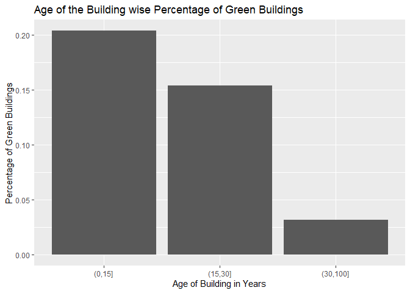<!-- --> 6)Now Bar Chart
on a standalone basis is not enough to give a actual picture, so
converting it to percentage of delayed flights is a better idea.

7)Here, “1” represents January and “12” represents
December.

|       |                                                                                                   Percentage of flights delayed in each month |
| ----- | --------------------------------------------------------------------------------------------------------------------------------------------: |
| 1     |                                                                                                                                          34.9 |
| 2     |                                                                                                                                          38.3 |
| 3     |                                                                                                                                          44.5 |
| 4     |                                                                                                                                          34.2 |
| 5     |                                                                                                                                          38.9 |
| 6     |                                                                                                                                          43.1 |
| 7     |                                                                                                                                          36.7 |
| 8     |                                                                                                                                          36.1 |
| 9     |                                                                                                                                          25.2 |
| 10    |                                                                                                                                          27.5 |
| 11    |                                                                                                                                          28.2 |
| 12    |                                                                                                                                          45.2 |
| 8)Goi | ng in further, and exploring the days where the flights gets relatively delayed more in the days of the week and calculating it’s perecntage. |

9)Here “1” represents Monday and “7” represents SUnday
<!-- -->

|   | Percentage of flights delayed by day |
| - | -----------------------------------: |
| 1 |                                 38.1 |
| 2 |                                 32.7 |
| 3 |                                 34.1 |
| 4 |                                 39.9 |
| 5 |                                 41.3 |
| 6 |                                 31.5 |
| 7 |                                 35.5 |

10)Conclusion: The plots are intuitive by themselves. It is clear that:

\-\>Month to avoid travelling: December

\-\>Day to avoid traveling: Friday

\-\>Best month to travel: September

\-\>Best day to travel: Saturday

This is just the general trend, for a particular year. So the insights
from this dataset should be taken with a grain of salt and not be
dependent on it completely. Other factors, which are unpredictable might
also play a part.

\#Q3: Portfolio modeling

In the following, bootstrap resampling will be used to estimate the
4-week (20-trading day) value at risk of 3 portfolios at the 5% level.

I have decided to go with evenly split portfolio, the seconf is a safe
portfolio and the final one is an aggressive portfolio.

These portfolios will be composed of 5 ETFs - SPY, TLT, LQD, EEM, and
VNQ at different weights based on the type of the portfolio.

    ## 'getSymbols' currently uses auto.assign=TRUE by default, but will
    ## use auto.assign=FALSE in 0.5-0. You will still be able to use
    ## 'loadSymbols' to automatically load data. getOption("getSymbols.env")
    ## and getOption("getSymbols.auto.assign") will still be checked for
    ## alternate defaults.
    ## 
    ## This message is shown once per session and may be disabled by setting 
    ## options("getSymbols.warning4.0"=FALSE). See ?getSymbols for details.

<!-- -->

    ##                ClCl.SPYa    ClCl.TLTa     ClCl.LQDa    ClCl.EEMa
    ## 2014-01-02            NA           NA            NA           NA
    ## 2014-01-03 -0.0001640007  0.000000000  0.0014858666 -0.001741727
    ## 2014-01-06 -0.0028979059  0.004208672  0.0021818816 -0.009471511
    ## 2014-01-07  0.0061416703  0.002534142 -0.0007838021  0.004277755
    ## 2014-01-08  0.0002180510 -0.002722137 -0.0042705073 -0.003257354
    ## 2014-01-09  0.0006538524  0.005849074  0.0022757287 -0.005279010
    ##               ClCl.VNQa
    ## 2014-01-02           NA
    ## 2014-01-03  0.005575345
    ## 2014-01-06  0.005082427
    ## 2014-01-07  0.004443779
    ## 2014-01-08 -0.004881769
    ## 2014-01-09  0.000000000

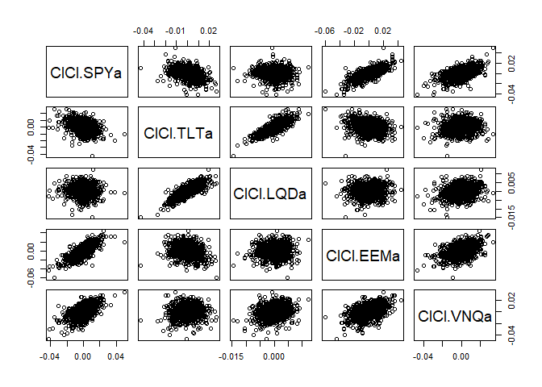<!-- -->

<!-- -->

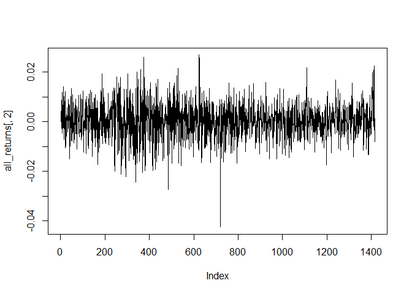<!-- -->

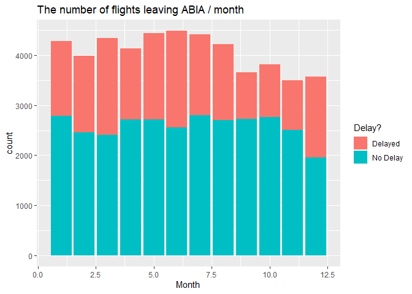<!-- -->

<!-- -->

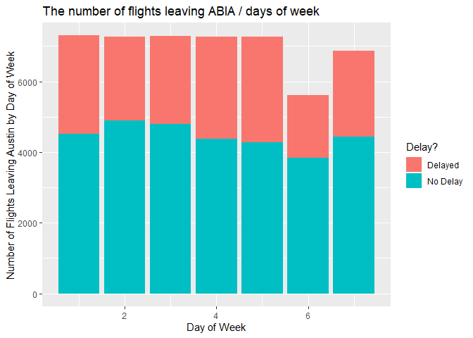<!-- -->

    ##            SPY.Open SPY.High  SPY.Low SPY.Close SPY.Volume SPY.Adjusted
    ## 2014-01-02 165.0890 165.1698 163.7430  164.1379  119636900     164.1379
    ## 2014-01-03 164.4160 164.7481 163.8776  164.1109   81390600     164.1109
    ## 2014-01-06 164.6493 164.7122 163.3841  163.6354  108028200     163.6354
    ## 2014-01-07 164.2904 164.9185 164.1648  164.6404   86144200     164.6404
    ## 2014-01-08 164.6134 164.9544 164.1109  164.6763   96582300     164.6762
    ## 2014-01-09 165.2057 165.2236 164.0302  164.7839   90683400     164.7839

    ##                ClCl.SPYa    ClCl.TLTa     ClCl.LQDa    ClCl.EEMa
    ## 2014-01-02            NA           NA            NA           NA
    ## 2014-01-03 -0.0001640007  0.000000000  0.0014858666 -0.001741727
    ## 2014-01-06 -0.0028979059  0.004208672  0.0021818816 -0.009471511
    ## 2014-01-07  0.0061416703  0.002534142 -0.0007838021  0.004277755
    ## 2014-01-08  0.0002180510 -0.002722137 -0.0042705073 -0.003257354
    ## 2014-01-09  0.0006538524  0.005849074  0.0022757287 -0.005279010
    ##               ClCl.VNQa
    ## 2014-01-02           NA
    ## 2014-01-03  0.005575345
    ## 2014-01-06  0.005082427
    ## 2014-01-07  0.004443779
    ## 2014-01-08 -0.004881769
    ## 2014-01-09  0.000000000

<!-- -->

    ## [1] 0.0004343371

    ## [1] 0.008338843

    ## [1] 0.0003825454

    ## [1] 0.007377203

    ## [1] 0.0002164548

    ## [1] 0.002973489

    ## [1] 0.0001375375

    ## [1] 0.0117614

    ## [1] 0.0004475514

    ## [1] 0.009055812

The portfolio EEM is the highest risk portfolio among everyone as it has
the highest standard deviation. Then the VNQ, SPY, TLT lies in the
middle and they can be classified as medium risk portfolio. Then LQD can
be classified as a safe portfolio based on it’s standard deviation
value.

4 weeks of return is simulated using bootstrap for an evenly split
portfolio - 20% weight in each ETF

    ## [1] 97788.95

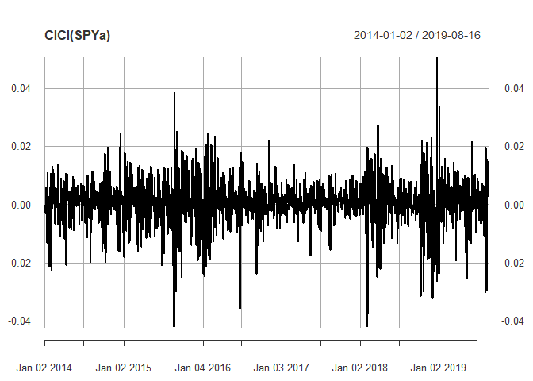<!-- --> In a medium
risk portfolio: 40% is alloted in SPY, 30% in TLT and 30% in VNQ

    ## [1] 100364.3

<!-- --> In a high risk
portfolio- 25% is alloted in SPY, 50% in EEM and 25% in VNQ

    ## [1] 95456.83

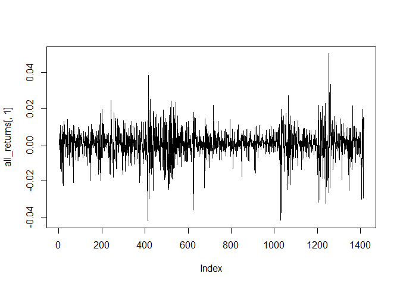<!-- -->

    ## [1] 100674.1

    ## [1] 100842.7

    ## [1] 100678.6

<!-- --> Plotting the
average 4-week returns for each portfolio type reveals that the safe
portfolio yields the highest return on average followed by the even
split portfolio and the aggressive portfolio.

Calculating value at risk at the 5% level for each portfolio

    ##        5% 
    ## -3087.787

    ##        5% 
    ## -3237.886

    ##        5% 
    ## -5961.303

the 4-week value at risk at the 5% level is $-3191.472 for the even
split portfolio, $-3179.721 for the medium risk portfolio, and
$-6037.401 for the risky portfolio.

Thus, in this case going with aggressive portfolio will prove to a bad
choice. Instead one can opt for a safer or a medium risk portfolio.
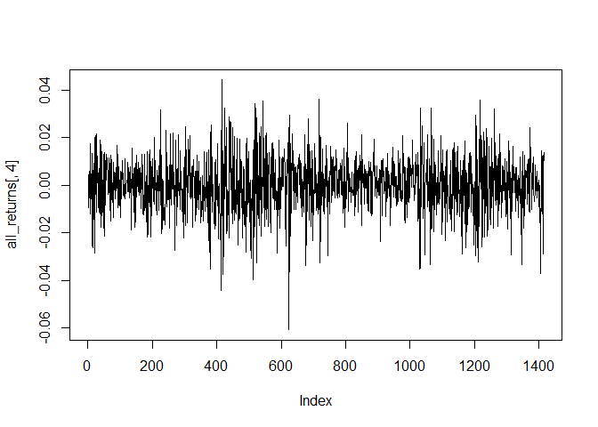<!-- -->

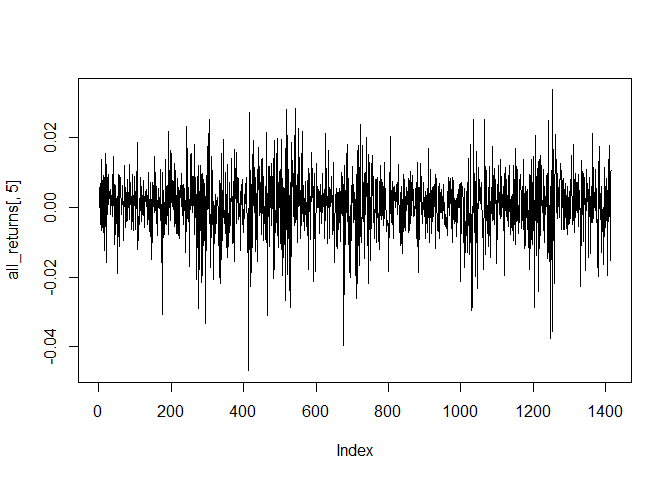<!-- -->

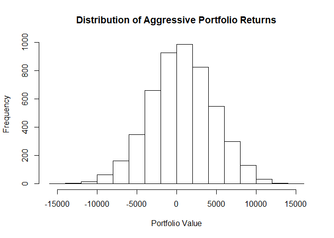<!-- --> Conclusion:
Thus, in this case going with aggressive portfolio will prove to be a
bad choice. Instead one can opt for a safer or a medium risk portfolio.
The safer portfolio was the one which ranked first. Then the medium risk
portfolio is the second best one among all the three.

\#Q4: Market Segmentation -

\#\#Step1: Import and scale the data

\#\#Step2: Elbow Method for finding the optimal number of clusters
Plotting
    wss

    ##  [1] 224580.0 214481.4 205922.7 198062.2 191432.1 184936.3 180158.6
    ##  [8] 176755.6 172721.5 169583.7 167343.3

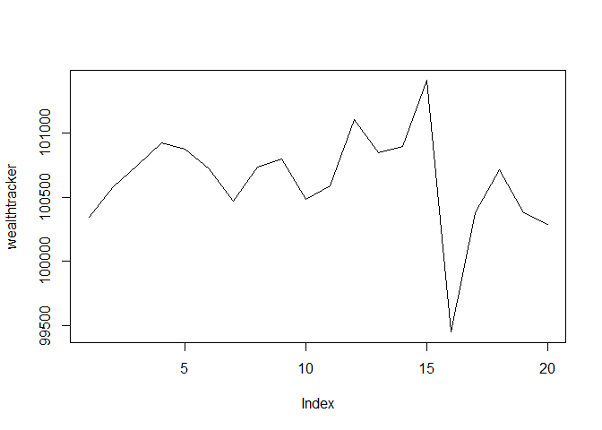<!-- -->

Plotting
    bss

    ##  [1]  59136.04  69234.64  77793.33  85653.77  92283.93  98779.68 103557.37
    ##  [8] 106960.45 110994.49 114132.28 116372.75

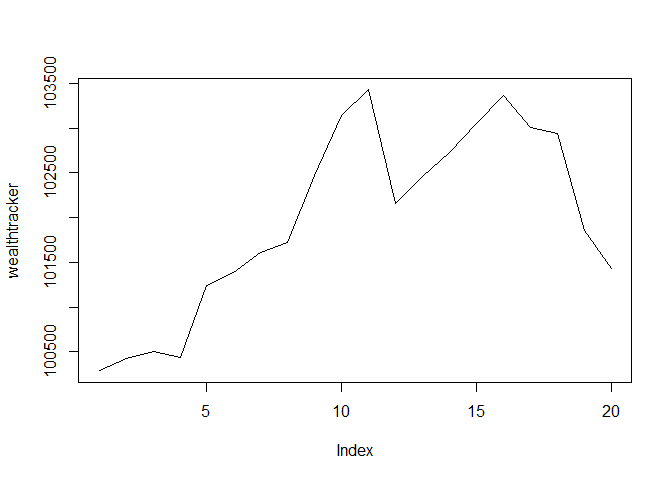<!-- -->

The plot does not give us any decisive results but k= 8-10 look like
viable results, so taking an estimate of k=8

\#\#Step 3: Analyse the clusters

Looking at
    cluster1

    ##            X chatter current_events travel photo_sharing uncategorized
    ## 2  clk1m5w8s       3              3      2             1             1
    ## 4  3oeb4hiln       1              5      2             2             0
    ## 5  fd75x1vgk       5              2      0             6             1
    ## 14 zm8kt97ic       1              0      0             1             0
    ## 15 4odi1h6wq       3              4      1             2             1
    ## 16 6vyz8cwje       9              0      0             2             0
    ## 19 3pifxrgs1       3              0      0             2             0
    ## 24 znu9lvmbw       4              0      0             1             0
    ## 25 64qgjkp2c       0              1      2             1             1
    ## 26 rk1fcwuay       3              1      0             0             1
    ##    tv_film sports_fandom politics food family home_and_garden music news
    ## 2        1             4        1    2      2               1     0    0
    ## 4        1             0        1    0      1               0     0    0
    ## 5        0             0        2    0      1               0     0    0
    ## 14       0             2        0    1      0               3     0    0
    ## 15       1             0        0    0      0               0     0    2
    ## 16       0             0        1    0      2               0     1    2
    ## 19       1             1        1    2      0               0     1    0
    ## 24       0             0        0    1      0               0     1    2
    ## 25       0             1        0    0      0               0     1    2
    ## 26       1             4        0    6      1               0     0    0
    ##    online_gaming shopping health_nutrition college_uni sports_playing
    ## 2              0        0                0           0              1
    ## 4              0        0                0           1              0
    ## 5              3        2                0           4              0
    ## 14             1        0                1           0              0
    ## 15             0        1                4           0              0
    ## 16             5        2                0           2              1
    ## 19             0        0                0           0              0
    ## 24             0        3                0           1              1
    ## 25             0        1                0           1              0
    ## 26             0        1                0           0              0
    ##    cooking eco computers business outdoors crafts automotive art religion
    ## 2        0   0         0        1        0      2          0   0        0
    ## 4        0   0         0        1        0      3          0   2        0
    ## 5        1   0         1        0        1      0          0   0        0
    ## 14       1   1         0        1        0      0          0   0        2
    ## 15       3   1         1        0        2      0          0   1        0
    ## 16       2   0         1        0        0      0          3   0        0
    ## 19       0   2         0        0        0      0          0   0        0
    ## 24       0   0         0        0        0      1          0   1        0
    ## 25       0   0         1        0        0      0          1   1        0
    ## 26       0   0         0        0        1      1          0   0        1
    ##    beauty parenting dating school personal_fitness fashion small_business
    ## 2       0         0      1      4                0       0              0
    ## 4       1         0      0      0                0       0              0
    ## 5       0         0      0      0                0       0              1
    ## 14      1         1      0      0                0       2              1
    ## 15      0         0      1      0                5       0              0
    ## 16      0         1      0      1                0       0              0
    ## 19      0         0      0      1                0       0              0
    ## 24      0         0      0      0                0       0              0
    ## 25      0         0      0      0                0       0              0
    ## 26      0         2      1      1                0       0              0
    ##    spam adult
    ## 2     0     0
    ## 4     0     0
    ## 5     0     0
    ## 14    0     0
    ## 15    0     0
    ## 16    0     0
    ## 19    0     0
    ## 24    0     0
    ## 25    0     0
    ## 26    0     0

Absolute numbers might be misleading because these are small counts,
where it might be the case that one category in general gets tweeted
about the most/least So looking at scaled data’s cluster centers to make
inferences about these
    clusters

    ##          chatter   current_events           travel    photo_sharing 
    ##      -0.35122913      -0.18081595      -0.23335202      -0.41392650 
    ##    uncategorized          tv_film    sports_fandom         politics 
    ##      -0.18036005      -0.17594444      -0.30100941      -0.27463183 
    ##             food           family  home_and_garden            music 
    ##      -0.36178105      -0.28842434      -0.19941681      -0.21834878 
    ##             news    online_gaming         shopping health_nutrition 
    ##      -0.24313963      -0.23496655      -0.37376616      -0.31853237 
    ##      college_uni   sports_playing          cooking              eco 
    ##      -0.26042051      -0.26458294      -0.33565323      -0.27848458 
    ##        computers         business         outdoors           crafts 
    ##      -0.26793882      -0.25923820      -0.31369757      -0.28945796 
    ##       automotive              art         religion           beauty 
    ##      -0.23169223      -0.19370768      -0.29913956      -0.27852333 
    ##        parenting           dating           school personal_fitness 
    ##      -0.32039093      -0.19322282      -0.31946340      -0.33641448 
    ##          fashion   small_business             spam            adult 
    ##      -0.29900303      -0.21246952      -0.07768727      -0.02636218

Cluster1 is negative centres for almost all the categories which might
be people who in general tweet
    less

    ##          chatter   current_events           travel    photo_sharing 
    ##      -0.06017664       0.08978878       1.89626032      -0.15659240 
    ##    uncategorized          tv_film    sports_fandom         politics 
    ##      -0.05994898       0.02406822       0.20587839       2.48177802 
    ##             food           family  home_and_garden            music 
    ##       0.03993536       0.02718130       0.09843043      -0.05209774 
    ##             news    online_gaming         shopping health_nutrition 
    ##       2.00449341      -0.13560059      -0.11580059      -0.20618720 
    ##      college_uni   sports_playing          cooking              eco 
    ##      -0.09455937      -0.01224925      -0.21731789       0.08823982 
    ##        computers         business         outdoors           crafts 
    ##       1.66893445       0.31568319       0.10330706       0.09864196 
    ##       automotive              art         religion           beauty 
    ##       1.05345477      -0.07579853      -0.01089024      -0.17341068 
    ##        parenting           dating           school personal_fitness 
    ##       0.04228275       0.18950417      -0.04319682      -0.19615054 
    ##          fashion   small_business             spam            adult 
    ##      -0.18693445       0.21625971      -0.07768727      -0.10711639

Cluster2 Politics, news, travel, Computers, automotive have the centres
: The aware, urban
    poulation

    ##          chatter   current_events           travel    photo_sharing 
    ##     -0.034556305      0.188999376     -0.038471515      1.212870951 
    ##    uncategorized          tv_film    sports_fandom         politics 
    ##      0.478939286     -0.048248205     -0.187387002     -0.109693015 
    ##             food           family  home_and_garden            music 
    ##     -0.185441396      0.039304722      0.126722091      0.529023795 
    ##             news    online_gaming         shopping health_nutrition 
    ##     -0.050512846     -0.031283725      0.220116145     -0.054192009 
    ##      college_uni   sports_playing          cooking              eco 
    ##     -0.026834930      0.170053792      2.777917348      0.013135385 
    ##        computers         business         outdoors           crafts 
    ##      0.054581605      0.236144963      0.028189533      0.117802707 
    ##       automotive              art         religion           beauty 
    ##      0.027508583      0.103076832     -0.115996182      2.556108958 
    ##        parenting           dating           school personal_fitness 
    ##     -0.075442356      0.023326805      0.154485237     -0.035691654 
    ##          fashion   small_business             spam            adult 
    ##      2.646931741      0.187505227     -0.077687267     -0.003122931

Cluster3 Fashion, beauty, cooking, photo sharing has the highest centres
(Beauty and lifestyle
    bloggers)

    ##          chatter   current_events           travel    photo_sharing 
    ##      -0.13209289      -0.01725352      -0.14015774      -0.09786320 
    ##    uncategorized          tv_film    sports_fandom         politics 
    ##       0.15847221      -0.09731398      -0.19053921      -0.17409724 
    ##             food           family  home_and_garden            music 
    ##       0.44480568      -0.06829666       0.15410419       0.01685412 
    ##             news    online_gaming         shopping health_nutrition 
    ##      -0.01820310      -0.11672680      -0.04340157       2.19376201 
    ##      college_uni   sports_playing          cooking              eco 
    ##      -0.21034603      -0.02173242       0.40999850       0.52654720 
    ##        computers         business         outdoors           crafts 
    ##      -0.08458197       0.04504632       1.71974505       0.07763626 
    ##       automotive              art         religion           beauty 
    ##      -0.11854503      -0.01040201      -0.16196682      -0.20479096 
    ##        parenting           dating           school personal_fitness 
    ##      -0.09309025       0.16152376      -0.16907678       2.15970326 
    ##          fashion   small_business             spam            adult 
    ##      -0.11078845      -0.13007568      -0.07768727       0.01303733

Cluster4 health\_nutrition, personal fitness, outdoors has highest
centres (Health
    bloggers)

    ##          chatter   current_events           travel    photo_sharing 
    ##      -0.13515892       0.12335634      -0.09600738      -0.09104774 
    ##    uncategorized          tv_film    sports_fandom         politics 
    ##      -0.07832912      -0.00807081       2.06790737      -0.20808775 
    ##             food           family  home_and_garden            music 
    ##       1.84228092       1.50303323       0.17563815       0.04208496 
    ##             news    online_gaming         shopping health_nutrition 
    ##      -0.06668843      -0.07135369      -0.03045397      -0.14514445 
    ##      college_uni   sports_playing          cooking              eco 
    ##      -0.11994126       0.10886442      -0.10648067       0.17713099 
    ##        computers         business         outdoors           crafts 
    ##       0.08044460       0.09339702      -0.07199692       0.71633541 
    ##       automotive              art         religion           beauty 
    ##       0.15473126       0.08681482       2.25902379       0.31737964 
    ##        parenting           dating           school personal_fitness 
    ##       2.14991505       0.01058691       1.67272910      -0.09156854 
    ##          fashion   small_business             spam            adult 
    ##       0.01276527       0.08872439      -0.07768727      -0.01375608

Cluster5 religion, parenting, sports, food, school has the highest
centres(Young
    parents)

    ##          chatter   current_events           travel    photo_sharing 
    ##     -0.089890516     -0.082802041     -0.014602030     -0.031251734 
    ##    uncategorized          tv_film    sports_fandom         politics 
    ##      0.028511182      0.231204168     -0.117698968     -0.168736148 
    ##             food           family  home_and_garden            music 
    ##     -0.081535276      0.206575080      0.115785587      0.010629139 
    ##             news    online_gaming         shopping health_nutrition 
    ##     -0.170272696      3.498681205     -0.134134727     -0.181765047 
    ##      college_uni   sports_playing          cooking              eco 
    ##      3.272318319      2.177726515     -0.127827628     -0.047761278 
    ##        computers         business         outdoors           crafts 
    ##     -0.068793786     -0.053978049     -0.128114236      0.087039012 
    ##       automotive              art         religion           beauty 
    ##      0.068841241      0.298937032     -0.166194090     -0.222022946 
    ##        parenting           dating           school personal_fitness 
    ##     -0.141760526      0.009762792     -0.222999463     -0.190977731 
    ##          fashion   small_business             spam            adult 
    ##     -0.060547012      0.146072869     -0.077687267     -0.017117538

Cluster6 Online gaming, college uni has the highest centres : College
Students

    ##          chatter   current_events           travel    photo_sharing 
    ##     0.0720588021     0.2768471097     0.2887270321    -0.0907182755 
    ##    uncategorized          tv_film    sports_fandom         politics 
    ##     0.1125985357    -0.1161910091     0.1406566940     0.1505274001 
    ##             food           family  home_and_garden            music 
    ##     0.0404942197    -0.0599955520     0.2351019070     0.0141826414 
    ##             news    online_gaming         shopping health_nutrition 
    ##    -0.0006901999     0.0893590644    -0.2378226398     0.0508605936 
    ##      college_uni   sports_playing          cooking              eco 
    ##     0.1273275311    -0.1112903585    -0.0589821944     0.4479994751 
    ##        computers         business         outdoors           crafts 
    ##     0.2975329049    -0.3460090080     0.2978031030     0.2179337318 
    ##       automotive              art         religion           beauty 
    ##     0.1245356399     0.3316753724     0.1207017943    -0.1007019535 
    ##        parenting           dating           school personal_fitness 
    ##     0.1865841424    -0.0095282441     0.0924482364     0.1218323604 
    ##          fashion   small_business             spam            adult 
    ##    -0.0204498722     0.3142882614    12.4188645015     3.7502221545

Cluster7 Spam, adult has the highest centres:
    Bot

    ##          chatter   current_events           travel    photo_sharing 
    ##      1.209413591      0.342941313     -0.116775377      0.871454944 
    ##    uncategorized          tv_film    sports_fandom         politics 
    ##      0.272184633      0.504466057     -0.176140850     -0.123278689 
    ##             food           family  home_and_garden            music 
    ##     -0.208345228     -0.066820249      0.223104777      0.386301388 
    ##             news    online_gaming         shopping health_nutrition 
    ##     -0.173923057     -0.166774394      1.107637308     -0.237368249 
    ##      college_uni   sports_playing          cooking              eco 
    ##      0.032929575      0.005847173     -0.235706700      0.299085003 
    ##        computers         business         outdoors           crafts 
    ##     -0.064305635      0.427012975     -0.201159759      0.236996369 
    ##       automotive              art         religion           beauty 
    ##      0.091106471      0.397419376     -0.213899194     -0.145597972 
    ##        parenting           dating           school personal_fitness 
    ##     -0.189192252      0.330099824      0.096099581     -0.207821204 
    ##          fashion   small_business             spam            adult 
    ##     -0.058847826      0.393420455     -0.077687267     -0.013122369

Cluster8 Chatter, shopping, photosharing has the highest centres

\#Q6: Association Rule mining

\#\#Import

    ## [[1]]
    ## [1] "citrus fruit"        "margarine"           "ready soups"        
    ## [4] "semi-finished bread"
    ## 
    ## [[2]]
    ## [1] "coffee"         "tropical fruit" "yogurt"        
    ## 
    ## [[3]]
    ## [1] "whole milk"
    ## 
    ## [[4]]
    ## [1] "cream cheese" "meat spreads" "pip fruit"    "yogurt"      
    ## 
    ## [[5]]
    ## [1] "condensed milk"           "long life bakery product"
    ## [3] "other vegetables"         "whole milk"              
    ## 
    ## [[6]]
    ## [1] "abrasive cleaner" "butter"           "rice"            
    ## [4] "whole milk"       "yogurt"

\#Frequency Plot

    ## Eclat
    ## 
    ## parameter specification:
    ##  tidLists support minlen maxlen            target   ext
    ##     FALSE    0.07      1     15 frequent itemsets FALSE
    ## 
    ## algorithmic control:
    ##  sparse sort verbose
    ##       7   -2    TRUE
    ## 
    ## Absolute minimum support count: 688 
    ## 
    ## create itemset ... 
    ## set transactions ...[169 item(s), 9835 transaction(s)] done [0.01s].
    ## sorting and recoding items ... [18 item(s)] done [0.00s].
    ## creating sparse bit matrix ... [18 row(s), 9835 column(s)] done [0.00s].
    ## writing  ... [19 set(s)] done [0.00s].
    ## Creating S4 object  ... done [0.00s].

<!-- -->

Starting with high support and high confidence to get strongest rules
Support = 0.0045, confidence = 0.5

    ## Apriori
    ## 
    ## Parameter specification:
    ##  confidence minval smax arem  aval originalSupport maxtime support minlen
    ##         0.5    0.1    1 none FALSE            TRUE       5  0.0045      1
    ##  maxlen target   ext
    ##      10  rules FALSE
    ## 
    ## Algorithmic control:
    ##  filter tree heap memopt load sort verbose
    ##     0.1 TRUE TRUE  FALSE TRUE    2    TRUE
    ## 
    ## Absolute minimum support count: 44 
    ## 
    ## set item appearances ...[0 item(s)] done [0.00s].
    ## set transactions ...[169 item(s), 9835 transaction(s)] done [0.01s].
    ## sorting and recoding items ... [121 item(s)] done [0.00s].
    ## creating transaction tree ... done [0.01s].
    ## checking subsets of size 1 2 3 4 5 done [0.01s].
    ## writing ... [157 rule(s)] done [0.00s].
    ## creating S4 object  ... done [0.01s].

    ##       lhs                           rhs                    support confidence     lift count
    ## [1]   {curd,                                                                                
    ##        tropical fruit}           => {yogurt}           0.005287239  0.5148515 3.690645    52
    ## [2]   {citrus fruit,                                                                        
    ##        root vegetables,                                                                     
    ##        whole milk}               => {other vegetables} 0.005795628  0.6333333 3.273165    57
    ## [3]   {pip fruit,                                                                           
    ##        root vegetables,                                                                     
    ##        whole milk}               => {other vegetables} 0.005490595  0.6136364 3.171368    54
    ## [4]   {root vegetables,                                                                     
    ##        tropical fruit,                                                                      
    ##        yogurt}                   => {other vegetables} 0.004982206  0.6125000 3.165495    49
    ## [5]   {pip fruit,                                                                           
    ##        whipped/sour cream}       => {other vegetables} 0.005592272  0.6043956 3.123610    55
    ## [6]   {onions,                                                                              
    ##        root vegetables}          => {other vegetables} 0.005693950  0.6021505 3.112008    56
    ## [7]   {citrus fruit,                                                                        
    ##        root vegetables}          => {other vegetables} 0.010371124  0.5862069 3.029608   102
    ## [8]   {chicken,                                                                             
    ##        yogurt}                   => {other vegetables} 0.004880529  0.5853659 3.025262    48
    ## [9]   {root vegetables,                                                                     
    ##        tropical fruit,                                                                      
    ##        whole milk}               => {other vegetables} 0.007015760  0.5847458 3.022057    69
    ## [10]  {root vegetables,                                                                     
    ##        tropical fruit}           => {other vegetables} 0.012302999  0.5845411 3.020999   121
    ## [11]  {butter,                                                                              
    ##        whipped/sour cream}       => {other vegetables} 0.005795628  0.5700000 2.945849    57
    ## [12]  {pip fruit,                                                                           
    ##        tropical fruit,                                                                      
    ##        whole milk}               => {other vegetables} 0.004778851  0.5662651 2.926546    47
    ## [13]  {tropical fruit,                                                                      
    ##        whipped/sour cream}       => {other vegetables} 0.007829181  0.5661765 2.926088    77
    ## [14]  {curd,                                                                                
    ##        domestic eggs}            => {whole milk}       0.004778851  0.7343750 2.874086    47
    ## [15]  {butter,                                                                              
    ##        tropical fruit}           => {other vegetables} 0.005490595  0.5510204 2.847759    54
    ## [16]  {fruit/vegetable juice,                                                               
    ##        root vegetables}          => {other vegetables} 0.006609049  0.5508475 2.846865    65
    ## [17]  {citrus fruit,                                                                        
    ##        tropical fruit,                                                                      
    ##        whole milk}               => {other vegetables} 0.004982206  0.5505618 2.845389    49
    ## [18]  {root vegetables,                                                                     
    ##        whipped/sour cream,                                                                  
    ##        whole milk}               => {other vegetables} 0.005185562  0.5483871 2.834150    51
    ## [19]  {onions,                                                                              
    ##        whole milk}               => {other vegetables} 0.006609049  0.5462185 2.822942    65
    ## [20]  {butter,                                                                              
    ##        curd}                     => {whole milk}       0.004880529  0.7164179 2.803808    48
    ## [21]  {hamburger meat,                                                                      
    ##        rolls/buns}               => {other vegetables} 0.004677173  0.5411765 2.796884    46
    ## [22]  {sausage,                                                                             
    ##        whipped/sour cream}       => {other vegetables} 0.004880529  0.5393258 2.787320    48
    ## [23]  {root vegetables,                                                                     
    ##        whole milk,                                                                          
    ##        yogurt}                   => {other vegetables} 0.007829181  0.5384615 2.782853    77
    ## [24]  {fruit/vegetable juice,                                                               
    ##        whole milk,                                                                          
    ##        yogurt}                   => {other vegetables} 0.005083884  0.5376344 2.778578    50
    ## [25]  {pastry,                                                                              
    ##        root vegetables}          => {other vegetables} 0.005897306  0.5370370 2.775491    58
    ## [26]  {domestic eggs,                                                                       
    ##        root vegetables,                                                                     
    ##        whole milk}               => {other vegetables} 0.004575496  0.5357143 2.768655    45
    ## [27]  {margarine,                                                                           
    ##        root vegetables}          => {other vegetables} 0.005897306  0.5321101 2.750028    58
    ## [28]  {pip fruit,                                                                           
    ##        whole milk,                                                                          
    ##        yogurt}                   => {other vegetables} 0.005083884  0.5319149 2.749019    50
    ## [29]  {root vegetables,                                                                     
    ##        tropical fruit,                                                                      
    ##        yogurt}                   => {whole milk}       0.005693950  0.7000000 2.739554    56
    ## [30]  {frozen vegetables,                                                                   
    ##        root vegetables}          => {other vegetables} 0.006100661  0.5263158 2.720082    60
    ## [31]  {chicken,                                                                             
    ##        root vegetables}          => {other vegetables} 0.005693950  0.5233645 2.704829    56
    ## [32]  {citrus fruit,                                                                        
    ##        whipped/sour cream}       => {other vegetables} 0.005693950  0.5233645 2.704829    56
    ## [33]  {pip fruit,                                                                           
    ##        root vegetables}          => {other vegetables} 0.008134215  0.5228758 2.702304    80
    ## [34]  {newspapers,                                                                          
    ##        root vegetables}          => {other vegetables} 0.005998983  0.5221239 2.698417    59
    ## [35]  {root vegetables,                                                                     
    ##        shopping bags}            => {other vegetables} 0.006609049  0.5158730 2.666112    65
    ## [36]  {chicken,                                                                             
    ##        rolls/buns}               => {other vegetables} 0.004982206  0.5157895 2.665680    49
    ## [37]  {pork,                                                                                
    ##        root vegetables}          => {other vegetables} 0.007015760  0.5149254 2.661214    69
    ## [38]  {curd,                                                                                
    ##        tropical fruit}           => {other vegetables} 0.005287239  0.5148515 2.660833    52
    ## [39]  {whipped/sour cream,                                                                  
    ##        whole milk,                                                                          
    ##        yogurt}                   => {other vegetables} 0.005592272  0.5140187 2.656529    55
    ## [40]  {butter,                                                                              
    ##        root vegetables}          => {other vegetables} 0.006609049  0.5118110 2.645119    65
    ## [41]  {other vegetables,                                                                    
    ##        pip fruit,                                                                           
    ##        root vegetables}          => {whole milk}       0.005490595  0.6750000 2.641713    54
    ## [42]  {domestic eggs,                                                                       
    ##        root vegetables}          => {other vegetables} 0.007320793  0.5106383 2.639058    72
    ## [43]  {domestic eggs,                                                                       
    ##        whipped/sour cream}       => {other vegetables} 0.005083884  0.5102041 2.636814    50
    ## [44]  {curd,                                                                                
    ##        root vegetables}          => {other vegetables} 0.005490595  0.5046729 2.608228    54
    ## [45]  {tropical fruit,                                                                      
    ##        whole milk,                                                                          
    ##        yogurt}                   => {other vegetables} 0.007625826  0.5033557 2.601421    75
    ## [46]  {rolls/buns,                                                                          
    ##        root vegetables}          => {other vegetables} 0.012201322  0.5020921 2.594890   120
    ## [47]  {butter,                                                                              
    ##        citrus fruit}             => {other vegetables} 0.004575496  0.5000000 2.584078    45
    ## [48]  {root vegetables,                                                                     
    ##        whipped/sour cream}       => {other vegetables} 0.008540925  0.5000000 2.584078    84
    ## [49]  {root vegetables,                                                                     
    ##        yogurt}                   => {other vegetables} 0.012913066  0.5000000 2.584078   127
    ## [50]  {butter,                                                                              
    ##        whipped/sour cream}       => {whole milk}       0.006710727  0.6600000 2.583008    66
    ## [51]  {pip fruit,                                                                           
    ##        whipped/sour cream}       => {whole milk}       0.005998983  0.6483516 2.537421    59
    ## [52]  {rolls/buns,                                                                          
    ##        root vegetables,                                                                     
    ##        yogurt}                   => {whole milk}       0.004677173  0.6478873 2.535604    46
    ## [53]  {butter,                                                                              
    ##        yogurt}                   => {whole milk}       0.009354347  0.6388889 2.500387    92
    ## [54]  {butter,                                                                              
    ##        root vegetables}          => {whole milk}       0.008235892  0.6377953 2.496107    81
    ## [55]  {curd,                                                                                
    ##        tropical fruit}           => {whole milk}       0.006507372  0.6336634 2.479936    64
    ## [56]  {citrus fruit,                                                                        
    ##        other vegetables,                                                                    
    ##        yogurt}                   => {whole milk}       0.004778851  0.6266667 2.452553    47
    ## [57]  {domestic eggs,                                                                       
    ##        other vegetables,                                                                    
    ##        root vegetables}          => {whole milk}       0.004575496  0.6250000 2.446031    45
    ## [58]  {other vegetables,                                                                    
    ##        pip fruit,                                                                           
    ##        yogurt}                   => {whole milk}       0.005083884  0.6250000 2.446031    50
    ## [59]  {domestic eggs,                                                                       
    ##        pip fruit}                => {whole milk}       0.005388917  0.6235294 2.440275    53
    ## [60]  {curd,                                                                                
    ##        pip fruit}                => {whole milk}       0.004880529  0.6233766 2.439677    48
    ## [61]  {butter,                                                                              
    ##        tropical fruit}           => {whole milk}       0.006202339  0.6224490 2.436047    61
    ## [62]  {domestic eggs,                                                                       
    ##        margarine}                => {whole milk}       0.005185562  0.6219512 2.434099    51
    ## [63]  {butter,                                                                              
    ##        domestic eggs}            => {whole milk}       0.005998983  0.6210526 2.430582    59
    ## [64]  {other vegetables,                                                                    
    ##        tropical fruit,                                                                      
    ##        yogurt}                   => {whole milk}       0.007625826  0.6198347 2.425816    75
    ## [65]  {fruit/vegetable juice,                                                               
    ##        other vegetables,                                                                    
    ##        yogurt}                   => {whole milk}       0.005083884  0.6172840 2.415833    50
    ## [66]  {rice}                     => {whole milk}       0.004677173  0.6133333 2.400371    46
    ## [67]  {domestic eggs,                                                                       
    ##        tropical fruit}           => {whole milk}       0.006914082  0.6071429 2.376144    68
    ## [68]  {other vegetables,                                                                    
    ##        root vegetables,                                                                     
    ##        whipped/sour cream}       => {whole milk}       0.005185562  0.6071429 2.376144    51
    ## [69]  {other vegetables,                                                                    
    ##        root vegetables,                                                                     
    ##        yogurt}                   => {whole milk}       0.007829181  0.6062992 2.372842    77
    ## [70]  {bottled water,                                                                       
    ##        butter}                   => {whole milk}       0.005388917  0.6022727 2.357084    53
    ## [71]  {beef,                                                                                
    ##        tropical fruit}           => {whole milk}       0.004575496  0.6000000 2.348189    45
    ## [72]  {domestic eggs,                                                                       
    ##        root vegetables}          => {whole milk}       0.008540925  0.5957447 2.331536    84
    ## [73]  {domestic eggs,                                                                       
    ##        fruit/vegetable juice}    => {whole milk}       0.004778851  0.5949367 2.328373    47
    ## [74]  {curd,                                                                                
    ##        rolls/buns}               => {whole milk}       0.005897306  0.5858586 2.292845    58
    ## [75]  {other vegetables,                                                                    
    ##        sugar}                    => {whole milk}       0.006304016  0.5849057 2.289115    62
    ## [76]  {curd,                                                                                
    ##        yogurt}                   => {whole milk}       0.010066090  0.5823529 2.279125    99
    ## [77]  {citrus fruit,                                                                        
    ##        whipped/sour cream}       => {whole milk}       0.006304016  0.5794393 2.267722    62
    ## [78]  {pip fruit,                                                                           
    ##        root vegetables}          => {whole milk}       0.008947636  0.5751634 2.250988    88
    ## [79]  {curd,                                                                                
    ##        other vegetables}         => {whole milk}       0.009862735  0.5739645 2.246296    97
    ## [80]  {butter,                                                                              
    ##        other vegetables}         => {whole milk}       0.011489578  0.5736041 2.244885   113
    ## [81]  {tropical fruit,                                                                      
    ##        whipped/sour cream}       => {whole milk}       0.007930859  0.5735294 2.244593    78
    ## [82]  {domestic eggs,                                                                       
    ##        whipped/sour cream}       => {whole milk}       0.005693950  0.5714286 2.236371    56
    ## [83]  {other vegetables,                                                                    
    ##        root vegetables,                                                                     
    ##        tropical fruit}           => {whole milk}       0.007015760  0.5702479 2.231750    69
    ## [84]  {curd,                                                                                
    ##        root vegetables}          => {whole milk}       0.006202339  0.5700935 2.231146    61
    ## [85]  {root vegetables,                                                                     
    ##        tropical fruit}           => {whole milk}       0.011997966  0.5700483 2.230969   118
    ## [86]  {frozen vegetables,                                                                   
    ##        tropical fruit}           => {whole milk}       0.004982206  0.5697674 2.229870    49
    ## [87]  {sliced cheese,                                                                       
    ##        yogurt}                   => {whole milk}       0.004575496  0.5696203 2.229294    45
    ## [88]  {curd,                                                                                
    ##        whipped/sour cream}       => {whole milk}       0.005897306  0.5631068 2.203802    58
    ## [89]  {root vegetables,                                                                     
    ##        yogurt}                   => {whole milk}       0.014539908  0.5629921 2.203354   143
    ## [90]  {sausage,                                                                             
    ##        whipped/sour cream}       => {whole milk}       0.005083884  0.5617978 2.198679    50
    ## [91]  {bottled beer,                                                                        
    ##        yogurt}                   => {whole milk}       0.005185562  0.5604396 2.193364    51
    ## [92]  {brown bread,                                                                         
    ##        root vegetables}          => {whole milk}       0.005693950  0.5600000 2.191643    56
    ## [93]  {citrus fruit,                                                                        
    ##        other vegetables,                                                                    
    ##        root vegetables}          => {whole milk}       0.005795628  0.5588235 2.187039    57
    ## [94]  {rolls/buns,                                                                          
    ##        tropical fruit,                                                                      
    ##        yogurt}                   => {whole milk}       0.004880529  0.5581395 2.184362    48
    ## [95]  {pork,                                                                                
    ##        whipped/sour cream}       => {whole milk}       0.004575496  0.5555556 2.174249    45
    ## [96]  {butter,                                                                              
    ##        citrus fruit}             => {whole milk}       0.005083884  0.5555556 2.174249    50
    ## [97]  {frankfurter,                                                                         
    ##        yogurt}                   => {whole milk}       0.006202339  0.5545455 2.170296    61
    ## [98]  {root vegetables,                                                                     
    ##        whipped/sour cream}       => {whole milk}       0.009456024  0.5535714 2.166484    93
    ## [99]  {butter,                                                                              
    ##        sausage}                  => {whole milk}       0.004778851  0.5529412 2.164018    47
    ## [100] {domestic eggs,                                                                       
    ##        other vegetables}         => {whole milk}       0.012302999  0.5525114 2.162336   121
    ## [101] {chicken,                                                                             
    ##        root vegetables}          => {whole milk}       0.005998983  0.5514019 2.157993    59
    ## [102] {citrus fruit,                                                                        
    ##        other vegetables,                                                                    
    ##        tropical fruit}           => {whole milk}       0.004982206  0.5505618 2.154706    49
    ## [103] {other vegetables,                                                                    
    ##        whipped/sour cream,                                                                  
    ##        yogurt}                   => {whole milk}       0.005592272  0.5500000 2.152507    55
    ## [104] {pork,                                                                                
    ##        rolls/buns}               => {whole milk}       0.006202339  0.5495495 2.150744    61
    ## [105] {citrus fruit,                                                                        
    ##        domestic eggs}            => {whole milk}       0.005693950  0.5490196 2.148670    56
    ## [106] {frankfurter,                                                                         
    ##        tropical fruit}           => {whole milk}       0.005185562  0.5483871 2.146195    51
    ## [107] {chicken,                                                                             
    ##        rolls/buns}               => {whole milk}       0.005287239  0.5473684 2.142208    52
    ## [108] {frozen vegetables,                                                                   
    ##        other vegetables}         => {whole milk}       0.009659380  0.5428571 2.124552    95
    ## [109] {hygiene articles,                                                                    
    ##        other vegetables}         => {whole milk}       0.005185562  0.5425532 2.123363    51
    ## [110] {fruit/vegetable juice,                                                               
    ##        root vegetables}          => {whole milk}       0.006507372  0.5423729 2.122657    64
    ## [111] {white bread,                                                                         
    ##        yogurt}                   => {whole milk}       0.004880529  0.5393258 2.110732    48
    ## [112] {domestic eggs,                                                                       
    ##        yogurt}                   => {whole milk}       0.007727504  0.5390071 2.109485    76
    ## [113] {margarine,                                                                           
    ##        rolls/buns}               => {whole milk}       0.007930859  0.5379310 2.105273    78
    ## [114] {butter milk,                                                                         
    ##        yogurt}                   => {whole milk}       0.004575496  0.5357143 2.096598    45
    ## [115] {frozen vegetables,                                                                   
    ##        root vegetables}          => {whole milk}       0.006202339  0.5350877 2.094146    61
    ## [116] {rolls/buns,                                                                          
    ##        whipped/sour cream}       => {whole milk}       0.007829181  0.5347222 2.092715    77
    ## [117] {long life bakery product,                                                            
    ##        other vegetables}         => {whole milk}       0.005693950  0.5333333 2.087279    56
    ## [118] {brown bread,                                                                         
    ##        tropical fruit}           => {whole milk}       0.005693950  0.5333333 2.087279    56
    ## [119] {bottled water,                                                                       
    ##        domestic eggs}            => {whole milk}       0.004880529  0.5333333 2.087279    48
    ## [120] {cream cheese,                                                                        
    ##        yogurt}                   => {whole milk}       0.006609049  0.5327869 2.085141    65
    ## [121] {pip fruit,                                                                           
    ##        yogurt}                   => {whole milk}       0.009557702  0.5310734 2.078435    94
    ## [122] {whipped/sour cream,                                                                  
    ##        yogurt}                   => {whole milk}       0.010879512  0.5245098 2.052747   107
    ## [123] {long life bakery product,                                                            
    ##        yogurt}                   => {whole milk}       0.004575496  0.5232558 2.047840    45
    ## [124] {tropical fruit,                                                                      
    ##        white bread}              => {whole milk}       0.004575496  0.5232558 2.047840    45
    ## [125] {rolls/buns,                                                                          
    ##        root vegetables}          => {whole milk}       0.012709710  0.5230126 2.046888   125
    ## [126] {baking powder}            => {whole milk}       0.009252669  0.5229885 2.046793    91
    ## [127] {ham,                                                                                 
    ##        other vegetables}         => {whole milk}       0.004778851  0.5222222 2.043794    47
    ## [128] {other vegetables,                                                                    
    ##        rolls/buns,                                                                          
    ##        yogurt}                   => {whole milk}       0.005998983  0.5221239 2.043410    59
    ## [129] {beef,                                                                                
    ##        yogurt}                   => {whole milk}       0.006100661  0.5217391 2.041904    60
    ## [130] {coffee,                                                                              
    ##        yogurt}                   => {whole milk}       0.005083884  0.5208333 2.038359    50
    ## [131] {pip fruit,                                                                           
    ##        sausage}                  => {whole milk}       0.005592272  0.5188679 2.030667    55
    ## [132] {pastry,                                                                              
    ##        root vegetables}          => {whole milk}       0.005693950  0.5185185 2.029299    56
    ## [133] {sausage,                                                                             
    ##        tropical fruit}           => {whole milk}       0.007219115  0.5182482 2.028241    71
    ## [134] {other vegetables,                                                                    
    ##        pip fruit}                => {whole milk}       0.013523132  0.5175097 2.025351   133
    ## [135] {tropical fruit,                                                                      
    ##        yogurt}                   => {whole milk}       0.015149975  0.5173611 2.024770   149
    ## [136] {pastry,                                                                              
    ##        yogurt}                   => {whole milk}       0.009150991  0.5172414 2.024301    90
    ## [137] {citrus fruit,                                                                        
    ##        root vegetables}          => {whole milk}       0.009150991  0.5172414 2.024301    90
    ## [138] {root vegetables,                                                                     
    ##        sausage}                  => {whole milk}       0.007727504  0.5170068 2.023383    76
    ## [139] {other vegetables,                                                                    
    ##        yogurt}                   => {whole milk}       0.022267412  0.5128806 2.007235   219
    ## [140] {rolls/buns,                                                                          
    ##        waffles}                  => {whole milk}       0.004677173  0.5111111 2.000310    46
    ## [141] {pork,                                                                                
    ##        yogurt}                   => {whole milk}       0.004880529  0.5106383 1.998459    48
    ## [142] {oil,                                                                                 
    ##        other vegetables}         => {whole milk}       0.005083884  0.5102041 1.996760    50
    ## [143] {other vegetables,                                                                    
    ##        rolls/buns,                                                                          
    ##        root vegetables}          => {whole milk}       0.006202339  0.5083333 1.989438    61
    ## [144] {pastry,                                                                              
    ##        tropical fruit}           => {whole milk}       0.006710727  0.5076923 1.986930    66
    ## [145] {other vegetables,                                                                    
    ##        whipped/sour cream}       => {whole milk}       0.014641586  0.5070423 1.984385   144
    ## [146] {other vegetables,                                                                    
    ##        sliced cheese}            => {whole milk}       0.004575496  0.5056180 1.978811    45
    ## [147] {fruit/vegetable juice,                                                               
    ##        yogurt}                   => {whole milk}       0.009456024  0.5054348 1.978094    93
    ## [148] {onions,                                                                              
    ##        root vegetables}          => {whole milk}       0.004778851  0.5053763 1.977866    47
    ## [149] {other vegetables,                                                                    
    ##        pip fruit,                                                                           
    ##        tropical fruit}           => {whole milk}       0.004778851  0.5053763 1.977866    47
    ## [150] {newspapers,                                                                          
    ##        root vegetables}          => {whole milk}       0.005795628  0.5044248 1.974142    57
    ## [151] {frozen vegetables,                                                                   
    ##        rolls/buns}               => {whole milk}       0.005083884  0.5000000 1.956825    50
    ## [152] {beef,                                                                                
    ##        rolls/buns}               => {whole milk}       0.006812405  0.5000000 1.956825    67
    ## [153] {pork,                                                                                
    ##        root vegetables}          => {whole milk}       0.006812405  0.5000000 1.956825    67
    ## [154] {frankfurter,                                                                         
    ##        root vegetables}          => {whole milk}       0.005083884  0.5000000 1.956825    50
    ## [155] {brown bread,                                                                         
    ##        other vegetables}         => {whole milk}       0.009354347  0.5000000 1.956825    92
    ## [156] {fruit/vegetable juice,                                                               
    ##        pip fruit}                => {whole milk}       0.004778851  0.5000000 1.956825    47
    ## [157] {citrus fruit,                                                                        
    ##        pastry}                   => {whole milk}       0.004880529  0.5000000 1.956825    48

\#First set of rules A lot of high support rules involve whole milk and
other vegetables on rhs because we can see from eclat that whole milk
and other vegetables are sold the most 157 rules with support \> 0.0045
and confidence 0.5 involve only whole milk and other vegetables in rhs,
so if we look at only high support rules, we won’t get rules involving
other products First step to extract rules from here would be, for
support\>0.0045, get very high confidence and lift rules. Conf of 0.6
and lift of 2.5 These gives us all the important rules where rhs is
whole milk or other vegetables. (Produces 13 rules) All these rules look
like a general vegetarian diary/vegetable/fruit grocery trip.

    ## Apriori
    ## 
    ## Parameter specification:
    ##  confidence minval smax arem  aval originalSupport maxtime support minlen
    ##         0.6    0.1    1 none FALSE            TRUE       5  0.0045      1
    ##  maxlen target   ext
    ##      10  rules FALSE
    ## 
    ## Algorithmic control:
    ##  filter tree heap memopt load sort verbose
    ##     0.1 TRUE TRUE  FALSE TRUE    2    TRUE
    ## 
    ## Absolute minimum support count: 44 
    ## 
    ## set item appearances ...[0 item(s)] done [0.00s].
    ## set transactions ...[169 item(s), 9835 transaction(s)] done [0.01s].
    ## sorting and recoding items ... [121 item(s)] done [0.00s].
    ## creating transaction tree ... done [0.01s].
    ## checking subsets of size 1 2 3 4 5 done [0.01s].
    ## writing ... [31 rule(s)] done [0.00s].
    ## creating S4 object  ... done [0.00s].

    ##      lhs                     rhs                    support confidence     lift count
    ## [1]  {citrus fruit,                                                                  
    ##       root vegetables,                                                               
    ##       whole milk}         => {other vegetables} 0.005795628  0.6333333 3.273165    57
    ## [2]  {pip fruit,                                                                     
    ##       root vegetables,                                                               
    ##       whole milk}         => {other vegetables} 0.005490595  0.6136364 3.171368    54
    ## [3]  {root vegetables,                                                               
    ##       tropical fruit,                                                                
    ##       yogurt}             => {other vegetables} 0.004982206  0.6125000 3.165495    49
    ## [4]  {pip fruit,                                                                     
    ##       whipped/sour cream} => {other vegetables} 0.005592272  0.6043956 3.123610    55
    ## [5]  {onions,                                                                        
    ##       root vegetables}    => {other vegetables} 0.005693950  0.6021505 3.112008    56
    ## [6]  {curd,                                                                          
    ##       domestic eggs}      => {whole milk}       0.004778851  0.7343750 2.874086    47
    ## [7]  {butter,                                                                        
    ##       curd}               => {whole milk}       0.004880529  0.7164179 2.803808    48
    ## [8]  {root vegetables,                                                               
    ##       tropical fruit,                                                                
    ##       yogurt}             => {whole milk}       0.005693950  0.7000000 2.739554    56
    ## [9]  {other vegetables,                                                              
    ##       pip fruit,                                                                     
    ##       root vegetables}    => {whole milk}       0.005490595  0.6750000 2.641713    54
    ## [10] {butter,                                                                        
    ##       whipped/sour cream} => {whole milk}       0.006710727  0.6600000 2.583008    66
    ## [11] {pip fruit,                                                                     
    ##       whipped/sour cream} => {whole milk}       0.005998983  0.6483516 2.537421    59
    ## [12] {rolls/buns,                                                                    
    ##       root vegetables,                                                               
    ##       yogurt}             => {whole milk}       0.004677173  0.6478873 2.535604    46
    ## [13] {butter,                                                                        
    ##       yogurt}             => {whole milk}       0.009354347  0.6388889 2.500387    92

\#\#Second set of rules Many rules have support between 0.002 and 0.001
but their lift is very high. To capture those, reduced the support to
0.001 (The count reduces by a great deal because of this) So one way of
pulling these would be, support of 0.001, confidence of 0.6 and lift of
9. This will help us capture only those rules where the impact is huge
even though the support is small. This gives us 11 rules These look like
sandwich, party, parfait trips.

    ## Apriori
    ## 
    ## Parameter specification:
    ##  confidence minval smax arem  aval originalSupport maxtime support minlen
    ##         0.6    0.1    1 none FALSE            TRUE       5   0.001      1
    ##  maxlen target   ext
    ##      10  rules FALSE
    ## 
    ## Algorithmic control:
    ##  filter tree heap memopt load sort verbose
    ##     0.1 TRUE TRUE  FALSE TRUE    2    TRUE
    ## 
    ## Absolute minimum support count: 9 
    ## 
    ## set item appearances ...[0 item(s)] done [0.00s].
    ## set transactions ...[169 item(s), 9835 transaction(s)] done [0.01s].
    ## sorting and recoding items ... [157 item(s)] done [0.01s].
    ## creating transaction tree ... done [0.01s].
    ## checking subsets of size 1 2 3 4 5 6 done [0.03s].
    ## writing ... [2918 rule(s)] done [0.01s].
    ## creating S4 object  ... done [0.00s].

    ##      lhs                        rhs                      support confidence      lift count
    ## [1]  {Instant food products,                                                               
    ##       soda}                  => {hamburger meat}     0.001220132  0.6315789 18.995654    12
    ## [2]  {popcorn,                                                                             
    ##       soda}                  => {salty snack}        0.001220132  0.6315789 16.697793    12
    ## [3]  {ham,                                                                                 
    ##       processed cheese}      => {white bread}        0.001931876  0.6333333 15.045491    19
    ## [4]  {other vegetables,                                                                    
    ##       tropical fruit,                                                                      
    ##       white bread,                                                                         
    ##       yogurt}                => {butter}             0.001016777  0.6666667 12.030581    10
    ## [5]  {hamburger meat,                                                                      
    ##       whipped/sour cream,                                                                  
    ##       yogurt}                => {butter}             0.001016777  0.6250000 11.278670    10
    ## [6]  {domestic eggs,                                                                       
    ##       other vegetables,                                                                    
    ##       tropical fruit,                                                                      
    ##       whole milk,                                                                          
    ##       yogurt}                => {butter}             0.001016777  0.6250000 11.278670    10
    ## [7]  {liquor,                                                                              
    ##       red/blush wine}        => {bottled beer}       0.001931876  0.9047619 11.235269    19
    ## [8]  {butter,                                                                              
    ##       other vegetables,                                                                    
    ##       sugar}                 => {whipped/sour cream} 0.001016777  0.7142857  9.964539    10
    ## [9]  {butter,                                                                              
    ##       hard cheese,                                                                         
    ##       whole milk}            => {whipped/sour cream} 0.001423488  0.6666667  9.300236    14
    ## [10] {butter,                                                                              
    ##       fruit/vegetable juice,                                                               
    ##       other vegetables,                                                                    
    ##       tropical fruit}        => {whipped/sour cream} 0.001016777  0.6666667  9.300236    10
    ## [11] {cream cheese,                                                                        
    ##       curd,                                                                                
    ##       whole milk,                                                                          
    ##       yogurt}                => {whipped/sour cream} 0.001118454  0.6470588  9.026700    11

\#\#Third set of rules Increase support to 0.002 So another set of rules
can be support = 0.002, confidence of 0.5 with all rules. But again
because whole milk and other vegetables are the most bought itmes. They
appear the most frequently in rhs of these 1098 rules. As we have
already extracted rules of them, lets consider only those rules where
rhs is not whole milk or other
vegetables

``` r
rules_3 <- apriori (data_raw, parameter = list(supp = 0.002, conf = 0.5))
```

    ## Apriori
    ## 
    ## Parameter specification:
    ##  confidence minval smax arem  aval originalSupport maxtime support minlen
    ##         0.5    0.1    1 none FALSE            TRUE       5   0.002      1
    ##  maxlen target   ext
    ##      10  rules FALSE
    ## 
    ## Algorithmic control:
    ##  filter tree heap memopt load sort verbose
    ##     0.1 TRUE TRUE  FALSE TRUE    2    TRUE
    ## 
    ## Absolute minimum support count: 19 
    ## 
    ## set item appearances ...[0 item(s)] done [0.00s].
    ## set transactions ...[169 item(s), 9835 transaction(s)] done [0.00s].
    ## sorting and recoding items ... [147 item(s)] done [0.00s].
    ## creating transaction tree ... done [0.00s].
    ## checking subsets of size 1 2 3 4 5 done [0.01s].
    ## writing ... [1098 rule(s)] done [0.00s].
    ## creating S4 object  ... done [0.00s].

``` r
rules_sort_3 <- sort (rules_3, by="lift", decreasing=TRUE)
arules::inspect(rules_sort_3)
```

    ##        lhs                           rhs                      support confidence     lift count
    ## [1]    {butter,                                                                                
    ##         hard cheese}              => {whipped/sour cream} 0.002033554  0.5128205 7.154028    20
    ## [2]    {beef,                                                                                  
    ##         citrus fruit,                                                                          
    ##         other vegetables}         => {root vegetables}    0.002135231  0.6363636 5.838280    21
    ## [3]    {citrus fruit,                                                                          
    ##         other vegetables,                                                                      
    ##         tropical fruit,                                                                        
    ##         whole milk}               => {root vegetables}    0.003152008  0.6326531 5.804238    31
    ## [4]    {citrus fruit,                                                                          
    ##         frozen vegetables,                                                                     
    ##         other vegetables}         => {root vegetables}    0.002033554  0.6250000 5.734025    20
    ## [5]    {beef,                                                                                  
    ##         other vegetables,                                                                      
    ##         tropical fruit}           => {root vegetables}    0.002745297  0.6136364 5.629770    27
    ## [6]    {bottled water,                                                                         
    ##         root vegetables,                                                                       
    ##         yogurt}                   => {tropical fruit}     0.002236909  0.5789474 5.517391    22
    ## [7]    {herbs,                                                                                 
    ##         other vegetables,                                                                      
    ##         whole milk}               => {root vegetables}    0.002440264  0.6000000 5.504664    24
    ## [8]    {grapes,                                                                                
    ##         pip fruit}                => {tropical fruit}     0.002135231  0.5675676 5.408941    21
    ## [9]    {herbs,                                                                                 
    ##         yogurt}                   => {root vegetables}    0.002033554  0.5714286 5.242537    20
    ## [10]   {beef,                                                                                  
    ##         other vegetables,                                                                      
    ##         soda}                     => {root vegetables}    0.002033554  0.5714286 5.242537    20
    ## [11]   {citrus fruit,                                                                          
    ##         other vegetables,                                                                      
    ##         root vegetables,                                                                       
    ##         whole milk}               => {tropical fruit}     0.003152008  0.5438596 5.183004    31
    ## [12]   {other vegetables,                                                                      
    ##         rice}                     => {root vegetables}    0.002236909  0.5641026 5.175325    22
    ## [13]   {beef,                                                                                  
    ##         citrus fruit,                                                                          
    ##         whole milk}               => {root vegetables}    0.002236909  0.5641026 5.175325    22
    ## [14]   {butter,                                                                                
    ##         other vegetables,                                                                      
    ##         whole milk,                                                                            
    ##         yogurt}                   => {tropical fruit}     0.002338587  0.5348837 5.097463    23
    ## [15]   {beef,                                                                                  
    ##         butter,                                                                                
    ##         whole milk}               => {root vegetables}    0.002033554  0.5555556 5.096911    20
    ## [16]   {beef,                                                                                  
    ##         tropical fruit,                                                                        
    ##         whole milk}               => {root vegetables}    0.002541942  0.5555556 5.096911    25
    ## [17]   {grapes,                                                                                
    ##         other vegetables,                                                                      
    ##         whole milk}               => {tropical fruit}     0.002033554  0.5263158 5.015810    20
    ## [18]   {butter,                                                                                
    ##         other vegetables,                                                                      
    ##         tropical fruit,                                                                        
    ##         whole milk}               => {yogurt}             0.002338587  0.6969697 4.996135    23
    ## [19]   {herbs,                                                                                 
    ##         whole milk}               => {root vegetables}    0.004168785  0.5394737 4.949369    41
    ## [20]   {other vegetables,                                                                      
    ##         sliced cheese,                                                                         
    ##         whole milk}               => {root vegetables}    0.002440264  0.5333333 4.893035    24
    ## [21]   {bottled water,                                                                         
    ##         other vegetables,                                                                      
    ##         whole milk,                                                                            
    ##         yogurt}                   => {tropical fruit}     0.002033554  0.5128205 4.887199    20
    ## [22]   {citrus fruit,                                                                          
    ##         other vegetables,                                                                      
    ##         whole milk,                                                                            
    ##         yogurt}                   => {tropical fruit}     0.002440264  0.5106383 4.866403    24
    ## [23]   {beef,                                                                                  
    ##         sausage}                  => {root vegetables}    0.002948653  0.5272727 4.837432    29
    ## [24]   {rice,                                                                                  
    ##         whole milk}               => {root vegetables}    0.002440264  0.5217391 4.786665    24
    ## [25]   {oil,                                                                                   
    ##         other vegetables,                                                                      
    ##         whole milk}               => {root vegetables}    0.002643620  0.5200000 4.770709    26
    ## [26]   {citrus fruit,                                                                          
    ##         other vegetables,                                                                      
    ##         soda}                     => {root vegetables}    0.002135231  0.5121951 4.699104    21
    ## [27]   {other vegetables,                                                                      
    ##         pip fruit,                                                                             
    ##         tropical fruit,                                                                        
    ##         whole milk}               => {root vegetables}    0.002440264  0.5106383 4.684821    24
    ## [28]   {beef,                                                                                  
    ##         butter}                   => {root vegetables}    0.002948653  0.5087719 4.667698    29
    ## [29]   {herbs,                                                                                 
    ##         other vegetables}         => {root vegetables}    0.003863752  0.5000000 4.587220    38
    ## [30]   {butter,                                                                                
    ##         onions}                   => {root vegetables}    0.002033554  0.5000000 4.587220    20
    ## [31]   {other vegetables,                                                                      
    ##         rolls/buns,                                                                            
    ##         tropical fruit,                                                                        
    ##         whole milk}               => {root vegetables}    0.002033554  0.5000000 4.587220    20
    ## [32]   {citrus fruit,                                                                          
    ##         root vegetables,                                                                       
    ##         tropical fruit,                                                                        
    ##         whole milk}               => {other vegetables}   0.003152008  0.8857143 4.577509    31
    ## [33]   {other vegetables,                                                                      
    ##         rolls/buns,                                                                            
    ##         tropical fruit,                                                                        
    ##         whole milk}               => {yogurt}             0.002541942  0.6250000 4.480230    25
    ## [34]   {rolls/buns,                                                                            
    ##         tropical fruit,                                                                        
    ##         whipped/sour cream}       => {yogurt}             0.002135231  0.6176471 4.427521    21
    ## [35]   {curd,                                                                                  
    ##         tropical fruit,                                                                        
    ##         whole milk}               => {yogurt}             0.003965430  0.6093750 4.368224    39
    ## [36]   {rolls/buns,                                                                            
    ##         root vegetables,                                                                       
    ##         tropical fruit,                                                                        
    ##         whole milk}               => {yogurt}             0.002236909  0.5945946 4.262272    22
    ## [37]   {cream cheese,                                                                          
    ##         whipped/sour cream,                                                                    
    ##         whole milk}               => {yogurt}             0.002338587  0.5897436 4.227499    23
    ## [38]   {cream cheese,                                                                          
    ##         root vegetables,                                                                       
    ##         whole milk}               => {yogurt}             0.002338587  0.5897436 4.227499    23
    ## [39]   {citrus fruit,                                                                          
    ##         curd,                                                                                  
    ##         whole milk}               => {yogurt}             0.002135231  0.5833333 4.181548    21
    ## [40]   {grapes,                                                                                
    ##         tropical fruit,                                                                        
    ##         whole milk}               => {other vegetables}   0.002033554  0.8000000 4.134524    20
    ## [41]   {fruit/vegetable juice,                                                                 
    ##         root vegetables,                                                                       
    ##         whole milk,                                                                            
    ##         yogurt}                   => {other vegetables}   0.002033554  0.8000000 4.134524    20
    ## [42]   {bottled water,                                                                         
    ##         other vegetables,                                                                      
    ##         tropical fruit,                                                                        
    ##         whole milk}               => {yogurt}             0.002033554  0.5714286 4.096210    20
    ## [43]   {citrus fruit,                                                                          
    ##         root vegetables,                                                                       
    ##         tropical fruit}           => {other vegetables}   0.004473818  0.7857143 4.060694    44
    ## [44]   {frozen vegetables,                                                                     
    ##         other vegetables,                                                                      
    ##         whipped/sour cream}       => {yogurt}             0.002236909  0.5641026 4.043694    22
    ## [45]   {margarine,                                                                             
    ##         other vegetables,                                                                      
    ##         tropical fruit}           => {yogurt}             0.002236909  0.5641026 4.043694    22
    ## [46]   {fruit/vegetable juice,                                                                 
    ##         root vegetables,                                                                       
    ##         tropical fruit}           => {other vegetables}   0.002541942  0.7812500 4.037622    25
    ## [47]   {onions,                                                                                
    ##         whipped/sour cream,                                                                    
    ##         whole milk}               => {other vegetables}   0.002135231  0.7777778 4.019677    21
    ## [48]   {root vegetables,                                                                       
    ##         sliced cheese,                                                                         
    ##         whole milk}               => {other vegetables}   0.002440264  0.7741935 4.001153    24
    ## [49]   {pip fruit,                                                                             
    ##         root vegetables,                                                                       
    ##         tropical fruit,                                                                        
    ##         whole milk}               => {other vegetables}   0.002440264  0.7741935 4.001153    24
    ## [50]   {butter,                                                                                
    ##         other vegetables,                                                                      
    ##         tropical fruit}           => {yogurt}             0.003050330  0.5555556 3.982426    30
    ## [51]   {citrus fruit,                                                                          
    ##         frozen vegetables,                                                                     
    ##         root vegetables}          => {other vegetables}   0.002033554  0.7692308 3.975504    20
    ## [52]   {butter,                                                                                
    ##         tropical fruit,                                                                        
    ##         whipped/sour cream}       => {other vegetables}   0.002338587  0.7666667 3.962253    23
    ## [53]   {tropical fruit,                                                                        
    ##         whipped/sour cream,                                                                    
    ##         whole milk}               => {yogurt}             0.004372140  0.5512821 3.951792    43
    ## [54]   {fruit/vegetable juice,                                                                 
    ##         other vegetables,                                                                      
    ##         whipped/sour cream}       => {yogurt}             0.002338587  0.5476190 3.925534    23
    ## [55]   {other vegetables,                                                                      
    ##         tropical fruit,                                                                        
    ##         whipped/sour cream,                                                                    
    ##         whole milk}               => {yogurt}             0.002440264  0.5454545 3.910019    24
    ## [56]   {butter,                                                                                
    ##         tropical fruit,                                                                        
    ##         whole milk}               => {yogurt}             0.003355363  0.5409836 3.877969    33
    ## [57]   {specialty cheese,                                                                      
    ##         whole milk}               => {yogurt}             0.002033554  0.5405405 3.874793    20
    ## [58]   {pip fruit,                                                                             
    ##         pork,                                                                                  
    ##         whole milk}               => {other vegetables}   0.002338587  0.7419355 3.834438    23
    ## [59]   {citrus fruit,                                                                          
    ##         root vegetables,                                                                       
    ##         whole milk,                                                                            
    ##         yogurt}                   => {other vegetables}   0.002338587  0.7419355 3.834438    23
    ## [60]   {soft cheese,                                                                           
    ##         whipped/sour cream}       => {other vegetables}   0.002236909  0.7333333 3.789981    22
    ## [61]   {root vegetables,                                                                       
    ##         tropical fruit,                                                                        
    ##         whipped/sour cream}       => {other vegetables}   0.003355363  0.7333333 3.789981    33
    ## [62]   {beef,                                                                                  
    ##         root vegetables,                                                                       
    ##         tropical fruit}           => {other vegetables}   0.002745297  0.7297297 3.771357    27
    ## [63]   {pip fruit,                                                                             
    ##         tropical fruit,                                                                        
    ##         whipped/sour cream}       => {other vegetables}   0.002745297  0.7297297 3.771357    27
    ## [64]   {butter,                                                                                
    ##         cream cheese}             => {yogurt}             0.002135231  0.5250000 3.763393    21
    ## [65]   {pastry,                                                                                
    ##         rolls/buns,                                                                            
    ##         tropical fruit}           => {yogurt}             0.002135231  0.5250000 3.763393    21
    ## [66]   {root vegetables,                                                                       
    ##         soft cheese}              => {other vegetables}   0.002440264  0.7272727 3.758659    24
    ## [67]   {cream cheese,                                                                          
    ##         whipped/sour cream}       => {yogurt}             0.003355363  0.5238095 3.754859    33
    ## [68]   {curd,                                                                                  
    ##         pastry,                                                                                
    ##         whole milk}               => {yogurt}             0.002338587  0.5227273 3.747101    23
    ## [69]   {citrus fruit,                                                                          
    ##         herbs}                    => {other vegetables}   0.002135231  0.7241379 3.742457    21
    ## [70]   {root vegetables,                                                                       
    ##         shopping bags,                                                                         
    ##         yogurt}                   => {other vegetables}   0.002135231  0.7241379 3.742457    21
    ## [71]   {curd,                                                                                  
    ##         pip fruit,                                                                             
    ##         whole milk}               => {yogurt}             0.002541942  0.5208333 3.733525    25
    ## [72]   {sliced cheese,                                                                         
    ##         tropical fruit}           => {yogurt}             0.002745297  0.5192308 3.722037    27
    ## [73]   {cream cheese,                                                                          
    ##         other vegetables,                                                                      
    ##         whole milk}               => {yogurt}             0.003457041  0.5151515 3.692795    34
    ## [74]   {baking powder,                                                                         
    ##         root vegetables}          => {other vegetables}   0.002541942  0.7142857 3.691540    25
    ## [75]   {curd,                                                                                  
    ##         tropical fruit}           => {yogurt}             0.005287239  0.5148515 3.690645    52
    ## [76]   {fruit/vegetable juice,                                                                 
    ##         other vegetables,                                                                      
    ##         root vegetables,                                                                       
    ##         whole milk}               => {yogurt}             0.002033554  0.5128205 3.676086    20
    ## [77]   {butter,                                                                                
    ##         fruit/vegetable juice,                                                                 
    ##         whole milk}               => {yogurt}             0.002135231  0.5121951 3.671603    21
    ## [78]   {rice,                                                                                  
    ##         root vegetables}          => {other vegetables}   0.002236909  0.7096774 3.667723    22
    ## [79]   {oil,                                                                                   
    ##         whole milk,                                                                            
    ##         yogurt}                   => {other vegetables}   0.002236909  0.7096774 3.667723    22
    ## [80]   {fruit/vegetable juice,                                                                 
    ##         other vegetables,                                                                      
    ##         pip fruit}                => {yogurt}             0.002236909  0.5116279 3.667537    22
    ## [81]   {root vegetables,                                                                       
    ##         tropical fruit,                                                                        
    ##         whipped/sour cream}       => {yogurt}             0.002338587  0.5111111 3.663832    23
    ## [82]   {dessert,                                                                               
    ##         other vegetables,                                                                      
    ##         whole milk}               => {yogurt}             0.002541942  0.5102041 3.657330    25
    ## [83]   {fruit/vegetable juice,                                                                 
    ##         root vegetables,                                                                       
    ##         yogurt}                   => {other vegetables}   0.002440264  0.7058824 3.648110    24
    ## [84]   {other vegetables,                                                                      
    ##         root vegetables,                                                                       
    ##         tropical fruit,                                                                        
    ##         whole milk}               => {yogurt}             0.003558719  0.5072464 3.636128    35
    ## [85]   {citrus fruit,                                                                          
    ##         root vegetables,                                                                       
    ##         soda}                     => {other vegetables}   0.002135231  0.7000000 3.617709    21
    ## [86]   {frankfurter,                                                                           
    ##         pip fruit,                                                                             
    ##         whole milk}               => {other vegetables}   0.002338587  0.6969697 3.602048    23
    ## [87]   {citrus fruit,                                                                          
    ##         root vegetables,                                                                       
    ##         whipped/sour cream}       => {other vegetables}   0.002338587  0.6969697 3.602048    23
    ## [88]   {butter,                                                                                
    ##         tropical fruit,                                                                        
    ##         whole milk,                                                                            
    ##         yogurt}                   => {other vegetables}   0.002338587  0.6969697 3.602048    23
    ## [89]   {cream cheese,                                                                          
    ##         root vegetables}          => {yogurt}             0.003762074  0.5000000 3.584184    37
    ## [90]   {frozen vegetables,                                                                     
    ##         fruit/vegetable juice,                                                                 
    ##         whole milk}               => {yogurt}             0.002135231  0.5000000 3.584184    21
    ## [91]   {newspapers,                                                                            
    ##         other vegetables,                                                                      
    ##         tropical fruit}           => {yogurt}             0.002135231  0.5000000 3.584184    21
    ## [92]   {bottled water,                                                                         
    ##         sausage,                                                                               
    ##         soda}                     => {yogurt}             0.002033554  0.5000000 3.584184    20
    ## [93]   {bottled beer,                                                                          
    ##         domestic eggs,                                                                         
    ##         whole milk}               => {other vegetables}   0.002033554  0.6896552 3.564245    20
    ## [94]   {citrus fruit,                                                                          
    ##         pip fruit,                                                                             
    ##         root vegetables}          => {other vegetables}   0.002643620  0.6842105 3.536106    26
    ## [95]   {onions,                                                                                
    ##         root vegetables,                                                                       
    ##         whole milk}               => {other vegetables}   0.003253686  0.6808511 3.518744    32
    ## [96]   {processed cheese,                                                                      
    ##         root vegetables}          => {other vegetables}   0.002135231  0.6774194 3.501009    21
    ## [97]   {frozen vegetables,                                                                     
    ##         onions}                   => {other vegetables}   0.002135231  0.6774194 3.501009    21
    ## [98]   {citrus fruit,                                                                          
    ##         tropical fruit,                                                                        
    ##         whipped/sour cream}       => {other vegetables}   0.002135231  0.6774194 3.501009    21
    ## [99]   {citrus fruit,                                                                          
    ##         fruit/vegetable juice,                                                                 
    ##         root vegetables}          => {other vegetables}   0.002338587  0.6764706 3.496105    23
    ## [100]  {beef,                                                                                  
    ##         domestic eggs,                                                                         
    ##         whole milk}               => {other vegetables}   0.002541942  0.6756757 3.491997    25
    ## [101]  {root vegetables,                                                                       
    ##         sliced cheese}            => {other vegetables}   0.003762074  0.6727273 3.476759    37
    ## [102]  {ham,                                                                                   
    ##         pip fruit}                => {other vegetables}   0.002643620  0.6666667 3.445437    26
    ## [103]  {frozen vegetables,                                                                     
    ##         whipped/sour cream,                                                                    
    ##         yogurt}                   => {other vegetables}   0.002236909  0.6666667 3.445437    22
    ## [104]  {butter,                                                                                
    ##         margarine,                                                                             
    ##         whole milk}               => {other vegetables}   0.002033554  0.6666667 3.445437    20
    ## [105]  {butter,                                                                                
    ##         tropical fruit,                                                                        
    ##         yogurt}                   => {other vegetables}   0.003050330  0.6666667 3.445437    30
    ## [106]  {pip fruit,                                                                             
    ##         root vegetables,                                                                       
    ##         whipped/sour cream}       => {other vegetables}   0.002033554  0.6666667 3.445437    20
    ## [107]  {hamburger meat,                                                                        
    ##         pip fruit}                => {other vegetables}   0.002948653  0.6590909 3.406284    29
    ## [108]  {frozen meals,                                                                          
    ##         root vegetables}          => {other vegetables}   0.002541942  0.6578947 3.400102    25
    ## [109]  {butter,                                                                                
    ##         root vegetables,                                                                       
    ##         tropical fruit}           => {other vegetables}   0.002338587  0.6571429 3.396217    23
    ## [110]  {pip fruit,                                                                             
    ##         root vegetables,                                                                       
    ##         whole milk,                                                                            
    ##         yogurt}                   => {other vegetables}   0.002338587  0.6571429 3.396217    23
    ## [111]  {soft cheese,                                                                           
    ##         tropical fruit}           => {other vegetables}   0.002135231  0.6562500 3.391602    21
    ## [112]  {hard cheese,                                                                           
    ##         root vegetables,                                                                       
    ##         whole milk}               => {other vegetables}   0.002135231  0.6562500 3.391602    21
    ## [113]  {margarine,                                                                             
    ##         root vegetables,                                                                       
    ##         whole milk}               => {other vegetables}   0.003253686  0.6530612 3.375122    32
    ## [114]  {brown bread,                                                                           
    ##         whipped/sour cream}       => {other vegetables}   0.003050330  0.6521739 3.370536    30
    ## [115]  {chicken,                                                                               
    ##         hamburger meat}           => {other vegetables}   0.002440264  0.6486486 3.352317    24
    ## [116]  {citrus fruit,                                                                          
    ##         rolls/buns,                                                                            
    ##         root vegetables}          => {other vegetables}   0.002236909  0.6470588 3.344101    22
    ## [117]  {herbs,                                                                                 
    ##         whipped/sour cream}       => {other vegetables}   0.002033554  0.6451613 3.334294    20
    ## [118]  {domestic eggs,                                                                         
    ##         soft cheese}              => {other vegetables}   0.002033554  0.6451613 3.334294    20
    ## [119]  {curd,                                                                                  
    ##         hamburger meat}           => {other vegetables}   0.002033554  0.6451613 3.334294    20
    ## [120]  {frozen vegetables,                                                                     
    ##         sugar}                    => {other vegetables}   0.002033554  0.6451613 3.334294    20
    ## [121]  {curd,                                                                                  
    ##         root vegetables,                                                                       
    ##         tropical fruit}           => {other vegetables}   0.002033554  0.6451613 3.334294    20
    ## [122]  {beef,                                                                                  
    ##         tropical fruit,                                                                        
    ##         whole milk}               => {other vegetables}   0.002948653  0.6444444 3.330589    29
    ## [123]  {onions,                                                                                
    ##         tropical fruit}           => {other vegetables}   0.003660397  0.6428571 3.322386    36
    ## [124]  {chicken,                                                                               
    ##         whole milk,                                                                            
    ##         yogurt}                   => {other vegetables}   0.002541942  0.6410256 3.312920    25
    ## [125]  {butter,                                                                                
    ##         other vegetables,                                                                      
    ##         pork}                     => {whole milk}         0.002236909  0.8461538 3.311549    22
    ## [126]  {butter milk,                                                                           
    ##         pip fruit}                => {other vegetables}   0.003253686  0.6400000 3.307620    32
    ## [127]  {root vegetables,                                                                       
    ##         whipped/sour cream,                                                                    
    ##         whole milk,                                                                            
    ##         yogurt}                   => {other vegetables}   0.002338587  0.6388889 3.301877    23
    ## [128]  {citrus fruit,                                                                          
    ##         onions}                   => {other vegetables}   0.003558719  0.6363636 3.288826    35
    ## [129]  {long life bakery product,                                                              
    ##         root vegetables}          => {other vegetables}   0.003355363  0.6346154 3.279791    33
    ## [130]  {pip fruit,                                                                             
    ##         root vegetables,                                                                       
    ##         tropical fruit}           => {other vegetables}   0.003355363  0.6346154 3.279791    33
    ## [131]  {citrus fruit,                                                                          
    ##         root vegetables,                                                                       
    ##         whole milk}               => {other vegetables}   0.005795628  0.6333333 3.273165    57
    ## [132]  {onions,                                                                                
    ##         whole milk,                                                                            
    ##         yogurt}                   => {other vegetables}   0.002440264  0.6315789 3.264098    24
    ## [133]  {frozen vegetables,                                                                     
    ##         whipped/sour cream,                                                                    
    ##         whole milk}               => {other vegetables}   0.002440264  0.6315789 3.264098    24
    ## [134]  {butter,                                                                                
    ##         rolls/buns,                                                                            
    ##         root vegetables}          => {other vegetables}   0.002440264  0.6315789 3.264098    24
    ## [135]  {citrus fruit,                                                                          
    ##         tropical fruit,                                                                        
    ##         whole milk,                                                                            
    ##         yogurt}                   => {other vegetables}   0.002440264  0.6315789 3.264098    24
    ## [136]  {fruit/vegetable juice,                                                                 
    ##         other vegetables,                                                                      
    ##         root vegetables,                                                                       
    ##         yogurt}                   => {whole milk}         0.002033554  0.8333333 3.261374    20
    ## [137]  {semi-finished bread,                                                                   
    ##         yogurt}                   => {other vegetables}   0.002236909  0.6285714 3.248555    22
    ## [138]  {fruit/vegetable juice,                                                                 
    ##         pip fruit,                                                                             
    ##         yogurt}                   => {other vegetables}   0.002236909  0.6285714 3.248555    22
    ## [139]  {hamburger meat,                                                                        
    ##         pork}                     => {other vegetables}   0.002033554  0.6250000 3.230097    20
    ## [140]  {domestic eggs,                                                                         
    ##         whipped/sour cream,                                                                    
    ##         whole milk}               => {other vegetables}   0.003558719  0.6250000 3.230097    35
    ## [141]  {root vegetables,                                                                       
    ##         tropical fruit,                                                                        
    ##         whole milk,                                                                            
    ##         yogurt}                   => {other vegetables}   0.003558719  0.6250000 3.230097    35
    ## [142]  {curd,                                                                                  
    ##         domestic eggs,                                                                         
    ##         other vegetables}         => {whole milk}         0.002846975  0.8235294 3.223005    28
    ## [143]  {frozen vegetables,                                                                     
    ##         root vegetables,                                                                       
    ##         whole milk}               => {other vegetables}   0.003863752  0.6229508 3.219507    38
    ## [144]  {herbs,                                                                                 
    ##         tropical fruit}           => {whole milk}         0.002338587  0.8214286 3.214783    23
    ## [145]  {citrus fruit,                                                                          
    ##         other vegetables,                                                                      
    ##         root vegetables,                                                                       
    ##         yogurt}                   => {whole milk}         0.002338587  0.8214286 3.214783    23
    ## [146]  {root vegetables,                                                                       
    ##         soda,                                                                                  
    ##         tropical fruit}           => {other vegetables}   0.002338587  0.6216216 3.212637    23
    ## [147]  {pip fruit,                                                                             
    ##         tropical fruit,                                                                        
    ##         whole milk,                                                                            
    ##         yogurt}                   => {other vegetables}   0.002338587  0.6216216 3.212637    23
    ## [148]  {onions,                                                                                
    ##         whipped/sour cream}       => {other vegetables}   0.003152008  0.6200000 3.204256    31
    ## [149]  {hard cheese,                                                                           
    ##         root vegetables}          => {other vegetables}   0.003457041  0.6181818 3.194860    34
    ## [150]  {onions,                                                                                
    ##         pip fruit}                => {other vegetables}   0.002135231  0.6176471 3.192096    21
    ## [151]  {pork,                                                                                  
    ##         waffles}                  => {other vegetables}   0.002135231  0.6176471 3.192096    21
    ## [152]  {beef,                                                                                  
    ##         whipped/sour cream,                                                                    
    ##         whole milk}               => {other vegetables}   0.002135231  0.6176471 3.192096    21
    ## [153]  {butter,                                                                                
    ##         root vegetables,                                                                       
    ##         whipped/sour cream}       => {other vegetables}   0.002135231  0.6176471 3.192096    21
    ## [154]  {rolls/buns,                                                                            
    ##         root vegetables,                                                                       
    ##         tropical fruit,                                                                        
    ##         yogurt}                   => {whole milk}         0.002236909  0.8148148 3.188899    22
    ## [155]  {pip fruit,                                                                             
    ##         pork}                     => {other vegetables}   0.003762074  0.6166667 3.187029    37
    ## [156]  {oil,                                                                                   
    ##         yogurt}                   => {other vegetables}   0.003253686  0.6153846 3.180403    32
    ## [157]  {cream cheese,                                                                          
    ##         root vegetables,                                                                       
    ##         whole milk}               => {other vegetables}   0.002440264  0.6153846 3.180403    24
    ## [158]  {chicken,                                                                               
    ##         domestic eggs,                                                                         
    ##         whole milk}               => {other vegetables}   0.002440264  0.6153846 3.180403    24
    ## [159]  {bottled beer,                                                                          
    ##         root vegetables,                                                                       
    ##         whole milk}               => {other vegetables}   0.002440264  0.6153846 3.180403    24
    ## [160]  {grapes,                                                                                
    ##         root vegetables}          => {other vegetables}   0.002745297  0.6136364 3.171368    27
    ## [161]  {hard cheese,                                                                           
    ##         whipped/sour cream}       => {other vegetables}   0.002745297  0.6136364 3.171368    27
    ## [162]  {butter,                                                                                
    ##         pip fruit,                                                                             
    ##         whole milk}               => {other vegetables}   0.002745297  0.6136364 3.171368    27
    ## [163]  {pip fruit,                                                                             
    ##         root vegetables,                                                                       
    ##         whole milk}               => {other vegetables}   0.005490595  0.6136364 3.171368    54
    ## [164]  {root vegetables,                                                                       
    ##         tropical fruit,                                                                        
    ##         yogurt}                   => {other vegetables}   0.004982206  0.6125000 3.165495    49
    ## [165]  {whipped/sour cream,                                                                    
    ##         white bread}              => {other vegetables}   0.003355363  0.6111111 3.158317    33
    ## [166]  {pip fruit,                                                                             
    ##         whipped/sour cream,                                                                    
    ##         yogurt}                   => {other vegetables}   0.002236909  0.6111111 3.158317    22
    ## [167]  {curd,                                                                                  
    ##         hamburger meat}           => {whole milk}         0.002541942  0.8064516 3.156169    25
    ## [168]  {pip fruit,                                                                             
    ##         whipped/sour cream,                                                                    
    ##         whole milk}               => {other vegetables}   0.003660397  0.6101695 3.153451    36
    ## [169]  {fruit/vegetable juice,                                                                 
    ##         root vegetables,                                                                       
    ##         whole milk}               => {other vegetables}   0.003965430  0.6093750 3.149345    39
    ## [170]  {grapes,                                                                                
    ##         yogurt}                   => {other vegetables}   0.002846975  0.6086957 3.145834    28
    ## [171]  {cat food,                                                                              
    ##         root vegetables}          => {other vegetables}   0.002846975  0.6086957 3.145834    28
    ## [172]  {coffee,                                                                                
    ##         oil}                      => {other vegetables}   0.002033554  0.6060606 3.132215    20
    ## [173]  {frozen vegetables,                                                                     
    ##         tropical fruit,                                                                        
    ##         yogurt}                   => {other vegetables}   0.002033554  0.6060606 3.132215    20
    ## [174]  {citrus fruit,                                                                          
    ##         newspapers,                                                                            
    ##         whole milk}               => {other vegetables}   0.002033554  0.6060606 3.132215    20
    ## [175]  {herbs,                                                                                 
    ##         rolls/buns}               => {whole milk}         0.002440264  0.8000000 3.130919    24
    ## [176]  {butter milk,                                                                           
    ##         whipped/sour cream}       => {other vegetables}   0.002338587  0.6052632 3.128094    23
    ## [177]  {fruit/vegetable juice,                                                                 
    ##         whipped/sour cream,                                                                    
    ##         yogurt}                   => {other vegetables}   0.002338587  0.6052632 3.128094    23
    ## [178]  {pip fruit,                                                                             
    ##         whipped/sour cream}       => {other vegetables}   0.005592272  0.6043956 3.123610    55
    ## [179]  {rolls/buns,                                                                            
    ##         root vegetables,                                                                       
    ##         tropical fruit}           => {other vegetables}   0.003558719  0.6034483 3.118715    35
    ## [180]  {onions,                                                                                
    ##         root vegetables}          => {other vegetables}   0.005693950  0.6021505 3.112008    56
    ## [181]  {butter,                                                                                
    ##         curd,                                                                                  
    ##         yogurt}                   => {whole milk}         0.002338587  0.7931034 3.103929    23
    ## [182]  {other vegetables,                                                                      
    ##         pip fruit,                                                                             
    ##         root vegetables,                                                                       
    ##         yogurt}                   => {whole milk}         0.002338587  0.7931034 3.103929    23
    ## [183]  {baking powder,                                                                         
    ##         rolls/buns}               => {other vegetables}   0.002135231  0.6000000 3.100893    21
    ## [184]  {grapes,                                                                                
    ##         tropical fruit}           => {other vegetables}   0.003660397  0.6000000 3.100893    36
    ## [185]  {butter,                                                                                
    ##         root vegetables,                                                                       
    ##         yogurt}                   => {whole milk}         0.003050330  0.7894737 3.089723    30
    ## [186]  {dessert,                                                                               
    ##         root vegetables}          => {other vegetables}   0.003457041  0.5964912 3.082759    34
    ## [187]  {chicken,                                                                               
    ##         sausage}                  => {other vegetables}   0.003152008  0.5961538 3.081016    31
    ## [188]  {chicken,                                                                               
    ##         pip fruit}                => {other vegetables}   0.002846975  0.5957447 3.078901    28
    ## [189]  {curd,                                                                                  
    ##         domestic eggs,                                                                         
    ##         whole milk}               => {other vegetables}   0.002846975  0.5957447 3.078901    28
    ## [190]  {citrus fruit,                                                                          
    ##         fruit/vegetable juice,                                                                 
    ##         whole milk}               => {other vegetables}   0.002541942  0.5952381 3.076283    25
    ## [191]  {specialty cheese,                                                                      
    ##         whole milk}               => {other vegetables}   0.002236909  0.5945946 3.072957    22
    ## [192]  {cream cheese,                                                                          
    ##         root vegetables}          => {other vegetables}   0.004473818  0.5945946 3.072957    44
    ## [193]  {pastry,                                                                                
    ##         root vegetables,                                                                       
    ##         yogurt}                   => {other vegetables}   0.002236909  0.5945946 3.072957    22
    ## [194]  {oil,                                                                                   
    ##         root vegetables,                                                                       
    ##         whole milk}               => {other vegetables}   0.002643620  0.5909091 3.053910    26
    ## [195]  {butter,                                                                                
    ##         whipped/sour cream,                                                                    
    ##         whole milk}               => {other vegetables}   0.003965430  0.5909091 3.053910    39
    ## [196]  {hamburger meat,                                                                        
    ##         root vegetables}          => {other vegetables}   0.003660397  0.5901639 3.050059    36
    ## [197]  {cream cheese,                                                                          
    ##         whipped/sour cream,                                                                    
    ##         whole milk}               => {other vegetables}   0.002338587  0.5897436 3.047887    23
    ## [198]  {root vegetables,                                                                       
    ##         white bread,                                                                           
    ##         whole milk}               => {other vegetables}   0.002338587  0.5897436 3.047887    23
    ## [199]  {beef,                                                                                  
    ##         pork,                                                                                  
    ##         whole milk}               => {other vegetables}   0.002338587  0.5897436 3.047887    23
    ## [200]  {citrus fruit,                                                                          
    ##         fruit/vegetable juice,                                                                 
    ##         tropical fruit}           => {other vegetables}   0.002338587  0.5897436 3.047887    23
    ## [201]  {beef,                                                                                  
    ##         rolls/buns,                                                                            
    ##         tropical fruit}           => {whole milk}         0.002135231  0.7777778 3.043949    21
    ## [202]  {root vegetables,                                                                       
    ##         sugar,                                                                                 
    ##         whole milk}               => {other vegetables}   0.002033554  0.5882353 3.040091    20
    ## [203]  {coffee,                                                                                
    ##         whipped/sour cream,                                                                    
    ##         whole milk}               => {other vegetables}   0.002033554  0.5882353 3.040091    20
    ## [204]  {beef,                                                                                  
    ##         soda,                                                                                  
    ##         whole milk}               => {other vegetables}   0.002033554  0.5882353 3.040091    20
    ## [205]  {domestic eggs,                                                                         
    ##         pork,                                                                                  
    ##         whole milk}               => {other vegetables}   0.002033554  0.5882353 3.040091    20
    ## [206]  {brown bread,                                                                           
    ##         other vegetables,                                                                      
    ##         root vegetables}          => {whole milk}         0.003152008  0.7750000 3.033078    31
    ## [207]  {beef,                                                                                  
    ##         tropical fruit}           => {other vegetables}   0.004473818  0.5866667 3.031985    44
    ## [208]  {rice,                                                                                  
    ##         root vegetables}          => {whole milk}         0.002440264  0.7741935 3.029922    24
    ## [209]  {citrus fruit,                                                                          
    ##         other vegetables,                                                                      
    ##         tropical fruit,                                                                        
    ##         yogurt}                   => {whole milk}         0.002440264  0.7741935 3.029922    24
    ## [210]  {citrus fruit,                                                                          
    ##         root vegetables}          => {other vegetables}   0.010371124  0.5862069 3.029608   102
    ## [211]  {chicken,                                                                               
    ##         yogurt}                   => {other vegetables}   0.004880529  0.5853659 3.025262    48
    ## [212]  {herbs,                                                                                 
    ##         root vegetables,                                                                       
    ##         whole milk}               => {other vegetables}   0.002440264  0.5853659 3.025262    24
    ## [213]  {pastry,                                                                                
    ##         whipped/sour cream,                                                                    
    ##         whole milk}               => {other vegetables}   0.002440264  0.5853659 3.025262    24
    ## [214]  {root vegetables,                                                                       
    ##         tropical fruit,                                                                        
    ##         whole milk}               => {other vegetables}   0.007015760  0.5847458 3.022057    69
    ## [215]  {root vegetables,                                                                       
    ##         tropical fruit}           => {other vegetables}   0.012302999  0.5845411 3.020999   121
    ## [216]  {domestic eggs,                                                                         
    ##         root vegetables,                                                                       
    ##         tropical fruit}           => {whole milk}         0.002745297  0.7714286 3.019101    27
    ## [217]  {root vegetables,                                                                       
    ##         sausage,                                                                               
    ##         tropical fruit}           => {whole milk}         0.002745297  0.7714286 3.019101    27
    ## [218]  {turkey,                                                                                
    ##         whole milk}               => {other vegetables}   0.002135231  0.5833333 3.014757    21
    ## [219]  {ham,                                                                                   
    ##         root vegetables}          => {other vegetables}   0.002135231  0.5833333 3.014757    21
    ## [220]  {dessert,                                                                               
    ##         whipped/sour cream}       => {other vegetables}   0.002846975  0.5833333 3.014757    28
    ## [221]  {frozen vegetables,                                                                     
    ##         whole milk,                                                                            
    ##         yogurt}                   => {other vegetables}   0.003558719  0.5833333 3.014757    35
    ## [222]  {brown bread,                                                                           
    ##         pip fruit,                                                                             
    ##         whole milk}               => {other vegetables}   0.002135231  0.5833333 3.014757    21
    ## [223]  {fruit/vegetable juice,                                                                 
    ##         tropical fruit,                                                                        
    ##         yogurt}                   => {other vegetables}   0.002846975  0.5833333 3.014757    28
    ## [224]  {citrus fruit,                                                                          
    ##         root vegetables,                                                                       
    ##         yogurt}                   => {other vegetables}   0.002846975  0.5833333 3.014757    28
    ## [225]  {bottled beer,                                                                          
    ##         domestic eggs,                                                                         
    ##         other vegetables}         => {whole milk}         0.002033554  0.7692308 3.010499    20
    ## [226]  {rolls/buns,                                                                            
    ##         root vegetables,                                                                       
    ##         whipped/sour cream}       => {other vegetables}   0.002541942  0.5813953 3.004742    25
    ## [227]  {citrus fruit,                                                                          
    ##         whipped/sour cream,                                                                    
    ##         whole milk}               => {other vegetables}   0.003660397  0.5806452 3.000865    36
    ## [228]  {frozen vegetables,                                                                     
    ##         root vegetables,                                                                       
    ##         tropical fruit}           => {whole milk}         0.002338587  0.7666667 3.000464    23
    ## [229]  {pip fruit,                                                                             
    ##         root vegetables,                                                                       
    ##         whipped/sour cream}       => {whole milk}         0.002338587  0.7666667 3.000464    23
    ## [230]  {butter,                                                                                
    ##         other vegetables,                                                                      
    ##         tropical fruit,                                                                        
    ##         yogurt}                   => {whole milk}         0.002338587  0.7666667 3.000464    23
    ## [231]  {butter,                                                                                
    ##         citrus fruit,                                                                          
    ##         whole milk}               => {other vegetables}   0.002948653  0.5800000 2.997530    29
    ## [232]  {sausage,                                                                               
    ##         whipped/sour cream,                                                                    
    ##         whole milk}               => {other vegetables}   0.002948653  0.5800000 2.997530    29
    ## [233]  {butter,                                                                                
    ##         root vegetables,                                                                       
    ##         whipped/sour cream}       => {whole milk}         0.002643620  0.7647059 2.992790    26
    ## [234]  {butter,                                                                                
    ##         pork,                                                                                  
    ##         whole milk}               => {other vegetables}   0.002236909  0.5789474 2.992090    22
    ## [235]  {butter milk,                                                                           
    ##         whipped/sour cream}       => {whole milk}         0.002948653  0.7631579 2.986732    29
    ## [236]  {long life bakery product,                                                              
    ##         whole milk,                                                                            
    ##         yogurt}                   => {other vegetables}   0.002643620  0.5777778 2.986045    26
    ## [237]  {bottled water,                                                                         
    ##         root vegetables,                                                                       
    ##         tropical fruit}           => {other vegetables}   0.002643620  0.5777778 2.986045    26
    ## [238]  {rolls/buns,                                                                            
    ##         root vegetables,                                                                       
    ##         yogurt}                   => {other vegetables}   0.004168785  0.5774648 2.984428    41
    ## [239]  {sliced cheese,                                                                         
    ##         tropical fruit}           => {other vegetables}   0.003050330  0.5769231 2.981628    30
    ## [240]  {butter,                                                                                
    ##         onions}                   => {other vegetables}   0.002338587  0.5750000 2.971689    23
    ## [241]  {domestic eggs,                                                                         
    ##         hamburger meat}           => {other vegetables}   0.002338587  0.5750000 2.971689    23
    ## [242]  {butter,                                                                                
    ##         domestic eggs,                                                                         
    ##         yogurt}                   => {whole milk}         0.002236909  0.7586207 2.968975    22
    ## [243]  {tropical fruit,                                                                        
    ##         whipped/sour cream,                                                                    
    ##         yogurt}                   => {other vegetables}   0.003558719  0.5737705 2.965335    35
    ## [244]  {beef,                                                                                  
    ##         domestic eggs,                                                                         
    ##         other vegetables}         => {whole milk}         0.002541942  0.7575758 2.964886    25
    ## [245]  {herbs,                                                                                 
    ##         yogurt}                   => {other vegetables}   0.002033554  0.5714286 2.953232    20
    ## [246]  {hamburger meat,                                                                        
    ##         whipped/sour cream}       => {other vegetables}   0.002440264  0.5714286 2.953232    24
    ## [247]  {root vegetables,                                                                       
    ##         salty snack}              => {other vegetables}   0.002846975  0.5714286 2.953232    28
    ## [248]  {butter,                                                                                
    ##         waffles}                  => {other vegetables}   0.002033554  0.5714286 2.953232    20
    ## [249]  {chicken,                                                                               
    ##         tropical fruit}           => {other vegetables}   0.003660397  0.5714286 2.953232    36
    ## [250]  {citrus fruit,                                                                          
    ##         frozen vegetables,                                                                     
    ##         whole milk}               => {other vegetables}   0.002033554  0.5714286 2.953232    20
    ## [251]  {beef,                                                                                  
    ##         rolls/buns,                                                                            
    ##         root vegetables}          => {other vegetables}   0.002846975  0.5714286 2.953232    28
    ## [252]  {sausage,                                                                               
    ##         whipped/sour cream,                                                                    
    ##         yogurt}                   => {other vegetables}   0.002033554  0.5714286 2.953232    20
    ## [253]  {butter,                                                                                
    ##         whipped/sour cream}       => {other vegetables}   0.005795628  0.5700000 2.945849    57
    ## [254]  {bottled water,                                                                         
    ##         sausage,                                                                               
    ##         yogurt}                   => {soda}               0.002033554  0.5128205 2.940869    20
    ## [255]  {hard cheese,                                                                           
    ##         sausage}                  => {other vegetables}   0.002948653  0.5686275 2.938755    29
    ## [256]  {butter,                                                                                
    ##         onions}                   => {whole milk}         0.003050330  0.7500000 2.935237    30
    ## [257]  {hygiene articles,                                                                      
    ##         other vegetables,                                                                      
    ##         yogurt}                   => {whole milk}         0.002135231  0.7500000 2.935237    21
    ## [258]  {curd,                                                                                  
    ##         tropical fruit,                                                                        
    ##         yogurt}                   => {whole milk}         0.003965430  0.7500000 2.935237    39
    ## [259]  {butter,                                                                                
    ##         domestic eggs,                                                                         
    ##         root vegetables}          => {whole milk}         0.002440264  0.7500000 2.935237    24
    ## [260]  {fruit/vegetable juice,                                                                 
    ##         oil}                      => {other vegetables}   0.002135231  0.5675676 2.933277    21
    ## [261]  {beef,                                                                                  
    ##         hamburger meat}           => {other vegetables}   0.002135231  0.5675676 2.933277    21
    ## [262]  {cream cheese,                                                                          
    ##         root vegetables,                                                                       
    ##         yogurt}                   => {other vegetables}   0.002135231  0.5675676 2.933277    21
    ## [263]  {pip fruit,                                                                             
    ##         tropical fruit,                                                                        
    ##         whole milk}               => {other vegetables}   0.004778851  0.5662651 2.926546    47
    ## [264]  {tropical fruit,                                                                        
    ##         whipped/sour cream}       => {other vegetables}   0.007829181  0.5661765 2.926088    77
    ## [265]  {rice,                                                                                  
    ##         whole milk}               => {other vegetables}   0.002643620  0.5652174 2.921131    26
    ## [266]  {bottled beer,                                                                          
    ##         domestic eggs}            => {other vegetables}   0.002643620  0.5652174 2.921131    26
    ## [267]  {butter,                                                                                
    ##         pastry,                                                                                
    ##         whole milk}               => {other vegetables}   0.002236909  0.5641026 2.915370    22
    ## [268]  {tropical fruit,                                                                        
    ##         whipped/sour cream,                                                                    
    ##         whole milk}               => {other vegetables}   0.004473818  0.5641026 2.915370    44
    ## [269]  {bottled water,                                                                         
    ##         sausage,                                                                               
    ##         yogurt}                   => {other vegetables}   0.002236909  0.5641026 2.915370    22
    ## [270]  {bottled water,                                                                         
    ##         rolls/buns,                                                                            
    ##         sausage}                  => {other vegetables}   0.002236909  0.5641026 2.915370    22
    ## [271]  {flour,                                                                                 
    ##         yogurt}                   => {other vegetables}   0.002745297  0.5625000 2.907087    27
    ## [272]  {rolls/buns,                                                                            
    ##         root vegetables,                                                                       
    ##         soda}                     => {other vegetables}   0.002745297  0.5625000 2.907087    27
    ## [273]  {citrus fruit,                                                                          
    ##         tropical fruit,                                                                        
    ##         whipped/sour cream}       => {whole milk}         0.002338587  0.7419355 2.903675    23
    ## [274]  {chicken,                                                                               
    ##         whipped/sour cream,                                                                    
    ##         whole milk}               => {other vegetables}   0.002338587  0.5609756 2.899209    23
    ## [275]  {butter,                                                                                
    ##         soft cheese}              => {whole milk}         0.002033554  0.7407407 2.898999    20
    ## [276]  {cream cheese,                                                                          
    ##         sugar}                    => {whole milk}         0.002033554  0.7407407 2.898999    20
    ## [277]  {curd,                                                                                  
    ##         domestic eggs,                                                                         
    ##         yogurt}                   => {whole milk}         0.002033554  0.7407407 2.898999    20
    ## [278]  {frankfurter,                                                                           
    ##         root vegetables,                                                                       
    ##         tropical fruit}           => {whole milk}         0.002033554  0.7407407 2.898999    20
    ## [279]  {beef,                                                                                  
    ##         whipped/sour cream}       => {other vegetables}   0.003762074  0.5606061 2.897299    37
    ## [280]  {butter milk,                                                                           
    ##         root vegetables}          => {other vegetables}   0.002846975  0.5600000 2.894167    28
    ## [281]  {cream cheese,                                                                          
    ##         domestic eggs}            => {other vegetables}   0.002846975  0.5600000 2.894167    28
    ## [282]  {beef,                                                                                  
    ##         domestic eggs}            => {other vegetables}   0.003355363  0.5593220 2.890663    33
    ## [283]  {butter,                                                                                
    ##         hamburger meat}           => {other vegetables}   0.002440264  0.5581395 2.884552    24
    ## [284]  {butter,                                                                                
    ##         long life bakery product} => {other vegetables}   0.002440264  0.5581395 2.884552    24
    ## [285]  {tropical fruit,                                                                        
    ##         whipped/sour cream,                                                                    
    ##         whole milk,                                                                            
    ##         yogurt}                   => {other vegetables}   0.002440264  0.5581395 2.884552    24
    ## [286]  {pip fruit,                                                                             
    ##         root vegetables,                                                                       
    ##         yogurt}                   => {other vegetables}   0.002948653  0.5576923 2.882241    29
    ## [287]  {root vegetables,                                                                       
    ##         shopping bags,                                                                         
    ##         whole milk}               => {other vegetables}   0.002948653  0.5576923 2.882241    29
    ## [288]  {curd,                                                                                  
    ##         rolls/buns,                                                                            
    ##         yogurt}                   => {whole milk}         0.002541942  0.7352941 2.877683    25
    ## [289]  {fruit/vegetable juice,                                                                 
    ##         root vegetables,                                                                       
    ##         yogurt}                   => {whole milk}         0.002541942  0.7352941 2.877683    25
    ## [290]  {curd,                                                                                  
    ##         domestic eggs}            => {whole milk}         0.004778851  0.7343750 2.874086    47
    ## [291]  {margarine,                                                                             
    ##         oil}                      => {other vegetables}   0.002033554  0.5555556 2.871198    20
    ## [292]  {butter,                                                                                
    ##         pip fruit}                => {other vegetables}   0.004067107  0.5555556 2.871198    40
    ## [293]  {pip fruit,                                                                             
    ##         tropical fruit,                                                                        
    ##         yogurt}                   => {other vegetables}   0.003558719  0.5555556 2.871198    35
    ## [294]  {bottled water,                                                                         
    ##         tropical fruit,                                                                        
    ##         whole milk,                                                                            
    ##         yogurt}                   => {other vegetables}   0.002033554  0.5555556 2.871198    20
    ## [295]  {butter,                                                                                
    ##         curd,                                                                                  
    ##         other vegetables}         => {whole milk}         0.002236909  0.7333333 2.870009    22
    ## [296]  {butter,                                                                                
    ##         tropical fruit,                                                                        
    ##         yogurt}                   => {whole milk}         0.003355363  0.7333333 2.870009    33
    ## [297]  {pastry,                                                                                
    ##         whipped/sour cream}       => {other vegetables}   0.004168785  0.5540541 2.863438    41
    ## [298]  {brown bread,                                                                           
    ##         root vegetables,                                                                       
    ##         whole milk}               => {other vegetables}   0.003152008  0.5535714 2.860943    31
    ## [299]  {chicken,                                                                               
    ##         pastry}                   => {other vegetables}   0.002643620  0.5531915 2.858980    26
    ## [300]  {sliced cheese,                                                                         
    ##         whipped/sour cream}       => {other vegetables}   0.002135231  0.5526316 2.856086    21
    ## [301]  {beef,                                                                                  
    ##         citrus fruit,                                                                          
    ##         root vegetables}          => {other vegetables}   0.002135231  0.5526316 2.856086    21
    ## [302]  {butter,                                                                                
    ##         whipped/sour cream,                                                                    
    ##         yogurt}                   => {other vegetables}   0.002135231  0.5526316 2.856086    21
    ## [303]  {butter,                                                                                
    ##         root vegetables,                                                                       
    ##         yogurt}                   => {other vegetables}   0.002135231  0.5526316 2.856086    21
    ## [304]  {pork,                                                                                  
    ##         root vegetables,                                                                       
    ##         whole milk}               => {other vegetables}   0.003762074  0.5522388 2.854056    37
    ## [305]  {dessert,                                                                               
    ##         sausage}                  => {other vegetables}   0.003253686  0.5517241 2.851396    32
    ## [306]  {frozen fish,                                                                           
    ##         whole milk}               => {other vegetables}   0.002745297  0.5510204 2.847759    27
    ## [307]  {dessert,                                                                               
    ##         pip fruit}                => {other vegetables}   0.002745297  0.5510204 2.847759    27
    ## [308]  {butter,                                                                                
    ##         tropical fruit}           => {other vegetables}   0.005490595  0.5510204 2.847759    54
    ## [309]  {fruit/vegetable juice,                                                                 
    ##         root vegetables}          => {other vegetables}   0.006609049  0.5508475 2.846865    65
    ## [310]  {chicken,                                                                               
    ##         domestic eggs,                                                                         
    ##         other vegetables}         => {whole milk}         0.002440264  0.7272727 2.846290    24
    ## [311]  {bottled water,                                                                         
    ##         butter,                                                                                
    ##         root vegetables}          => {whole milk}         0.002440264  0.7272727 2.846290    24
    ## [312]  {other vegetables,                                                                      
    ##         pip fruit,                                                                             
    ##         root vegetables,                                                                       
    ##         tropical fruit}           => {whole milk}         0.002440264  0.7272727 2.846290    24
    ## [313]  {herbs,                                                                                 
    ##         root vegetables}          => {other vegetables}   0.003863752  0.5507246 2.846231    38
    ## [314]  {oil,                                                                                   
    ##         root vegetables}          => {other vegetables}   0.003863752  0.5507246 2.846231    38
    ## [315]  {citrus fruit,                                                                          
    ##         tropical fruit,                                                                        
    ##         whole milk}               => {other vegetables}   0.004982206  0.5505618 2.845389    49
    ## [316]  {margarine,                                                                             
    ##         tropical fruit,                                                                        
    ##         yogurt}                   => {other vegetables}   0.002236909  0.5500000 2.842486    22
    ## [317]  {root vegetables,                                                                       
    ##         soda,                                                                                  
    ##         whole milk}               => {other vegetables}   0.004473818  0.5500000 2.842486    44
    ## [318]  {citrus fruit,                                                                          
    ##         pip fruit,                                                                             
    ##         whole milk}               => {other vegetables}   0.002846975  0.5490196 2.837419    28
    ## [319]  {root vegetables,                                                                       
    ##         whipped/sour cream,                                                                    
    ##         whole milk}               => {other vegetables}   0.005185562  0.5483871 2.834150    51
    ## [320]  {frankfurter,                                                                           
    ##         tropical fruit,                                                                        
    ##         yogurt}                   => {whole milk}         0.002135231  0.7241379 2.834022    21
    ## [321]  {hamburger meat,                                                                        
    ##         tropical fruit}           => {other vegetables}   0.002338587  0.5476190 2.830180    23
    ## [322]  {hygiene articles,                                                                      
    ##         whipped/sour cream}       => {other vegetables}   0.002338587  0.5476190 2.830180    23
    ## [323]  {butter,                                                                                
    ##         white bread}              => {other vegetables}   0.002338587  0.5476190 2.830180    23
    ## [324]  {long life bakery product,                                                              
    ##         other vegetables,                                                                      
    ##         yogurt}                   => {whole milk}         0.002643620  0.7222222 2.826524    26
    ## [325]  {bottled beer,                                                                          
    ##         other vegetables,                                                                      
    ##         yogurt}                   => {whole milk}         0.002643620  0.7222222 2.826524    26
    ## [326]  {bottled water,                                                                         
    ##         butter,                                                                                
    ##         other vegetables}         => {whole milk}         0.002643620  0.7222222 2.826524    26
    ## [327]  {beef,                                                                                  
    ##         pork}                     => {other vegetables}   0.004168785  0.5466667 2.825258    41
    ## [328]  {onions,                                                                                
    ##         whole milk}               => {other vegetables}   0.006609049  0.5462185 2.822942    65
    ## [329]  {domestic eggs,                                                                         
    ##         pork}                     => {other vegetables}   0.003050330  0.5454545 2.818994    30
    ## [330]  {curd,                                                                                  
    ##         pastry,                                                                                
    ##         yogurt}                   => {whole milk}         0.002338587  0.7187500 2.812935    23
    ## [331]  {frankfurter,                                                                           
    ##         root vegetables,                                                                       
    ##         yogurt}                   => {whole milk}         0.002338587  0.7187500 2.812935    23
    ## [332]  {oil,                                                                                   
    ##         tropical fruit}           => {other vegetables}   0.002541942  0.5434783 2.808780    25
    ## [333]  {butter,                                                                                
    ##         curd}                     => {whole milk}         0.004880529  0.7164179 2.803808    48
    ## [334]  {fruit/vegetable juice,                                                                 
    ##         tropical fruit,                                                                        
    ##         whole milk}               => {other vegetables}   0.003253686  0.5423729 2.803067    32
    ## [335]  {sugar,                                                                                 
    ##         whipped/sour cream}       => {other vegetables}   0.002643620  0.5416667 2.799418    26
    ## [336]  {bottled water,                                                                         
    ##         root vegetables,                                                                       
    ##         whole milk}               => {other vegetables}   0.003965430  0.5416667 2.799418    39
    ## [337]  {hamburger meat,                                                                        
    ##         rolls/buns}               => {other vegetables}   0.004677173  0.5411765 2.796884    46
    ## [338]  {chicken,                                                                               
    ##         domestic eggs}            => {other vegetables}   0.003355363  0.5409836 2.795887    33
    ## [339]  {butter,                                                                                
    ##         tropical fruit,                                                                        
    ##         whole milk}               => {other vegetables}   0.003355363  0.5409836 2.795887    33
    ## [340]  {specialty cheese,                                                                      
    ##         yogurt}                   => {whole milk}         0.002033554  0.7142857 2.795464    20
    ## [341]  {butter milk,                                                                           
    ##         dessert}                  => {whole milk}         0.002033554  0.7142857 2.795464    20
    ## [342]  {domestic eggs,                                                                         
    ##         sugar}                    => {whole milk}         0.003558719  0.7142857 2.795464    35
    ## [343]  {hard cheese,                                                                           
    ##         other vegetables,                                                                      
    ##         yogurt}                   => {whole milk}         0.002033554  0.7142857 2.795464    20
    ## [344]  {tropical fruit,                                                                        
    ##         white bread,                                                                           
    ##         yogurt}                   => {whole milk}         0.002033554  0.7142857 2.795464    20
    ## [345]  {coffee,                                                                                
    ##         other vegetables,                                                                      
    ##         whipped/sour cream}       => {whole milk}         0.002033554  0.7142857 2.795464    20
    ## [346]  {curd,                                                                                  
    ##         tropical fruit,                                                                        
    ##         whipped/sour cream}       => {whole milk}         0.002033554  0.7142857 2.795464    20
    ## [347]  {pork,                                                                                  
    ##         rolls/buns,                                                                            
    ##         root vegetables}          => {whole milk}         0.002033554  0.7142857 2.795464    20
    ## [348]  {margarine,                                                                             
    ##         rolls/buns,                                                                            
    ##         root vegetables}          => {whole milk}         0.002033554  0.7142857 2.795464    20
    ## [349]  {citrus fruit,                                                                          
    ##         rolls/buns,                                                                            
    ##         whipped/sour cream}       => {whole milk}         0.002033554  0.7142857 2.795464    20
    ## [350]  {other vegetables,                                                                      
    ##         root vegetables,                                                                       
    ##         tropical fruit,                                                                        
    ##         yogurt}                   => {whole milk}         0.003558719  0.7142857 2.795464    35
    ## [351]  {pickled vegetables,                                                                    
    ##         tropical fruit}           => {other vegetables}   0.002033554  0.5405405 2.793598    20
    ## [352]  {rolls/buns,                                                                            
    ##         root vegetables,                                                                       
    ##         tropical fruit,                                                                        
    ##         whole milk}               => {other vegetables}   0.002033554  0.5405405 2.793598    20
    ## [353]  {meat,                                                                                  
    ##         root vegetables}          => {other vegetables}   0.002745297  0.5400000 2.790804    27
    ## [354]  {cream cheese,                                                                          
    ##         curd}                     => {other vegetables}   0.002745297  0.5400000 2.790804    27
    ## [355]  {root vegetables,                                                                       
    ##         sugar}                    => {other vegetables}   0.003457041  0.5396825 2.789163    34
    ## [356]  {root vegetables,                                                                       
    ##         whipped/sour cream,                                                                    
    ##         yogurt}                   => {other vegetables}   0.003457041  0.5396825 2.789163    34
    ## [357]  {sausage,                                                                               
    ##         whipped/sour cream}       => {other vegetables}   0.004880529  0.5393258 2.787320    48
    ## [358]  {baking powder,                                                                         
    ##         yogurt}                   => {whole milk}         0.003253686  0.7111111 2.783039    32
    ## [359]  {meat,                                                                                  
    ##         yogurt}                   => {other vegetables}   0.002846975  0.5384615 2.782853    28
    ## [360]  {bottled beer,                                                                          
    ##         whipped/sour cream}       => {other vegetables}   0.002135231  0.5384615 2.782853    21
    ## [361]  {hygiene articles,                                                                      
    ##         whole milk,                                                                            
    ##         yogurt}                   => {other vegetables}   0.002135231  0.5384615 2.782853    21
    ## [362]  {chicken,                                                                               
    ##         rolls/buns,                                                                            
    ##         whole milk}               => {other vegetables}   0.002846975  0.5384615 2.782853    28
    ## [363]  {beef,                                                                                  
    ##         citrus fruit,                                                                          
    ##         whole milk}               => {other vegetables}   0.002135231  0.5384615 2.782853    21
    ## [364]  {root vegetables,                                                                       
    ##         whole milk,                                                                            
    ##         yogurt}                   => {other vegetables}   0.007829181  0.5384615 2.782853    77
    ## [365]  {sliced cheese,                                                                         
    ##         whipped/sour cream}       => {whole milk}         0.002745297  0.7105263 2.780751    27
    ## [366]  {fruit/vegetable juice,                                                                 
    ##         whole milk,                                                                            
    ##         yogurt}                   => {other vegetables}   0.005083884  0.5376344 2.778578    50
    ## [367]  {pastry,                                                                                
    ##         root vegetables}          => {other vegetables}   0.005897306  0.5370370 2.775491    58
    ## [368]  {frankfurter,                                                                           
    ##         rolls/buns,                                                                            
    ##         yogurt}                   => {other vegetables}   0.002236909  0.5365854 2.773157    22
    ## [369]  {domestic eggs,                                                                         
    ##         pastry,                                                                                
    ##         whole milk}               => {other vegetables}   0.002236909  0.5365854 2.773157    22
    ## [370]  {bottled water,                                                                         
    ##         rolls/buns,                                                                            
    ##         root vegetables}          => {other vegetables}   0.002236909  0.5365854 2.773157    22
    ## [371]  {domestic eggs,                                                                         
    ##         root vegetables,                                                                       
    ##         whole milk}               => {other vegetables}   0.004575496  0.5357143 2.768655    45
    ## [372]  {pastry,                                                                                
    ##         root vegetables,                                                                       
    ##         whole milk}               => {other vegetables}   0.003050330  0.5357143 2.768655    30
    ## [373]  {onions,                                                                                
    ##         yogurt}                   => {other vegetables}   0.003863752  0.5352113 2.766055    38
    ## [374]  {chicken,                                                                               
    ##         whipped/sour cream}       => {other vegetables}   0.003863752  0.5352113 2.766055    38
    ## [375]  {butter,                                                                                
    ##         hygiene articles}         => {other vegetables}   0.002338587  0.5348837 2.764362    23
    ## [376]  {tropical fruit,                                                                        
    ##         whipped/sour cream,                                                                    
    ##         yogurt}                   => {whole milk}         0.004372140  0.7049180 2.758802    43
    ## [377]  {citrus fruit,                                                                          
    ##         other vegetables,                                                                      
    ##         root vegetables,                                                                       
    ##         tropical fruit}           => {whole milk}         0.003152008  0.7045455 2.757344    31
    ## [378]  {baking powder,                                                                         
    ##         whipped/sour cream}       => {other vegetables}   0.002440264  0.5333333 2.756350    24
    ## [379]  {pork,                                                                                  
    ##         whipped/sour cream,                                                                    
    ##         whole milk}               => {other vegetables}   0.002440264  0.5333333 2.756350    24
    ## [380]  {butter,                                                                                
    ##         pork}                     => {whole milk}         0.003863752  0.7037037 2.754049    38
    ## [381]  {margarine,                                                                             
    ##         root vegetables}          => {other vegetables}   0.005897306  0.5321101 2.750028    58
    ## [382]  {beef,                                                                                  
    ##         frankfurter}              => {other vegetables}   0.002541942  0.5319149 2.749019    25
    ## [383]  {dessert,                                                                               
    ##         whole milk,                                                                            
    ##         yogurt}                   => {other vegetables}   0.002541942  0.5319149 2.749019    25
    ## [384]  {newspapers,                                                                            
    ##         soda,                                                                                  
    ##         whole milk}               => {other vegetables}   0.002541942  0.5319149 2.749019    25
    ## [385]  {pip fruit,                                                                             
    ##         whole milk,                                                                            
    ##         yogurt}                   => {other vegetables}   0.005083884  0.5319149 2.749019    50
    ## [386]  {butter,                                                                                
    ##         coffee}                   => {whole milk}         0.003355363  0.7021277 2.747881    33
    ## [387]  {hamburger meat,                                                                        
    ##         yogurt}                   => {other vegetables}   0.003457041  0.5312500 2.745583    34
    ## [388]  {curd,                                                                                  
    ##         domestic eggs}            => {other vegetables}   0.003457041  0.5312500 2.745583    34
    ## [389]  {chicken,                                                                               
    ##         frozen vegetables}        => {other vegetables}   0.003558719  0.5303030 2.740689    35
    ## [390]  {butter,                                                                                
    ##         margarine}                => {other vegetables}   0.003558719  0.5303030 2.740689    35
    ## [391]  {citrus fruit,                                                                          
    ##         curd,                                                                                  
    ##         yogurt}                   => {whole milk}         0.002135231  0.7000000 2.739554    21
    ## [392]  {butter,                                                                                
    ##         tropical fruit,                                                                        
    ##         whipped/sour cream}       => {whole milk}         0.002135231  0.7000000 2.739554    21
    ## [393]  {domestic eggs,                                                                         
    ##         other vegetables,                                                                      
    ##         whipped/sour cream}       => {whole milk}         0.003558719  0.7000000 2.739554    35
    ## [394]  {root vegetables,                                                                       
    ##         tropical fruit,                                                                        
    ##         yogurt}                   => {whole milk}         0.005693950  0.7000000 2.739554    56
    ## [395]  {salty snack,                                                                           
    ##         whipped/sour cream}       => {other vegetables}   0.002745297  0.5294118 2.736082    27
    ## [396]  {butter,                                                                                
    ##         hamburger meat}           => {whole milk}         0.003050330  0.6976744 2.730453    30
    ## [397]  {butter,                                                                                
    ##         hygiene articles}         => {whole milk}         0.003050330  0.6976744 2.730453    30
    ## [398]  {root vegetables,                                                                       
    ##         soft cheese}              => {whole milk}         0.002338587  0.6969697 2.727695    23
    ## [399]  {cream cheese,                                                                          
    ##         whipped/sour cream,                                                                    
    ##         yogurt}                   => {whole milk}         0.002338587  0.6969697 2.727695    23
    ## [400]  {cream cheese,                                                                          
    ##         other vegetables,                                                                      
    ##         whipped/sour cream}       => {whole milk}         0.002338587  0.6969697 2.727695    23
    ## [401]  {grapes,                                                                                
    ##         whole milk}               => {other vegetables}   0.003863752  0.5277778 2.727638    38
    ## [402]  {canned vegetables,                                                                     
    ##         whole milk}               => {other vegetables}   0.002033554  0.5263158 2.720082    20
    ## [403]  {herbs,                                                                                 
    ##         whole milk}               => {other vegetables}   0.004067107  0.5263158 2.720082    40
    ## [404]  {grapes,                                                                                
    ##         pastry}                   => {other vegetables}   0.002033554  0.5263158 2.720082    20
    ## [405]  {onions,                                                                                
    ##         pork}                     => {other vegetables}   0.002033554  0.5263158 2.720082    20
    ## [406]  {frozen vegetables,                                                                     
    ##         long life bakery product} => {other vegetables}   0.002033554  0.5263158 2.720082    20
    ## [407]  {butter,                                                                                
    ##         chicken}                  => {other vegetables}   0.003050330  0.5263158 2.720082    30
    ## [408]  {frozen vegetables,                                                                     
    ##         root vegetables}          => {other vegetables}   0.006100661  0.5263158 2.720082    60
    ## [409]  {root vegetables,                                                                       
    ##         waffles,                                                                               
    ##         whole milk}               => {other vegetables}   0.002033554  0.5263158 2.720082    20
    ## [410]  {newspapers,                                                                            
    ##         root vegetables,                                                                       
    ##         whole milk}               => {other vegetables}   0.003050330  0.5263158 2.720082    30
    ## [411]  {bottled water,                                                                         
    ##         root vegetables,                                                                       
    ##         yogurt}                   => {other vegetables}   0.002033554  0.5263158 2.720082    20
    ## [412]  {domestic eggs,                                                                         
    ##         root vegetables,                                                                       
    ##         yogurt}                   => {whole milk}         0.002541942  0.6944444 2.717812    25
    ## [413]  {pickled vegetables,                                                                    
    ##         root vegetables}          => {other vegetables}   0.002135231  0.5250000 2.713282    21
    ## [414]  {beef,                                                                                  
    ##         bottled beer}             => {other vegetables}   0.002135231  0.5250000 2.713282    21
    ## [415]  {margarine,                                                                             
    ##         whipped/sour cream,                                                                    
    ##         whole milk}               => {other vegetables}   0.002135231  0.5250000 2.713282    21
    ## [416]  {pork,                                                                                  
    ##         rolls/buns,                                                                            
    ##         whole milk}               => {other vegetables}   0.003253686  0.5245902 2.711164    32
    ## [417]  {semi-finished bread,                                                                   
    ##         tropical fruit}           => {other vegetables}   0.002236909  0.5238095 2.707129    22
    ## [418]  {candy,                                                                                 
    ##         root vegetables}          => {other vegetables}   0.002236909  0.5238095 2.707129    22
    ## [419]  {cream cheese,                                                                          
    ##         whipped/sour cream}       => {other vegetables}   0.003355363  0.5238095 2.707129    33
    ## [420]  {chocolate,                                                                             
    ##         root vegetables}          => {other vegetables}   0.003355363  0.5238095 2.707129    33
    ## [421]  {frozen vegetables,                                                                     
    ##         fruit/vegetable juice,                                                                 
    ##         whole milk}               => {other vegetables}   0.002236909  0.5238095 2.707129    22
    ## [422]  {chicken,                                                                               
    ##         root vegetables}          => {other vegetables}   0.005693950  0.5233645 2.704829    56
    ## [423]  {citrus fruit,                                                                          
    ##         whipped/sour cream}       => {other vegetables}   0.005693950  0.5233645 2.704829    56
    ## [424]  {cream cheese,                                                                          
    ##         whole milk,                                                                            
    ##         yogurt}                   => {other vegetables}   0.003457041  0.5230769 2.703343    34
    ## [425]  {pip fruit,                                                                             
    ##         root vegetables}          => {other vegetables}   0.008134215  0.5228758 2.702304    80
    ## [426]  {domestic eggs,                                                                         
    ##         tropical fruit,                                                                        
    ##         yogurt}                   => {whole milk}         0.002948653  0.6904762 2.702281    29
    ## [427]  {cream cheese,                                                                          
    ##         pastry}                   => {other vegetables}   0.002338587  0.5227273 2.701536    23
    ## [428]  {beef,                                                                                  
    ##         butter,                                                                                
    ##         root vegetables}          => {whole milk}         0.002033554  0.6896552 2.699068    20
    ## [429]  {newspapers,                                                                            
    ##         root vegetables}          => {other vegetables}   0.005998983  0.5221239 2.698417    59
    ## [430]  {curd,                                                                                  
    ##         root vegetables,                                                                       
    ##         yogurt}                   => {other vegetables}   0.002440264  0.5217391 2.696429    24
    ## [431]  {rolls/buns,                                                                            
    ##         root vegetables,                                                                       
    ##         whole milk,                                                                            
    ##         yogurt}                   => {other vegetables}   0.002440264  0.5217391 2.696429    24
    ## [432]  {domestic eggs,                                                                         
    ##         onions}                   => {other vegetables}   0.002541942  0.5208333 2.691748    25
    ## [433]  {fruit/vegetable juice,                                                                 
    ##         pork}                     => {other vegetables}   0.002541942  0.5208333 2.691748    25
    ## [434]  {rolls/buns,                                                                            
    ##         tropical fruit,                                                                        
    ##         whole milk,                                                                            
    ##         yogurt}                   => {other vegetables}   0.002541942  0.5208333 2.691748    25
    ## [435]  {frozen fish,                                                                           
    ##         yogurt}                   => {whole milk}         0.002236909  0.6875000 2.690634    22
    ## [436]  {oil,                                                                                   
    ##         other vegetables,                                                                      
    ##         yogurt}                   => {whole milk}         0.002236909  0.6875000 2.690634    22
    ## [437]  {rice}                     => {other vegetables}   0.003965430  0.5200000 2.687441    39
    ## [438]  {butter,                                                                                
    ##         root vegetables,                                                                       
    ##         tropical fruit}           => {whole milk}         0.002440264  0.6857143 2.683645    24
    ## [439]  {other vegetables,                                                                      
    ##         tropical fruit,                                                                        
    ##         whipped/sour cream,                                                                    
    ##         yogurt}                   => {whole milk}         0.002440264  0.6857143 2.683645    24
    ## [440]  {soda,                                                                                  
    ##         whipped/sour cream,                                                                    
    ##         whole milk}               => {other vegetables}   0.002846975  0.5185185 2.679784    28
    ## [441]  {frozen meals,                                                                          
    ##         root vegetables}          => {whole milk}         0.002643620  0.6842105 2.677760    26
    ## [442]  {oil,                                                                                   
    ##         other vegetables,                                                                      
    ##         root vegetables}          => {whole milk}         0.002643620  0.6842105 2.677760    26
    ## [443]  {butter,                                                                                
    ##         whipped/sour cream,                                                                    
    ##         yogurt}                   => {whole milk}         0.002643620  0.6842105 2.677760    26
    ## [444]  {butter,                                                                                
    ##         other vegetables,                                                                      
    ##         whipped/sour cream}       => {whole milk}         0.003965430  0.6842105 2.677760    39
    ## [445]  {citrus fruit,                                                                          
    ##         cream cheese}             => {other vegetables}   0.002948653  0.5178571 2.676366    29
    ## [446]  {butter,                                                                                
    ##         other vegetables,                                                                      
    ##         yogurt}                   => {whole milk}         0.004372140  0.6825397 2.671221    43
    ## [447]  {root vegetables,                                                                       
    ##         shopping bags}            => {other vegetables}   0.006609049  0.5158730 2.666112    65
    ## [448]  {chicken,                                                                               
    ##         rolls/buns}               => {other vegetables}   0.004982206  0.5157895 2.665680    49
    ## [449]  {citrus fruit,                                                                          
    ##         pork}                     => {other vegetables}   0.003355363  0.5156250 2.664830    33
    ## [450]  {cream cheese,                                                                          
    ##         domestic eggs}            => {whole milk}         0.003457041  0.6800000 2.661281    34
    ## [451]  {pork,                                                                                  
    ##         root vegetables}          => {other vegetables}   0.007015760  0.5149254 2.661214    69
    ## [452]  {curd,                                                                                  
    ##         tropical fruit}           => {other vegetables}   0.005287239  0.5148515 2.660833    52
    ## [453]  {chicken,                                                                               
    ##         citrus fruit}             => {other vegetables}   0.003558719  0.5147059 2.660080    35
    ## [454]  {whipped/sour cream,                                                                    
    ##         whole milk,                                                                            
    ##         yogurt}                   => {other vegetables}   0.005592272  0.5140187 2.656529    55
    ## [455]  {domestic eggs,                                                                         
    ##         soft cheese}              => {whole milk}         0.002135231  0.6774194 2.651182    21
    ## [456]  {butter,                                                                                
    ##         sugar}                    => {whole milk}         0.002135231  0.6774194 2.651182    21
    ## [457]  {onions,                                                                                
    ##         other vegetables,                                                                      
    ##         whipped/sour cream}       => {whole milk}         0.002135231  0.6774194 2.651182    21
    ## [458]  {frozen vegetables,                                                                     
    ##         fruit/vegetable juice,                                                                 
    ##         yogurt}                   => {whole milk}         0.002135231  0.6774194 2.651182    21
    ## [459]  {frozen dessert,                                                                        
    ##         whole milk}               => {other vegetables}   0.002033554  0.5128205 2.650336    20
    ## [460]  {butter,                                                                                
    ##         hard cheese}              => {other vegetables}   0.002033554  0.5128205 2.650336    20
    ## [461]  {ham,                                                                                   
    ##         whole milk,                                                                            
    ##         yogurt}                   => {other vegetables}   0.002033554  0.5128205 2.650336    20
    ## [462]  {hamburger meat,                                                                        
    ##         root vegetables,                                                                       
    ##         whole milk}               => {other vegetables}   0.002033554  0.5128205 2.650336    20
    ## [463]  {beef,                                                                                  
    ##         root vegetables,                                                                       
    ##         soda}                     => {other vegetables}   0.002033554  0.5128205 2.650336    20
    ## [464]  {napkins,                                                                               
    ##         whipped/sour cream,                                                                    
    ##         whole milk}               => {other vegetables}   0.002033554  0.5128205 2.650336    20
    ## [465]  {pip fruit,                                                                             
    ##         rolls/buns,                                                                            
    ##         yogurt}                   => {other vegetables}   0.002033554  0.5128205 2.650336    20
    ## [466]  {curd,                                                                                  
    ##         sugar}                    => {whole milk}         0.002338587  0.6764706 2.647468    23
    ## [467]  {napkins,                                                                               
    ##         white bread}              => {whole milk}         0.002338587  0.6764706 2.647468    23
    ## [468]  {other vegetables,                                                                      
    ##         root vegetables,                                                                       
    ##         whipped/sour cream,                                                                    
    ##         yogurt}                   => {whole milk}         0.002338587  0.6764706 2.647468    23
    ## [469]  {ham,                                                                                   
    ##         whipped/sour cream}       => {other vegetables}   0.002135231  0.5121951 2.647104    21
    ## [470]  {pip fruit,                                                                             
    ##         sliced cheese}            => {other vegetables}   0.002135231  0.5121951 2.647104    21
    ## [471]  {butter,                                                                                
    ##         root vegetables}          => {other vegetables}   0.006609049  0.5118110 2.645119    65
    ## [472]  {margarine,                                                                             
    ##         white bread}              => {whole milk}         0.002541942  0.6756757 2.644357    25
    ## [473]  {beef,                                                                                  
    ##         root vegetables,                                                                       
    ##         tropical fruit}           => {whole milk}         0.002541942  0.6756757 2.644357    25
    ## [474]  {pastry,                                                                                
    ##         root vegetables,                                                                       
    ##         yogurt}                   => {whole milk}         0.002541942  0.6756757 2.644357    25
    ## [475]  {other vegetables,                                                                      
    ##         rolls/buns,                                                                            
    ##         tropical fruit,                                                                        
    ##         yogurt}                   => {whole milk}         0.002541942  0.6756757 2.644357    25
    ## [476]  {butter,                                                                                
    ##         cream cheese}             => {whole milk}         0.002745297  0.6750000 2.641713    27
    ## [477]  {butter,                                                                                
    ##         other vegetables,                                                                      
    ##         pip fruit}                => {whole milk}         0.002745297  0.6750000 2.641713    27
    ## [478]  {other vegetables,                                                                      
    ##         pip fruit,                                                                             
    ##         root vegetables}          => {whole milk}         0.005490595  0.6750000 2.641713    54
    ## [479]  {baking powder,                                                                         
    ##         yogurt}                   => {other vegetables}   0.002338587  0.5111111 2.641502    23
    ## [480]  {beef,                                                                                  
    ##         root vegetables,                                                                       
    ##         yogurt}                   => {other vegetables}   0.002338587  0.5111111 2.641502    23
    ## [481]  {citrus fruit,                                                                          
    ##         whipped/sour cream,                                                                    
    ##         yogurt}                   => {other vegetables}   0.002338587  0.5111111 2.641502    23
    ## [482]  {pip fruit,                                                                             
    ##         sugar}                    => {other vegetables}   0.002440264  0.5106383 2.639058    24
    ## [483]  {citrus fruit,                                                                          
    ##         sugar}                    => {other vegetables}   0.002440264  0.5106383 2.639058    24
    ## [484]  {domestic eggs,                                                                         
    ##         root vegetables}          => {other vegetables}   0.007320793  0.5106383 2.639058    72
    ## [485]  {fruit/vegetable juice,                                                                 
    ##         pip fruit,                                                                             
    ##         whole milk}               => {other vegetables}   0.002440264  0.5106383 2.639058    24
    ## [486]  {rolls/buns,                                                                            
    ##         whipped/sour cream,                                                                    
    ##         yogurt}                   => {other vegetables}   0.002440264  0.5106383 2.639058    24
    ## [487]  {root vegetables,                                                                       
    ##         soda,                                                                                  
    ##         yogurt}                   => {other vegetables}   0.002440264  0.5106383 2.639058    24
    ## [488]  {sausage,                                                                               
    ##         tropical fruit,                                                                        
    ##         yogurt}                   => {whole milk}         0.003152008  0.6739130 2.637459    31
    ## [489]  {citrus fruit,                                                                          
    ##         oil}                      => {other vegetables}   0.002541942  0.5102041 2.636814    25
    ## [490]  {domestic eggs,                                                                         
    ##         whipped/sour cream}       => {other vegetables}   0.005083884  0.5102041 2.636814    50
    ## [491]  {pip fruit,                                                                             
    ##         soda,                                                                                  
    ##         whole milk}               => {other vegetables}   0.002541942  0.5102041 2.636814    25
    ## [492]  {bottled beer,                                                                          
    ##         whole milk,                                                                            
    ##         yogurt}                   => {other vegetables}   0.002643620  0.5098039 2.634746    26
    ## [493]  {frozen vegetables,                                                                     
    ##         other vegetables,                                                                      
    ##         yogurt}                   => {whole milk}         0.003558719  0.6730769 2.634187    35
    ## [494]  {pip fruit,                                                                             
    ##         root vegetables,                                                                       
    ##         yogurt}                   => {whole milk}         0.003558719  0.6730769 2.634187    35
    ## [495]  {salty snack,                                                                           
    ##         tropical fruit}           => {other vegetables}   0.002846975  0.5090909 2.631061    28
    ## [496]  {beef,                                                                                  
    ##         sausage}                  => {other vegetables}   0.002846975  0.5090909 2.631061    28
    ## [497]  {citrus fruit,                                                                          
    ##         pip fruit,                                                                             
    ##         tropical fruit}           => {other vegetables}   0.002846975  0.5090909 2.631061    28
    ## [498]  {butter,                                                                                
    ##         domestic eggs,                                                                         
    ##         whole milk}               => {other vegetables}   0.003050330  0.5084746 2.627876    30
    ## [499]  {curd,                                                                                  
    ##         root vegetables,                                                                       
    ##         whole milk}               => {other vegetables}   0.003152008  0.5081967 2.626440    31
    ## [500]  {beef,                                                                                  
    ##         newspapers}               => {other vegetables}   0.003253686  0.5079365 2.625095    32
    ## [501]  {margarine,                                                                             
    ##         whipped/sour cream}       => {other vegetables}   0.003457041  0.5074627 2.622646    34
    ## [502]  {frankfurter,                                                                           
    ##         pip fruit}                => {other vegetables}   0.003660397  0.5070423 2.620473    36
    ## [503]  {butter,                                                                                
    ##         pastry}                   => {other vegetables}   0.003863752  0.5066667 2.618532    38
    ## [504]  {butter,                                                                                
    ##         root vegetables,                                                                       
    ##         whole milk}               => {other vegetables}   0.004168785  0.5061728 2.615980    41
    ## [505]  {other vegetables,                                                                      
    ##         rice}                     => {whole milk}         0.002643620  0.6666667 2.609099    26
    ## [506]  {detergent,                                                                             
    ##         rolls/buns}               => {whole milk}         0.002033554  0.6666667 2.609099    20
    ## [507]  {soft cheese,                                                                           
    ##         whipped/sour cream}       => {whole milk}         0.002033554  0.6666667 2.609099    20
    ## [508]  {frankfurter,                                                                           
    ##         hamburger meat}           => {whole milk}         0.002236909  0.6666667 2.609099    22
    ## [509]  {ham,                                                                                   
    ##         other vegetables,                                                                      
    ##         yogurt}                   => {whole milk}         0.002033554  0.6666667 2.609099    20
    ## [510]  {curd,                                                                                  
    ##         other vegetables,                                                                      
    ##         pip fruit}                => {whole milk}         0.002236909  0.6666667 2.609099    22
    ## [511]  {curd,                                                                                  
    ##         other vegetables,                                                                      
    ##         rolls/buns}               => {whole milk}         0.002440264  0.6666667 2.609099    24
    ## [512]  {domestic eggs,                                                                         
    ##         other vegetables,                                                                      
    ##         pork}                     => {whole milk}         0.002033554  0.6666667 2.609099    20
    ## [513]  {butter,                                                                                
    ##         domestic eggs,                                                                         
    ##         other vegetables}         => {whole milk}         0.003050330  0.6666667 2.609099    30
    ## [514]  {butter,                                                                                
    ##         citrus fruit,                                                                          
    ##         yogurt}                   => {whole milk}         0.002033554  0.6666667 2.609099    20
    ## [515]  {domestic eggs,                                                                         
    ##         other vegetables,                                                                      
    ##         pip fruit}                => {whole milk}         0.002643620  0.6666667 2.609099    26
    ## [516]  {pip fruit,                                                                             
    ##         whipped/sour cream,                                                                    
    ##         yogurt}                   => {whole milk}         0.002440264  0.6666667 2.609099    24
    ## [517]  {bottled water,                                                                         
    ##         other vegetables,                                                                      
    ##         pip fruit}                => {whole milk}         0.002033554  0.6666667 2.609099    20
    ## [518]  {citrus fruit,                                                                          
    ##         pastry,                                                                                
    ##         rolls/buns}               => {whole milk}         0.002033554  0.6666667 2.609099    20
    ## [519]  {bottled water,                                                                         
    ##         other vegetables,                                                                      
    ##         tropical fruit,                                                                        
    ##         yogurt}                   => {whole milk}         0.002033554  0.6666667 2.609099    20
    ## [520]  {curd,                                                                                  
    ##         root vegetables}          => {other vegetables}   0.005490595  0.5046729 2.608228    54
    ## [521]  {tropical fruit,                                                                        
    ##         whole milk,                                                                            
    ##         yogurt}                   => {other vegetables}   0.007625826  0.5033557 2.601421    75
    ## [522]  {rolls/buns,                                                                            
    ##         root vegetables}          => {other vegetables}   0.012201322  0.5020921 2.594890   120
    ## [523]  {hygiene articles,                                                                      
    ##         root vegetables}          => {whole milk}         0.003558719  0.6603774 2.584485    35
    ## [524]  {specialty cheese}         => {other vegetables}   0.004270463  0.5000000 2.584078    42
    ## [525]  {roll products,                                                                         
    ##         whole milk}               => {other vegetables}   0.002338587  0.5000000 2.584078    23
    ## [526]  {dishes,                                                                                
    ##         whole milk}               => {other vegetables}   0.002643620  0.5000000 2.584078    26
    ## [527]  {flour,                                                                                 
    ##         root vegetables}          => {other vegetables}   0.002338587  0.5000000 2.584078    23
    ## [528]  {hard cheese,                                                                           
    ##         tropical fruit}           => {other vegetables}   0.002033554  0.5000000 2.584078    20
    ## [529]  {hard cheese,                                                                           
    ##         rolls/buns}               => {other vegetables}   0.002948653  0.5000000 2.584078    29
    ## [530]  {butter milk,                                                                           
    ##         fruit/vegetable juice}    => {other vegetables}   0.002338587  0.5000000 2.584078    23
    ## [531]  {onions,                                                                                
    ##         shopping bags}            => {other vegetables}   0.002135231  0.5000000 2.584078    21
    ## [532]  {bottled water,                                                                         
    ##         onions}                   => {other vegetables}   0.002948653  0.5000000 2.584078    29
    ## [533]  {berries,                                                                               
    ##         bottled water}            => {other vegetables}   0.002033554  0.5000000 2.584078    20
    ## [534]  {pork,                                                                                  
    ##         sugar}                    => {other vegetables}   0.002236909  0.5000000 2.584078    22
    ## [535]  {canned beer,                                                                           
    ##         root vegetables}          => {other vegetables}   0.002033554  0.5000000 2.584078    20
    ## [536]  {root vegetables,                                                                       
    ##         white bread}              => {other vegetables}   0.003965430  0.5000000 2.584078    39
    ## [537]  {frozen vegetables,                                                                     
    ##         whipped/sour cream}       => {other vegetables}   0.003965430  0.5000000 2.584078    39
    ## [538]  {beef,                                                                                  
    ##         fruit/vegetable juice}    => {other vegetables}   0.002541942  0.5000000 2.584078    25
    ## [539]  {beef,                                                                                  
    ##         shopping bags}            => {other vegetables}   0.002440264  0.5000000 2.584078    24
    ## [540]  {butter,                                                                                
    ##         citrus fruit}             => {other vegetables}   0.004575496  0.5000000 2.584078    45
    ## [541]  {root vegetables,                                                                       
    ##         whipped/sour cream}       => {other vegetables}   0.008540925  0.5000000 2.584078    84
    ## [542]  {root vegetables,                                                                       
    ##         yogurt}                   => {other vegetables}   0.012913066  0.5000000 2.584078   127
    ## [543]  {beef,                                                                                  
    ##         whole milk,                                                                            
    ##         yogurt}                   => {other vegetables}   0.003050330  0.5000000 2.584078    30
    ## [544]  {pork,                                                                                  
    ##         soda,                                                                                  
    ##         whole milk}               => {other vegetables}   0.002135231  0.5000000 2.584078    21
    ## [545]  {brown bread,                                                                           
    ##         soda,                                                                                  
    ##         whole milk}               => {other vegetables}   0.002541942  0.5000000 2.584078    25
    ## [546]  {newspapers,                                                                            
    ##         tropical fruit,                                                                        
    ##         yogurt}                   => {other vegetables}   0.002135231  0.5000000 2.584078    21
    ## [547]  {citrus fruit,                                                                          
    ##         domestic eggs,                                                                         
    ##         whole milk}               => {other vegetables}   0.002846975  0.5000000 2.584078    28
    ## [548]  {domestic eggs,                                                                         
    ##         tropical fruit,                                                                        
    ##         yogurt}                   => {other vegetables}   0.002135231  0.5000000 2.584078    21
    ## [549]  {fruit/vegetable juice,                                                                 
    ##         whipped/sour cream,                                                                    
    ##         whole milk}               => {other vegetables}   0.002236909  0.5000000 2.584078    22
    ## [550]  {soda,                                                                                  
    ##         whipped/sour cream,                                                                    
    ##         yogurt}                   => {other vegetables}   0.002033554  0.5000000 2.584078    20
    ## [551]  {pastry,                                                                                
    ##         pip fruit,                                                                             
    ##         whole milk}               => {other vegetables}   0.002541942  0.5000000 2.584078    25
    ## [552]  {bottled water,                                                                         
    ##         citrus fruit,                                                                          
    ##         whole milk}               => {other vegetables}   0.002948653  0.5000000 2.584078    29
    ## [553]  {citrus fruit,                                                                          
    ##         tropical fruit,                                                                        
    ##         yogurt}                   => {other vegetables}   0.003152008  0.5000000 2.584078    31
    ## [554]  {butter,                                                                                
    ##         whipped/sour cream}       => {whole milk}         0.006710727  0.6600000 2.583008    66
    ## [555]  {beef,                                                                                  
    ##         other vegetables,                                                                      
    ##         tropical fruit}           => {whole milk}         0.002948653  0.6590909 2.579450    29
    ## [556]  {curd,                                                                                  
    ##         pip fruit,                                                                             
    ##         yogurt}                   => {whole milk}         0.002541942  0.6578947 2.574769    25
    ## [557]  {baking powder,                                                                         
    ##         root vegetables}          => {whole milk}         0.002338587  0.6571429 2.571827    23
    ## [558]  {fruit/vegetable juice,                                                                 
    ##         pip fruit,                                                                             
    ##         yogurt}                   => {whole milk}         0.002338587  0.6571429 2.571827    23
    ## [559]  {other vegetables,                                                                      
    ##         pip fruit,                                                                             
    ##         tropical fruit,                                                                        
    ##         yogurt}                   => {whole milk}         0.002338587  0.6571429 2.571827    23
    ## [560]  {soft cheese,                                                                           
    ##         tropical fruit}           => {whole milk}         0.002135231  0.6562500 2.568332    21
    ## [561]  {hamburger meat,                                                                        
    ##         pork}                     => {whole milk}         0.002135231  0.6562500 2.568332    21
    ## [562]  {other vegetables,                                                                      
    ##         pip fruit,                                                                             
    ##         whipped/sour cream}       => {whole milk}         0.003660397  0.6545455 2.561661    36
    ## [563]  {cream cheese,                                                                          
    ##         other vegetables,                                                                      
    ##         yogurt}                   => {whole milk}         0.003457041  0.6538462 2.558924    34
    ## [564]  {pastry,                                                                                
    ##         tropical fruit,                                                                        
    ##         yogurt}                   => {whole milk}         0.003050330  0.6521739 2.552380    30
    ## [565]  {rolls/buns,                                                                            
    ##         root vegetables,                                                                       
    ##         whipped/sour cream}       => {whole milk}         0.002846975  0.6511628 2.548423    28
    ## [566]  {hard cheese,                                                                           
    ##         yogurt}                   => {whole milk}         0.004168785  0.6507937 2.546978    41
    ## [567]  {cream cheese,                                                                          
    ##         pip fruit}                => {whole milk}         0.003965430  0.6500000 2.543872    39
    ## [568]  {berries,                                                                               
    ##         butter}                   => {whole milk}         0.002440264  0.6486486 2.538583    24
    ## [569]  {other vegetables,                                                                      
    ##         root vegetables,                                                                       
    ##         sliced cheese}            => {whole milk}         0.002440264  0.6486486 2.538583    24
    ## [570]  {pip fruit,                                                                             
    ##         whipped/sour cream}       => {whole milk}         0.005998983  0.6483516 2.537421    59
    ## [571]  {frozen meals,                                                                          
    ##         tropical fruit}           => {whole milk}         0.003558719  0.6481481 2.536624    35
    ## [572]  {rolls/buns,                                                                            
    ##         root vegetables,                                                                       
    ##         yogurt}                   => {whole milk}         0.004677173  0.6478873 2.535604    46
    ## [573]  {onions,                                                                                
    ##         pip fruit}                => {whole milk}         0.002236909  0.6470588 2.532361    22
    ## [574]  {chicken,                                                                               
    ##         curd}                     => {whole milk}         0.002236909  0.6470588 2.532361    22
    ## [575]  {sugar,                                                                                 
    ##         whipped/sour cream}       => {whole milk}         0.003152008  0.6458333 2.527565    31
    ## [576]  {citrus fruit,                                                                          
    ##         root vegetables,                                                                       
    ##         yogurt}                   => {whole milk}         0.003152008  0.6458333 2.527565    31
    ## [577]  {processed cheese,                                                                      
    ##         root vegetables}          => {whole milk}         0.002033554  0.6451613 2.524935    20
    ## [578]  {beef,                                                                                  
    ##         oil}                      => {whole milk}         0.002033554  0.6451613 2.524935    20
    ## [579]  {curd,                                                                                  
    ##         root vegetables,                                                                       
    ##         tropical fruit}           => {whole milk}         0.002033554  0.6451613 2.524935    20
    ## [580]  {brown bread,                                                                           
    ##         soda,                                                                                  
    ##         yogurt}                   => {whole milk}         0.002033554  0.6451613 2.524935    20
    ## [581]  {butter,                                                                                
    ##         citrus fruit,                                                                          
    ##         other vegetables}         => {whole milk}         0.002948653  0.6444444 2.522129    29
    ## [582]  {cereals}                  => {whole milk}         0.003660397  0.6428571 2.515917    36
    ## [583]  {citrus fruit,                                                                          
    ##         other vegetables,                                                                      
    ##         whipped/sour cream}       => {whole milk}         0.003660397  0.6428571 2.515917    36
    ## [584]  {frankfurter,                                                                           
    ##         other vegetables,                                                                      
    ##         tropical fruit}           => {whole milk}         0.002541942  0.6410256 2.508749    25
    ## [585]  {hamburger meat,                                                                        
    ##         root vegetables}          => {whole milk}         0.003965430  0.6393443 2.502169    39
    ## [586]  {chicken,                                                                               
    ##         domestic eggs}            => {whole milk}         0.003965430  0.6393443 2.502169    39
    ## [587]  {butter,                                                                                
    ##         yogurt}                   => {whole milk}         0.009354347  0.6388889 2.500387    92
    ## [588]  {frankfurter,                                                                           
    ##         other vegetables,                                                                      
    ##         pip fruit}                => {whole milk}         0.002338587  0.6388889 2.500387    23
    ## [589]  {hygiene articles,                                                                      
    ##         pip fruit}                => {whole milk}         0.003050330  0.6382979 2.498074    30
    ## [590]  {domestic eggs,                                                                         
    ##         other vegetables,                                                                      
    ##         tropical fruit}           => {whole milk}         0.003050330  0.6382979 2.498074    30
    ## [591]  {rolls/buns,                                                                            
    ##         whipped/sour cream,                                                                    
    ##         yogurt}                   => {whole milk}         0.003050330  0.6382979 2.498074    30
    ## [592]  {rolls/buns,                                                                            
    ##         root vegetables,                                                                       
    ##         tropical fruit}           => {whole milk}         0.003762074  0.6379310 2.496638    37
    ## [593]  {butter,                                                                                
    ##         root vegetables}          => {whole milk}         0.008235892  0.6377953 2.496107    81
    ## [594]  {oil,                                                                                   
    ##         root vegetables}          => {whole milk}         0.004473818  0.6376812 2.495660    44
    ## [595]  {cream cheese,                                                                          
    ##         frankfurter}              => {whole milk}         0.002135231  0.6363636 2.490504    21
    ## [596]  {curd,                                                                                  
    ##         frozen vegetables}        => {whole milk}         0.002846975  0.6363636 2.490504    28
    ## [597]  {beef,                                                                                  
    ##         citrus fruit,                                                                          
    ##         other vegetables}         => {whole milk}         0.002135231  0.6363636 2.490504    21
    ## [598]  {citrus fruit,                                                                          
    ##         domestic eggs,                                                                         
    ##         other vegetables}         => {whole milk}         0.002846975  0.6363636 2.490504    28
    ## [599]  {ham,                                                                                   
    ##         whipped/sour cream}       => {whole milk}         0.002643620  0.6341463 2.481826    26
    ## [600]  {brown bread,                                                                           
    ##         other vegetables,                                                                      
    ##         tropical fruit}           => {whole milk}         0.002643620  0.6341463 2.481826    26
    ## [601]  {curd,                                                                                  
    ##         tropical fruit}           => {whole milk}         0.006507372  0.6336634 2.479936    64
    ## [602]  {frozen vegetables,                                                                     
    ##         other vegetables,                                                                      
    ##         root vegetables}          => {whole milk}         0.003863752  0.6333333 2.478644    38
    ## [603]  {butter,                                                                                
    ##         napkins}                  => {whole milk}         0.003152008  0.6326531 2.475982    31
    ## [604]  {beef,                                                                                  
    ##         butter}                   => {whole milk}         0.003660397  0.6315789 2.471778    36
    ## [605]  {herbs,                                                                                 
    ##         other vegetables,                                                                      
    ##         root vegetables}          => {whole milk}         0.002440264  0.6315789 2.471778    24
    ## [606]  {onions,                                                                                
    ##         other vegetables,                                                                      
    ##         yogurt}                   => {whole milk}         0.002440264  0.6315789 2.471778    24
    ## [607]  {butter,                                                                                
    ##         other vegetables,                                                                      
    ##         root vegetables}          => {whole milk}         0.004168785  0.6307692 2.468609    41
    ## [608]  {flour,                                                                                 
    ##         root vegetables}          => {whole milk}         0.002948653  0.6304348 2.467300    29
    ## [609]  {bottled beer,                                                                          
    ##         domestic eggs}            => {whole milk}         0.002948653  0.6304348 2.467300    29
    ## [610]  {curd,                                                                                  
    ##         root vegetables,                                                                       
    ##         yogurt}                   => {whole milk}         0.002948653  0.6304348 2.467300    29
    ## [611]  {baking powder,                                                                         
    ##         rolls/buns}               => {whole milk}         0.002236909  0.6285714 2.460008    22
    ## [612]  {coffee,                                                                                
    ##         other vegetables,                                                                      
    ##         yogurt}                   => {whole milk}         0.002236909  0.6285714 2.460008    22
    ## [613]  {domestic eggs,                                                                         
    ##         whipped/sour cream,                                                                    
    ##         yogurt}                   => {whole milk}         0.002236909  0.6285714 2.460008    22
    ## [614]  {detergent,                                                                             
    ##         root vegetables}          => {whole milk}         0.002745297  0.6279070 2.457408    27
    ## [615]  {root vegetables,                                                                       
    ##         sausage,                                                                               
    ##         yogurt}                   => {whole milk}         0.003253686  0.6274510 2.455623    32
    ## [616]  {beef,                                                                                  
    ##         domestic eggs}            => {whole milk}         0.003762074  0.6271186 2.454322    37
    ## [617]  {citrus fruit,                                                                          
    ##         other vegetables,                                                                      
    ##         yogurt}                   => {whole milk}         0.004778851  0.6266667 2.452553    47
    ## [618]  {flour,                                                                                 
    ##         whipped/sour cream}       => {whole milk}         0.002541942  0.6250000 2.446031    25
    ## [619]  {domestic eggs,                                                                         
    ##         hamburger meat}           => {whole milk}         0.002541942  0.6250000 2.446031    25
    ## [620]  {other vegetables,                                                                      
    ##         root vegetables,                                                                       
    ##         waffles}                  => {whole milk}         0.002033554  0.6250000 2.446031    20
    ## [621]  {citrus fruit,                                                                          
    ##         frozen vegetables,                                                                     
    ##         other vegetables}         => {whole milk}         0.002033554  0.6250000 2.446031    20
    ## [622]  {domestic eggs,                                                                         
    ##         other vegetables,                                                                      
    ##         root vegetables}          => {whole milk}         0.004575496  0.6250000 2.446031    45
    ## [623]  {other vegetables,                                                                      
    ##         pip fruit,                                                                             
    ##         yogurt}                   => {whole milk}         0.005083884  0.6250000 2.446031    50
    ## [624]  {citrus fruit,                                                                          
    ##         root vegetables,                                                                       
    ##         tropical fruit}           => {whole milk}         0.003558719  0.6250000 2.446031    35
    ## [625]  {domestic eggs,                                                                         
    ##         pip fruit}                => {whole milk}         0.005388917  0.6235294 2.440275    53
    ## [626]  {curd,                                                                                  
    ##         pip fruit}                => {whole milk}         0.004880529  0.6233766 2.439677    48
    ## [627]  {butter,                                                                                
    ##         tropical fruit}           => {whole milk}         0.006202339  0.6224490 2.436047    61
    ## [628]  {domestic eggs,                                                                         
    ##         margarine}                => {whole milk}         0.005185562  0.6219512 2.434099    51
    ## [629]  {beef,                                                                                  
    ##         coffee}                   => {whole milk}         0.002338587  0.6216216 2.432809    23
    ## [630]  {cream cheese,                                                                          
    ##         root vegetables,                                                                       
    ##         yogurt}                   => {whole milk}         0.002338587  0.6216216 2.432809    23
    ## [631]  {other vegetables,                                                                      
    ##         pip fruit,                                                                             
    ##         pork}                     => {whole milk}         0.002338587  0.6216216 2.432809    23
    ## [632]  {butter,                                                                                
    ##         domestic eggs}            => {whole milk}         0.005998983  0.6210526 2.430582    59
    ## [633]  {meat,                                                                                  
    ##         root vegetables}          => {whole milk}         0.003152008  0.6200000 2.426462    31
    ## [634]  {butter milk,                                                                           
    ##         root vegetables}          => {whole milk}         0.003152008  0.6200000 2.426462    31
    ## [635]  {waffles,                                                                               
    ##         whipped/sour cream}       => {whole milk}         0.003152008  0.6200000 2.426462    31
    ## [636]  {other vegetables,                                                                      
    ##         tropical fruit,                                                                        
    ##         yogurt}                   => {whole milk}         0.007625826  0.6198347 2.425816    75
    ## [637]  {hamburger meat,                                                                        
    ##         whipped/sour cream}       => {whole milk}         0.002643620  0.6190476 2.422735    26
    ## [638]  {cream cheese,                                                                          
    ##         whipped/sour cream}       => {whole milk}         0.003965430  0.6190476 2.422735    39
    ## [639]  {domestic eggs,                                                                         
    ##         pork}                     => {whole milk}         0.003457041  0.6181818 2.419347    34
    ## [640]  {curd,                                                                                  
    ##         white bread}              => {whole milk}         0.002135231  0.6176471 2.417254    21
    ## [641]  {hard cheese,                                                                           
    ##         other vegetables,                                                                      
    ##         root vegetables}          => {whole milk}         0.002135231  0.6176471 2.417254    21
    ## [642]  {margarine,                                                                             
    ##         other vegetables,                                                                      
    ##         whipped/sour cream}       => {whole milk}         0.002135231  0.6176471 2.417254    21
    ## [643]  {margarine,                                                                             
    ##         root vegetables,                                                                       
    ##         yogurt}                   => {whole milk}         0.002135231  0.6176471 2.417254    21
    ## [644]  {domestic eggs,                                                                         
    ##         fruit/vegetable juice,                                                                 
    ##         other vegetables}         => {whole milk}         0.002135231  0.6176471 2.417254    21
    ## [645]  {rolls/buns,                                                                            
    ##         tropical fruit,                                                                        
    ##         whipped/sour cream}       => {whole milk}         0.002135231  0.6176471 2.417254    21
    ## [646]  {fruit/vegetable juice,                                                                 
    ##         other vegetables,                                                                      
    ##         yogurt}                   => {whole milk}         0.005083884  0.6172840 2.415833    50
    ## [647]  {beef,                                                                                  
    ##         frankfurter}              => {whole milk}         0.002948653  0.6170213 2.414805    29
    ## [648]  {frozen vegetables,                                                                     
    ##         other vegetables,                                                                      
    ##         whipped/sour cream}       => {whole milk}         0.002440264  0.6153846 2.408399    24
    ## [649]  {domestic eggs,                                                                         
    ##         margarine,                                                                             
    ##         other vegetables}         => {whole milk}         0.002440264  0.6153846 2.408399    24
    ## [650]  {other vegetables,                                                                      
    ##         pastry,                                                                                
    ##         yogurt}                   => {whole milk}         0.004067107  0.6153846 2.408399    40
    ## [651]  {fruit/vegetable juice,                                                                 
    ##         other vegetables,                                                                      
    ##         soda}                     => {whole milk}         0.002745297  0.6136364 2.401557    27
    ## [652]  {rice}                     => {whole milk}         0.004677173  0.6133333 2.400371    46
    ## [653]  {citrus fruit,                                                                          
    ##         tropical fruit,                                                                        
    ##         yogurt}                   => {whole milk}         0.003863752  0.6129032 2.398688    38
    ## [654]  {butter,                                                                                
    ##         pip fruit}                => {whole milk}         0.004473818  0.6111111 2.391674    44
    ## [655]  {butter,                                                                                
    ##         other vegetables,                                                                      
    ##         tropical fruit}           => {whole milk}         0.003355363  0.6111111 2.391674    33
    ## [656]  {brown bread,                                                                           
    ##         other vegetables,                                                                      
    ##         soda}                     => {whole milk}         0.002541942  0.6097561 2.386371    25
    ## [657]  {hamburger meat,                                                                        
    ##         yogurt}                   => {whole milk}         0.003965430  0.6093750 2.384880    39
    ## [658]  {margarine,                                                                             
    ##         other vegetables,                                                                      
    ##         rolls/buns}               => {whole milk}         0.003152008  0.6078431 2.378885    31
    ## [659]  {domestic eggs,                                                                         
    ##         tropical fruit}           => {whole milk}         0.006914082  0.6071429 2.376144    68
    ## [660]  {other vegetables,                                                                      
    ##         root vegetables,                                                                       
    ##         whipped/sour cream}       => {whole milk}         0.005185562  0.6071429 2.376144    51
    ## [661]  {other vegetables,                                                                      
    ##         root vegetables,                                                                       
    ##         yogurt}                   => {whole milk}         0.007829181  0.6062992 2.372842    77
    ## [662]  {detergent,                                                                             
    ##         tropical fruit}           => {whole milk}         0.002033554  0.6060606 2.371909    20
    ## [663]  {hygiene articles,                                                                      
    ##         tropical fruit}           => {whole milk}         0.004067107  0.6060606 2.371909    40
    ## [664]  {long life bakery product,                                                              
    ##         salty snack}              => {whole milk}         0.002033554  0.6060606 2.371909    20
    ## [665]  {napkins,                                                                               
    ##         sugar}                    => {whole milk}         0.002033554  0.6060606 2.371909    20
    ## [666]  {napkins,                                                                               
    ##         other vegetables,                                                                      
    ##         whipped/sour cream}       => {whole milk}         0.002033554  0.6060606 2.371909    20
    ## [667]  {domestic eggs,                                                                         
    ##         root vegetables,                                                                       
    ##         whipped/sour cream}       => {whole milk}         0.002033554  0.6060606 2.371909    20
    ## [668]  {citrus fruit,                                                                          
    ##         root vegetables,                                                                       
    ##         whipped/sour cream}       => {whole milk}         0.002033554  0.6060606 2.371909    20
    ## [669]  {bottled water,                                                                         
    ##         citrus fruit,                                                                          
    ##         root vegetables}          => {whole milk}         0.002033554  0.6060606 2.371909    20
    ## [670]  {pasta,                                                                                 
    ##         root vegetables}          => {whole milk}         0.002338587  0.6052632 2.368788    23
    ## [671]  {chicken,                                                                               
    ##         other vegetables,                                                                      
    ##         whipped/sour cream}       => {whole milk}         0.002338587  0.6052632 2.368788    23
    ## [672]  {butter,                                                                                
    ##         other vegetables,                                                                      
    ##         sausage}                  => {whole milk}         0.002338587  0.6052632 2.368788    23
    ## [673]  {butter,                                                                                
    ##         rolls/buns,                                                                            
    ##         root vegetables}          => {whole milk}         0.002338587  0.6052632 2.368788    23
    ## [674]  {citrus fruit,                                                                          
    ##         pip fruit,                                                                             
    ##         root vegetables}          => {whole milk}         0.002338587  0.6052632 2.368788    23
    ## [675]  {bottled water,                                                                         
    ##         root vegetables,                                                                       
    ##         yogurt}                   => {whole milk}         0.002338587  0.6052632 2.368788    23
    ## [676]  {beef,                                                                                  
    ##         pip fruit}                => {whole milk}         0.002948653  0.6041667 2.364496    29
    ## [677]  {other vegetables,                                                                      
    ##         sausage,                                                                               
    ##         whipped/sour cream}       => {whole milk}         0.002948653  0.6041667 2.364496    29
    ## [678]  {bottled water,                                                                         
    ##         butter}                   => {whole milk}         0.005388917  0.6022727 2.357084    53
    ## [679]  {herbs,                                                                                 
    ##         yogurt}                   => {whole milk}         0.002135231  0.6000000 2.348189    21
    ## [680]  {oil,                                                                                   
    ##         rolls/buns}               => {whole milk}         0.003050330  0.6000000 2.348189    30
    ## [681]  {coffee,                                                                                
    ##         napkins}                  => {whole milk}         0.002440264  0.6000000 2.348189    24
    ## [682]  {beef,                                                                                  
    ##         tropical fruit}           => {whole milk}         0.004575496  0.6000000 2.348189    45
    ## [683]  {curd,                                                                                  
    ##         whipped/sour cream,                                                                    
    ##         yogurt}                   => {whole milk}         0.002745297  0.6000000 2.348189    27
    ## [684]  {curd,                                                                                  
    ##         other vegetables,                                                                      
    ##         yogurt}                   => {whole milk}         0.003660397  0.6000000 2.348189    36
    ## [685]  {other vegetables,                                                                      
    ##         pork,                                                                                  
    ##         whipped/sour cream}       => {whole milk}         0.002440264  0.6000000 2.348189    24
    ## [686]  {butter,                                                                                
    ##         fruit/vegetable juice,                                                                 
    ##         yogurt}                   => {whole milk}         0.002135231  0.6000000 2.348189    21
    ## [687]  {fruit/vegetable juice,                                                                 
    ##         other vegetables,                                                                      
    ##         root vegetables}          => {whole milk}         0.003965430  0.6000000 2.348189    39
    ## [688]  {citrus fruit,                                                                          
    ##         whipped/sour cream,                                                                    
    ##         yogurt}                   => {whole milk}         0.002745297  0.6000000 2.348189    27
    ## [689]  {root vegetables,                                                                       
    ##         tropical fruit,                                                                        
    ##         whipped/sour cream}       => {whole milk}         0.002745297  0.6000000 2.348189    27
    ## [690]  {pastry,                                                                                
    ##         pip fruit,                                                                             
    ##         yogurt}                   => {whole milk}         0.002135231  0.6000000 2.348189    21
    ## [691]  {baking powder,                                                                         
    ##         other vegetables}         => {whole milk}         0.004372140  0.5972222 2.337318    43
    ## [692]  {brown bread,                                                                           
    ##         domestic eggs}            => {whole milk}         0.004067107  0.5970149 2.336507    40
    ## [693]  {margarine,                                                                             
    ##         whipped/sour cream}       => {whole milk}         0.004067107  0.5970149 2.336507    40
    ## [694]  {flour,                                                                                 
    ##         other vegetables}         => {whole milk}         0.003762074  0.5967742 2.335565    37
    ## [695]  {beef,                                                                                  
    ##         pastry}                   => {whole milk}         0.003762074  0.5967742 2.335565    37
    ## [696]  {oil,                                                                                   
    ##         yogurt}                   => {whole milk}         0.003152008  0.5961538 2.333137    31
    ## [697]  {curd,                                                                                  
    ##         other vegetables,                                                                      
    ##         tropical fruit}           => {whole milk}         0.003152008  0.5961538 2.333137    31
    ## [698]  {pip fruit,                                                                             
    ##         root vegetables,                                                                       
    ##         tropical fruit}           => {whole milk}         0.003152008  0.5961538 2.333137    31
    ## [699]  {sugar,                                                                                 
    ##         tropical fruit}           => {whole milk}         0.002846975  0.5957447 2.331536    28
    ## [700]  {domestic eggs,                                                                         
    ##         root vegetables}          => {whole milk}         0.008540925  0.5957447 2.331536    84
    ## [701]  {curd,                                                                                  
    ##         pork}                     => {whole milk}         0.002541942  0.5952381 2.329553    25
    ## [702]  {domestic eggs,                                                                         
    ##         fruit/vegetable juice}    => {whole milk}         0.004778851  0.5949367 2.328373    47
    ## [703]  {beef,                                                                                  
    ##         hamburger meat}           => {whole milk}         0.002236909  0.5945946 2.327035    22
    ## [704]  {curd,                                                                                  
    ##         pastry}                   => {whole milk}         0.004473818  0.5945946 2.327035    44
    ## [705]  {frozen vegetables,                                                                     
    ##         fruit/vegetable juice,                                                                 
    ##         other vegetables}         => {whole milk}         0.002236909  0.5945946 2.327035    22
    ## [706]  {beef,                                                                                  
    ##         rolls/buns,                                                                            
    ##         yogurt}                   => {whole milk}         0.002236909  0.5945946 2.327035    22
    ## [707]  {pastry,                                                                                
    ##         rolls/buns,                                                                            
    ##         root vegetables}          => {whole milk}         0.002236909  0.5945946 2.327035    22
    ## [708]  {rolls/buns,                                                                            
    ##         sausage,                                                                               
    ##         tropical fruit}           => {whole milk}         0.002236909  0.5945946 2.327035    22
    ## [709]  {herbs,                                                                                 
    ##         root vegetables}          => {whole milk}         0.004168785  0.5942029 2.325502    41
    ## [710]  {hard cheese,                                                                           
    ##         whipped/sour cream}       => {whole milk}         0.002643620  0.5909091 2.312611    26
    ## [711]  {ham,                                                                                   
    ##         yogurt}                   => {whole milk}         0.003965430  0.5909091 2.312611    39
    ## [712]  {pork,                                                                                  
    ##         sugar}                    => {whole milk}         0.002643620  0.5909091 2.312611    26
    ## [713]  {beef,                                                                                  
    ##         brown bread}              => {whole milk}         0.002643620  0.5909091 2.312611    26
    ## [714]  {other vegetables,                                                                      
    ##         root vegetables,                                                                       
    ##         white bread}              => {whole milk}         0.002338587  0.5897436 2.308049    23
    ## [715]  {pip fruit,                                                                             
    ##         rolls/buns,                                                                            
    ##         yogurt}                   => {whole milk}         0.002338587  0.5897436 2.308049    23
    ## [716]  {citrus fruit,                                                                          
    ##         sliced cheese}            => {whole milk}         0.002033554  0.5882353 2.302146    20
    ## [717]  {hygiene articles,                                                                      
    ##         pork}                     => {whole milk}         0.002033554  0.5882353 2.302146    20
    ## [718]  {other vegetables,                                                                      
    ##         root vegetables,                                                                       
    ##         sugar}                    => {whole milk}         0.002033554  0.5882353 2.302146    20
    ## [719]  {beef,                                                                                  
    ##         other vegetables,                                                                      
    ##         yogurt}                   => {whole milk}         0.003050330  0.5882353 2.302146    30
    ## [720]  {bottled water,                                                                         
    ##         margarine,                                                                             
    ##         other vegetables}         => {whole milk}         0.002033554  0.5882353 2.302146    20
    ## [721]  {pip fruit,                                                                             
    ##         tropical fruit,                                                                        
    ##         yogurt}                   => {whole milk}         0.003762074  0.5873016 2.298492    37
    ## [722]  {frozen fish,                                                                           
    ##         other vegetables}         => {whole milk}         0.002745297  0.5869565 2.297142    27
    ## [723]  {curd,                                                                                  
    ##         rolls/buns}               => {whole milk}         0.005897306  0.5858586 2.292845    58
    ## [724]  {frozen vegetables,                                                                     
    ##         other vegetables,                                                                      
    ##         tropical fruit}           => {whole milk}         0.002440264  0.5853659 2.290917    24
    ## [725]  {bottled beer,                                                                          
    ##         bottled water,                                                                         
    ##         other vegetables}         => {whole milk}         0.002440264  0.5853659 2.290917    24
    ## [726]  {other vegetables,                                                                      
    ##         pastry,                                                                                
    ##         whipped/sour cream}       => {whole milk}         0.002440264  0.5853659 2.290917    24
    ## [727]  {other vegetables,                                                                      
    ##         rolls/buns,                                                                            
    ##         root vegetables,                                                                       
    ##         yogurt}                   => {whole milk}         0.002440264  0.5853659 2.290917    24
    ## [728]  {other vegetables,                                                                      
    ##         sugar}                    => {whole milk}         0.006304016  0.5849057 2.289115    62
    ## [729]  {root vegetables,                                                                       
    ##         waffles}                  => {whole milk}         0.003863752  0.5846154 2.287979    38
    ## [730]  {ham,                                                                                   
    ##         root vegetables}          => {whole milk}         0.002135231  0.5833333 2.282962    21
    ## [731]  {sausage,                                                                               
    ##         sugar}                    => {whole milk}         0.002135231  0.5833333 2.282962    21
    ## [732]  {chocolate,                                                                             
    ##         napkins}                  => {whole milk}         0.002846975  0.5833333 2.282962    28
    ## [733]  {frankfurter,                                                                           
    ##         other vegetables,                                                                      
    ##         yogurt}                   => {whole milk}         0.002846975  0.5833333 2.282962    28
    ## [734]  {other vegetables,                                                                      
    ##         soda,                                                                                  
    ##         whipped/sour cream}       => {whole milk}         0.002846975  0.5833333 2.282962    28
    ## [735]  {curd,                                                                                  
    ##         yogurt}                   => {whole milk}         0.010066090  0.5823529 2.279125    99
    ## [736]  {hard cheese,                                                                           
    ##         root vegetables}          => {whole milk}         0.003253686  0.5818182 2.277032    32
    ## [737]  {other vegetables,                                                                      
    ##         pork,                                                                                  
    ##         rolls/buns}               => {whole milk}         0.003253686  0.5818182 2.277032    32
    ## [738]  {butter,                                                                                
    ##         long life bakery product} => {whole milk}         0.002541942  0.5813953 2.275377    25
    ## [739]  {curd,                                                                                  
    ##         other vegetables,                                                                      
    ##         whipped/sour cream}       => {whole milk}         0.002541942  0.5813953 2.275377    25
    ## [740]  {bottled water,                                                                         
    ##         citrus fruit,                                                                          
    ##         other vegetables}         => {whole milk}         0.002948653  0.5800000 2.269916    29
    ## [741]  {citrus fruit,                                                                          
    ##         whipped/sour cream}       => {whole milk}         0.006304016  0.5794393 2.267722    62
    ## [742]  {fruit/vegetable juice,                                                                 
    ##         ham}                      => {whole milk}         0.002236909  0.5789474 2.265797    22
    ## [743]  {hygiene articles,                                                                      
    ##         margarine}                => {whole milk}         0.002236909  0.5789474 2.265797    22
    ## [744]  {chicken,                                                                               
    ##         napkins}                  => {whole milk}         0.002236909  0.5789474 2.265797    22
    ## [745]  {brown bread,                                                                           
    ##         frozen vegetables}        => {whole milk}         0.002236909  0.5789474 2.265797    22
    ## [746]  {beef,                                                                                  
    ##         citrus fruit,                                                                          
    ##         root vegetables}          => {whole milk}         0.002236909  0.5789474 2.265797    22
    ## [747]  {beef,                                                                                  
    ##         other vegetables,                                                                      
    ##         rolls/buns}               => {whole milk}         0.003355363  0.5789474 2.265797    33
    ## [748]  {butter,                                                                                
    ##         other vegetables,                                                                      
    ##         pastry}                   => {whole milk}         0.002236909  0.5789474 2.265797    22
    ## [749]  {domestic eggs,                                                                         
    ##         other vegetables,                                                                      
    ##         yogurt}                   => {whole milk}         0.003355363  0.5789474 2.265797    33
    ## [750]  {baking powder,                                                                         
    ##         whipped/sour cream}       => {whole milk}         0.002643620  0.5777778 2.261219    26
    ## [751]  {margarine,                                                                             
    ##         rolls/buns,                                                                            
    ##         yogurt}                   => {whole milk}         0.002643620  0.5777778 2.261219    26
    ## [752]  {chicken,                                                                               
    ##         whipped/sour cream}       => {whole milk}         0.004168785  0.5774648 2.259995    41
    ## [753]  {chocolate,                                                                             
    ##         long life bakery product} => {whole milk}         0.003050330  0.5769231 2.257874    30
    ## [754]  {chicken,                                                                               
    ##         sausage}                  => {whole milk}         0.003050330  0.5769231 2.257874    30
    ## [755]  {soft cheese,                                                                           
    ##         yogurt}                   => {whole milk}         0.003457041  0.5762712 2.255323    34
    ## [756]  {pip fruit,                                                                             
    ##         root vegetables}          => {whole milk}         0.008947636  0.5751634 2.250988    88
    ## [757]  {hard cheese,                                                                           
    ##         tropical fruit}           => {whole milk}         0.002338587  0.5750000 2.250348    23
    ## [758]  {cream cheese,                                                                          
    ##         napkins}                  => {whole milk}         0.002338587  0.5750000 2.250348    23
    ## [759]  {brown bread,                                                                           
    ##         other vegetables,                                                                      
    ##         rolls/buns}               => {whole milk}         0.002338587  0.5750000 2.250348    23
    ## [760]  {domestic eggs,                                                                         
    ##         hygiene articles}         => {whole milk}         0.002745297  0.5744681 2.248266    27
    ## [761]  {citrus fruit,                                                                          
    ##         sugar}                    => {whole milk}         0.002745297  0.5744681 2.248266    27
    ## [762]  {beef,                                                                                  
    ##         chicken}                  => {whole milk}         0.002745297  0.5744681 2.248266    27
    ## [763]  {chicken,                                                                               
    ##         pastry}                   => {whole milk}         0.002745297  0.5744681 2.248266    27
    ## [764]  {chocolate,                                                                             
    ##         newspapers}               => {whole milk}         0.003152008  0.5740741 2.246724    31
    ## [765]  {curd,                                                                                  
    ##         other vegetables,                                                                      
    ##         root vegetables}          => {whole milk}         0.003152008  0.5740741 2.246724    31
    ## [766]  {curd,                                                                                  
    ##         other vegetables}         => {whole milk}         0.009862735  0.5739645 2.246296    97
    ## [767]  {bottled water,                                                                         
    ##         other vegetables,                                                                      
    ##         tropical fruit}           => {whole milk}         0.003558719  0.5737705 2.245536    35
    ## [768]  {butter,                                                                                
    ##         other vegetables}         => {whole milk}         0.011489578  0.5736041 2.244885   113
    ## [769]  {tropical fruit,                                                                        
    ##         whipped/sour cream}       => {whole milk}         0.007930859  0.5735294 2.244593    78
    ## [770]  {semi-finished bread,                                                                   
    ##         yogurt}                   => {whole milk}         0.002033554  0.5714286 2.236371    20
    ## [771]  {flour,                                                                                 
    ##         sugar}                    => {whole milk}         0.002846975  0.5714286 2.236371    28
    ## [772]  {candy,                                                                                 
    ##         root vegetables}          => {whole milk}         0.002440264  0.5714286 2.236371    24
    ## [773]  {fruit/vegetable juice,                                                                 
    ##         hamburger meat}           => {whole milk}         0.002033554  0.5714286 2.236371    20
    ## [774]  {hygiene articles,                                                                      
    ##         whipped/sour cream}       => {whole milk}         0.002440264  0.5714286 2.236371    24
    ## [775]  {dessert,                                                                               
    ##         pip fruit}                => {whole milk}         0.002846975  0.5714286 2.236371    28
    ## [776]  {chocolate,                                                                             
    ##         pork}                     => {whole milk}         0.002440264  0.5714286 2.236371    24
    ## [777]  {coffee,                                                                                
    ##         pork}                     => {whole milk}         0.002033554  0.5714286 2.236371    20
    ## [778]  {domestic eggs,                                                                         
    ##         whipped/sour cream}       => {whole milk}         0.005693950  0.5714286 2.236371    56
    ## [779]  {onions,                                                                                
    ##         other vegetables,                                                                      
    ##         root vegetables}          => {whole milk}         0.003253686  0.5714286 2.236371    32
    ## [780]  {chicken,                                                                               
    ##         other vegetables,                                                                      
    ##         rolls/buns}               => {whole milk}         0.002846975  0.5714286 2.236371    28
    ## [781]  {beef,                                                                                  
    ##         rolls/buns,                                                                            
    ##         root vegetables}          => {whole milk}         0.002846975  0.5714286 2.236371    28
    ## [782]  {beef,                                                                                  
    ##         other vegetables,                                                                      
    ##         soda}                     => {whole milk}         0.002033554  0.5714286 2.236371    20
    ## [783]  {bottled beer,                                                                          
    ##         other vegetables,                                                                      
    ##         root vegetables}          => {whole milk}         0.002440264  0.5714286 2.236371    24
    ## [784]  {butter,                                                                                
    ##         margarine,                                                                             
    ##         other vegetables}         => {whole milk}         0.002033554  0.5714286 2.236371    20
    ## [785]  {newspapers,                                                                            
    ##         other vegetables,                                                                      
    ##         tropical fruit}           => {whole milk}         0.002440264  0.5714286 2.236371    24
    ## [786]  {other vegetables,                                                                      
    ##         tropical fruit,                                                                        
    ##         whipped/sour cream}       => {whole milk}         0.004473818  0.5714286 2.236371    44
    ## [787]  {root vegetables,                                                                       
    ##         whipped/sour cream,                                                                    
    ##         yogurt}                   => {whole milk}         0.003660397  0.5714286 2.236371    36
    ## [788]  {other vegetables,                                                                      
    ##         rolls/buns,                                                                            
    ##         root vegetables,                                                                       
    ##         tropical fruit}           => {whole milk}         0.002033554  0.5714286 2.236371    20
    ## [789]  {other vegetables,                                                                      
    ##         root vegetables,                                                                       
    ##         tropical fruit}           => {whole milk}         0.007015760  0.5702479 2.231750    69
    ## [790]  {curd,                                                                                  
    ##         root vegetables}          => {whole milk}         0.006202339  0.5700935 2.231146    61
    ## [791]  {root vegetables,                                                                       
    ##         tropical fruit}           => {whole milk}         0.011997966  0.5700483 2.230969   118
    ## [792]  {frozen vegetables,                                                                     
    ##         tropical fruit}           => {whole milk}         0.004982206  0.5697674 2.229870    49
    ## [793]  {sliced cheese,                                                                         
    ##         yogurt}                   => {whole milk}         0.004575496  0.5696203 2.229294    45
    ## [794]  {hamburger meat,                                                                        
    ##         pip fruit}                => {whole milk}         0.002541942  0.5681818 2.223664    25
    ## [795]  {butter,                                                                                
    ##         rolls/buns,                                                                            
    ##         yogurt}                   => {whole milk}         0.002541942  0.5681818 2.223664    25
    ## [796]  {frankfurter,                                                                           
    ##         sugar}                    => {whole milk}         0.002135231  0.5675676 2.221260    21
    ## [797]  {beef,                                                                                  
    ##         cream cheese}             => {whole milk}         0.002135231  0.5675676 2.221260    21
    ## [798]  {beef,                                                                                  
    ##         other vegetables,                                                                      
    ##         whipped/sour cream}       => {whole milk}         0.002135231  0.5675676 2.221260    21
    ## [799]  {brown bread,                                                                           
    ##         other vegetables,                                                                      
    ##         pip fruit}                => {whole milk}         0.002135231  0.5675676 2.221260    21
    ## [800]  {fruit/vegetable juice,                                                                 
    ##         rolls/buns,                                                                            
    ##         yogurt}                   => {whole milk}         0.002135231  0.5675676 2.221260    21
    ## [801]  {coffee,                                                                                
    ##         whipped/sour cream}       => {whole milk}         0.003457041  0.5666667 2.217734    34
    ## [802]  {bottled beer,                                                                          
    ##         citrus fruit}             => {whole milk}         0.003457041  0.5666667 2.217734    34
    ## [803]  {frozen vegetables,                                                                     
    ##         napkins}                  => {whole milk}         0.002643620  0.5652174 2.212062    26
    ## [804]  {beef,                                                                                  
    ##         curd}                     => {whole milk}         0.002643620  0.5652174 2.212062    26
    ## [805]  {bottled water,                                                                         
    ##         other vegetables,                                                                      
    ##         root vegetables}          => {whole milk}         0.003965430  0.5652174 2.212062    39
    ## [806]  {citrus fruit,                                                                          
    ##         hamburger meat}           => {whole milk}         0.002236909  0.5641026 2.207699    22
    ## [807]  {frankfurter,                                                                           
    ##         other vegetables,                                                                      
    ##         root vegetables}          => {whole milk}         0.002236909  0.5641026 2.207699    22
    ## [808]  {pip fruit,                                                                             
    ##         sausage,                                                                               
    ##         yogurt}                   => {whole milk}         0.002236909  0.5641026 2.207699    22
    ## [809]  {root vegetables,                                                                       
    ##         sliced cheese}            => {whole milk}         0.003152008  0.5636364 2.205875    31
    ## [810]  {curd,                                                                                  
    ##         whipped/sour cream}       => {whole milk}         0.005897306  0.5631068 2.203802    58
    ## [811]  {root vegetables,                                                                       
    ##         yogurt}                   => {whole milk}         0.014539908  0.5629921 2.203354   143
    ## [812]  {domestic eggs,                                                                         
    ##         onions}                   => {whole milk}         0.002745297  0.5625000 2.201428    27
    ## [813]  {butter,                                                                                
    ##         frankfurter}              => {whole milk}         0.002745297  0.5625000 2.201428    27
    ## [814]  {fruit/vegetable juice,                                                                 
    ##         tropical fruit,                                                                        
    ##         yogurt}                   => {whole milk}         0.002745297  0.5625000 2.201428    27
    ## [815]  {sausage,                                                                               
    ##         whipped/sour cream}       => {whole milk}         0.005083884  0.5617978 2.198679    50
    ## [816]  {long life bakery product,                                                              
    ##         whipped/sour cream}       => {whole milk}         0.003253686  0.5614035 2.197136    32
    ## [817]  {butter,                                                                                
    ##         chicken}                  => {whole milk}         0.003253686  0.5614035 2.197136    32
    ## [818]  {domestic eggs,                                                                         
    ##         white bread}              => {whole milk}         0.003253686  0.5614035 2.197136    32
    ## [819]  {bottled beer,                                                                          
    ##         butter}                   => {whole milk}         0.003253686  0.5614035 2.197136    32
    ## [820]  {ham,                                                                                   
    ##         pastry}                   => {whole milk}         0.002338587  0.5609756 2.195462    23
    ## [821]  {beef,                                                                                  
    ##         other vegetables,                                                                      
    ##         pork}                     => {whole milk}         0.002338587  0.5609756 2.195462    23
    ## [822]  {frankfurter,                                                                           
    ##         rolls/buns,                                                                            
    ##         yogurt}                   => {whole milk}         0.002338587  0.5609756 2.195462    23
    ## [823]  {bottled water,                                                                         
    ##         rolls/buns,                                                                            
    ##         root vegetables}          => {whole milk}         0.002338587  0.5609756 2.195462    23
    ## [824]  {other vegetables,                                                                      
    ##         rolls/buns,                                                                            
    ##         whipped/sour cream}       => {whole milk}         0.003762074  0.5606061 2.194015    37
    ## [825]  {bottled beer,                                                                          
    ##         yogurt}                   => {whole milk}         0.005185562  0.5604396 2.193364    51
    ## [826]  {cream cheese,                                                                          
    ##         curd}                     => {whole milk}         0.002846975  0.5600000 2.191643    28
    ## [827]  {brown bread,                                                                           
    ##         root vegetables}          => {whole milk}         0.005693950  0.5600000 2.191643    56
    ## [828]  {domestic eggs,                                                                         
    ##         napkins}                  => {whole milk}         0.003355363  0.5593220 2.188990    33
    ## [829]  {citrus fruit,                                                                          
    ##         other vegetables,                                                                      
    ##         root vegetables}          => {whole milk}         0.005795628  0.5588235 2.187039    57
    ## [830]  {other vegetables,                                                                      
    ##         pot plants}               => {whole milk}         0.002440264  0.5581395 2.184362    24
    ## [831]  {hygiene articles,                                                                      
    ##         sausage}                  => {whole milk}         0.002440264  0.5581395 2.184362    24
    ## [832]  {long life bakery product,                                                              
    ##         white bread}              => {whole milk}         0.002440264  0.5581395 2.184362    24
    ## [833]  {fruit/vegetable juice,                                                                 
    ##         other vegetables,                                                                      
    ##         pip fruit}                => {whole milk}         0.002440264  0.5581395 2.184362    24
    ## [834]  {bottled water,                                                                         
    ##         fruit/vegetable juice,                                                                 
    ##         yogurt}                   => {whole milk}         0.002440264  0.5581395 2.184362    24
    ## [835]  {rolls/buns,                                                                            
    ##         tropical fruit,                                                                        
    ##         yogurt}                   => {whole milk}         0.004880529  0.5581395 2.184362    48
    ## [836]  {long life bakery product,                                                              
    ##         root vegetables}          => {whole milk}         0.002948653  0.5576923 2.182612    29
    ## [837]  {frozen dessert,                                                                        
    ##         other vegetables}         => {whole milk}         0.002033554  0.5555556 2.174249    20
    ## [838]  {detergent,                                                                             
    ##         other vegetables}         => {whole milk}         0.003558719  0.5555556 2.174249    35
    ## [839]  {berries,                                                                               
    ##         fruit/vegetable juice}    => {whole milk}         0.002033554  0.5555556 2.174249    20
    ## [840]  {hamburger meat,                                                                        
    ##         pastry}                   => {whole milk}         0.002541942  0.5555556 2.174249    25
    ## [841]  {hygiene articles,                                                                      
    ##         pastry}                   => {whole milk}         0.002541942  0.5555556 2.174249    25
    ## [842]  {brown bread,                                                                           
    ##         chicken}                  => {whole milk}         0.002033554  0.5555556 2.174249    20
    ## [843]  {chicken,                                                                               
    ##         fruit/vegetable juice}    => {whole milk}         0.002033554  0.5555556 2.174249    20
    ## [844]  {whipped/sour cream,                                                                    
    ##         white bread}              => {whole milk}         0.003050330  0.5555556 2.174249    30
    ## [845]  {chocolate,                                                                             
    ##         domestic eggs}            => {whole milk}         0.002033554  0.5555556 2.174249    20
    ## [846]  {chocolate,                                                                             
    ##         root vegetables}          => {whole milk}         0.003558719  0.5555556 2.174249    35
    ## [847]  {pork,                                                                                  
    ##         whipped/sour cream}       => {whole milk}         0.004575496  0.5555556 2.174249    45
    ## [848]  {butter,                                                                                
    ##         citrus fruit}             => {whole milk}         0.005083884  0.5555556 2.174249    50
    ## [849]  {grapes,                                                                                
    ##         other vegetables,                                                                      
    ##         tropical fruit}           => {whole milk}         0.002033554  0.5555556 2.174249    20
    ## [850]  {hamburger meat,                                                                        
    ##         other vegetables,                                                                      
    ##         root vegetables}          => {whole milk}         0.002033554  0.5555556 2.174249    20
    ## [851]  {dessert,                                                                               
    ##         other vegetables,                                                                      
    ##         yogurt}                   => {whole milk}         0.002541942  0.5555556 2.174249    25
    ## [852]  {beef,                                                                                  
    ##         root vegetables,                                                                       
    ##         yogurt}                   => {whole milk}         0.002541942  0.5555556 2.174249    25
    ## [853]  {other vegetables,                                                                      
    ##         pip fruit,                                                                             
    ##         sausage}                  => {whole milk}         0.002033554  0.5555556 2.174249    20
    ## [854]  {bottled water,                                                                         
    ##         root vegetables,                                                                       
    ##         tropical fruit}           => {whole milk}         0.002541942  0.5555556 2.174249    25
    ## [855]  {frankfurter,                                                                           
    ##         yogurt}                   => {whole milk}         0.006202339  0.5545455 2.170296    61
    ## [856]  {pastry,                                                                                
    ##         whipped/sour cream}       => {whole milk}         0.004168785  0.5540541 2.168373    41
    ## [857]  {berries,                                                                               
    ##         root vegetables}          => {whole milk}         0.003660397  0.5538462 2.167559    36
    ## [858]  {root vegetables,                                                                       
    ##         whipped/sour cream}       => {whole milk}         0.009456024  0.5535714 2.166484    93
    ## [859]  {margarine,                                                                             
    ##         other vegetables,                                                                      
    ##         yogurt}                   => {whole milk}         0.003152008  0.5535714 2.166484    31
    ## [860]  {cat food,                                                                              
    ##         tropical fruit}           => {whole milk}         0.002643620  0.5531915 2.164997    26
    ## [861]  {bottled water,                                                                         
    ##         sugar}                    => {whole milk}         0.002643620  0.5531915 2.164997    26
    ## [862]  {long life bakery product,                                                              
    ##         napkins}                  => {whole milk}         0.002643620  0.5531915 2.164997    26
    ## [863]  {curd,                                                                                  
    ##         napkins}                  => {whole milk}         0.002643620  0.5531915 2.164997    26
    ## [864]  {butter,                                                                                
    ##         sausage}                  => {whole milk}         0.004778851  0.5529412 2.164018    47
    ## [865]  {domestic eggs,                                                                         
    ##         hard cheese}              => {whole milk}         0.002135231  0.5526316 2.162806    21
    ## [866]  {brown bread,                                                                           
    ##         chocolate}                => {whole milk}         0.002135231  0.5526316 2.162806    21
    ## [867]  {other vegetables,                                                                      
    ##         pork,                                                                                  
    ##         soda}                     => {whole milk}         0.002135231  0.5526316 2.162806    21
    ## [868]  {domestic eggs,                                                                         
    ##         other vegetables}         => {whole milk}         0.012302999  0.5525114 2.162336   121
    ## [869]  {margarine,                                                                             
    ##         other vegetables,                                                                      
    ##         root vegetables}          => {whole milk}         0.003253686  0.5517241 2.159255    32
    ## [870]  {chicken,                                                                               
    ##         root vegetables}          => {whole milk}         0.005998983  0.5514019 2.157993    59
    ## [871]  {coffee,                                                                                
    ##         domestic eggs}            => {whole milk}         0.002745297  0.5510204 2.156500    27
    ## [872]  {citrus fruit,                                                                          
    ##         other vegetables,                                                                      
    ##         tropical fruit}           => {whole milk}         0.004982206  0.5505618 2.154706    49
    ## [873]  {semi-finished bread,                                                                   
    ##         soda}                     => {whole milk}         0.002236909  0.5500000 2.152507    22
    ## [874]  {domestic eggs,                                                                         
    ##         other vegetables,                                                                      
    ##         pastry}                   => {whole milk}         0.002236909  0.5500000 2.152507    22
    ## [875]  {bottled water,                                                                         
    ##         fruit/vegetable juice,                                                                 
    ##         other vegetables}         => {whole milk}         0.002236909  0.5500000 2.152507    22
    ## [876]  {other vegetables,                                                                      
    ##         whipped/sour cream,                                                                    
    ##         yogurt}                   => {whole milk}         0.005592272  0.5500000 2.152507    55
    ## [877]  {pork,                                                                                  
    ##         rolls/buns}               => {whole milk}         0.006202339  0.5495495 2.150744    61
    ## [878]  {napkins,                                                                               
    ##         whipped/sour cream}       => {whole milk}         0.003965430  0.5492958 2.149751    39
    ## [879]  {citrus fruit,                                                                          
    ##         domestic eggs}            => {whole milk}         0.005693950  0.5490196 2.148670    56
    ## [880]  {brown bread,                                                                           
    ##         other vegetables,                                                                      
    ##         yogurt}                   => {whole milk}         0.002846975  0.5490196 2.148670    28
    ## [881]  {curd,                                                                                  
    ##         margarine}                => {whole milk}         0.003457041  0.5483871 2.146195    34
    ## [882]  {frankfurter,                                                                           
    ##         tropical fruit}           => {whole milk}         0.005185562  0.5483871 2.146195    51
    ## [883]  {berries,                                                                               
    ##         pastry}                   => {whole milk}         0.002338587  0.5476190 2.143189    23
    ## [884]  {butter,                                                                                
    ##         white bread}              => {whole milk}         0.002338587  0.5476190 2.143189    23
    ## [885]  {pastry,                                                                                
    ##         sausage,                                                                               
    ##         yogurt}                   => {whole milk}         0.002338587  0.5476190 2.143189    23
    ## [886]  {chicken,                                                                               
    ##         rolls/buns}               => {whole milk}         0.005287239  0.5473684 2.142208    52
    ## [887]  {jam}                      => {whole milk}         0.002948653  0.5471698 2.141431    29
    ## [888]  {cream cheese,                                                                          
    ##         pastry}                   => {whole milk}         0.002440264  0.5454545 2.134718    24
    ## [889]  {frozen vegetables,                                                                     
    ##         fruit/vegetable juice}    => {whole milk}         0.004270463  0.5454545 2.134718    42
    ## [890]  {beef,                                                                                  
    ##         sausage}                  => {whole milk}         0.003050330  0.5454545 2.134718    30
    ## [891]  {cream cheese,                                                                          
    ##         other vegetables,                                                                      
    ##         root vegetables}          => {whole milk}         0.002440264  0.5454545 2.134718    24
    ## [892]  {butter,                                                                                
    ##         frozen vegetables}        => {whole milk}         0.003152008  0.5438596 2.128476    31
    ## [893]  {butter,                                                                                
    ##         newspapers}               => {whole milk}         0.003152008  0.5438596 2.128476    31
    ## [894]  {oil,                                                                                   
    ##         tropical fruit}           => {whole milk}         0.002541942  0.5434783 2.126983    25
    ## [895]  {other vegetables,                                                                      
    ##         pastry,                                                                                
    ##         pip fruit}                => {whole milk}         0.002541942  0.5434783 2.126983    25
    ## [896]  {other vegetables,                                                                      
    ##         pip fruit,                                                                             
    ##         soda}                     => {whole milk}         0.002541942  0.5434783 2.126983    25
    ## [897]  {other vegetables,                                                                      
    ##         root vegetables,                                                                       
    ##         soda}                     => {whole milk}         0.004473818  0.5432099 2.125933    44
    ## [898]  {frozen vegetables,                                                                     
    ##         other vegetables}         => {whole milk}         0.009659380  0.5428571 2.124552    95
    ## [899]  {hygiene articles,                                                                      
    ##         other vegetables}         => {whole milk}         0.005185562  0.5425532 2.123363    51
    ## [900]  {fruit/vegetable juice,                                                                 
    ##         root vegetables}          => {whole milk}         0.006507372  0.5423729 2.122657    64
    ## [901]  {hygiene articles,                                                                      
    ##         yogurt}                   => {whole milk}         0.003965430  0.5416667 2.119893    39
    ## [902]  {dessert,                                                                               
    ##         whipped/sour cream}       => {whole milk}         0.002643620  0.5416667 2.119893    26
    ## [903]  {coffee,                                                                                
    ##         root vegetables}          => {whole milk}         0.003965430  0.5416667 2.119893    39
    ## [904]  {fruit/vegetable juice,                                                                 
    ##         pork}                     => {whole milk}         0.002643620  0.5416667 2.119893    26
    ## [905]  {frozen meals,                                                                          
    ##         yogurt}                   => {whole milk}         0.003355363  0.5409836 2.117220    33
    ## [906]  {fruit/vegetable juice,                                                                 
    ##         long life bakery product} => {whole milk}         0.003355363  0.5409836 2.117220    33
    ## [907]  {butter,                                                                                
    ##         chocolate}                => {whole milk}         0.003355363  0.5409836 2.117220    33
    ## [908]  {fruit/vegetable juice,                                                                 
    ##         margarine}                => {whole milk}         0.003355363  0.5409836 2.117220    33
    ## [909]  {cake bar,                                                                              
    ##         other vegetables}         => {whole milk}         0.002033554  0.5405405 2.115486    20
    ## [910]  {baking powder,                                                                         
    ##         tropical fruit}           => {whole milk}         0.002033554  0.5405405 2.115486    20
    ## [911]  {flour,                                                                                 
    ##         rolls/buns}               => {whole milk}         0.002033554  0.5405405 2.115486    20
    ## [912]  {butter,                                                                                
    ##         sliced cheese}            => {whole milk}         0.002033554  0.5405405 2.115486    20
    ## [913]  {citrus fruit,                                                                          
    ##         newspapers,                                                                            
    ##         other vegetables}         => {whole milk}         0.002033554  0.5405405 2.115486    20
    ## [914]  {pip fruit,                                                                             
    ##         tropical fruit,                                                                        
    ##         whipped/sour cream}       => {whole milk}         0.002033554  0.5405405 2.115486    20
    ## [915]  {onions,                                                                                
    ##         whipped/sour cream}       => {whole milk}         0.002745297  0.5400000 2.113370    27
    ## [916]  {frozen vegetables,                                                                     
    ##         margarine}                => {whole milk}         0.002745297  0.5400000 2.113370    27
    ## [917]  {root vegetables,                                                                       
    ##         sugar}                    => {whole milk}         0.003457041  0.5396825 2.112128    34
    ## [918]  {white bread,                                                                           
    ##         yogurt}                   => {whole milk}         0.004880529  0.5393258 2.110732    48
    ## [919]  {domestic eggs,                                                                         
    ##         yogurt}                   => {whole milk}         0.007727504  0.5390071 2.109485    76
    ## [920]  {other vegetables,                                                                      
    ##         turkey}                   => {whole milk}         0.002135231  0.5384615 2.107349    21
    ## [921]  {detergent,                                                                             
    ##         yogurt}                   => {whole milk}         0.002135231  0.5384615 2.107349    21
    ## [922]  {butter,                                                                                
    ##         hard cheese}              => {whole milk}         0.002135231  0.5384615 2.107349    21
    ## [923]  {sliced cheese,                                                                         
    ##         tropical fruit}           => {whole milk}         0.002846975  0.5384615 2.107349    28
    ## [924]  {citrus fruit,                                                                          
    ##         frozen vegetables}        => {whole milk}         0.003558719  0.5384615 2.107349    35
    ## [925]  {frankfurter,                                                                           
    ##         fruit/vegetable juice}    => {whole milk}         0.002846975  0.5384615 2.107349    28
    ## [926]  {bottled beer,                                                                          
    ##         whipped/sour cream}       => {whole milk}         0.002135231  0.5384615 2.107349    21
    ## [927]  {other vegetables,                                                                      
    ##         white bread,                                                                           
    ##         yogurt}                   => {whole milk}         0.002135231  0.5384615 2.107349    21
    ## [928]  {napkins,                                                                               
    ##         other vegetables,                                                                      
    ##         yogurt}                   => {whole milk}         0.002135231  0.5384615 2.107349    21
    ## [929]  {brown bread,                                                                           
    ##         tropical fruit,                                                                        
    ##         yogurt}                   => {whole milk}         0.002135231  0.5384615 2.107349    21
    ## [930]  {margarine,                                                                             
    ##         rolls/buns}               => {whole milk}         0.007930859  0.5379310 2.105273    78
    ## [931]  {pip fruit,                                                                             
    ##         sliced cheese}            => {whole milk}         0.002236909  0.5365854 2.100007    22
    ## [932]  {butter milk,                                                                           
    ##         other vegetables,                                                                      
    ##         yogurt}                   => {whole milk}         0.002236909  0.5365854 2.100007    22
    ## [933]  {bottled water,                                                                         
    ##         citrus fruit,                                                                          
    ##         tropical fruit}           => {whole milk}         0.002236909  0.5365854 2.100007    22
    ## [934]  {other vegetables,                                                                      
    ##         pork,                                                                                  
    ##         root vegetables}          => {whole milk}         0.003762074  0.5362319 2.098623    37
    ## [935]  {butter milk,                                                                           
    ##         yogurt}                   => {whole milk}         0.004575496  0.5357143 2.096598    45
    ## [936]  {bottled water,                                                                         
    ##         hygiene articles}         => {whole milk}         0.003050330  0.5357143 2.096598    30
    ## [937]  {onions,                                                                                
    ##         yogurt}                   => {whole milk}         0.003863752  0.5352113 2.094629    38
    ## [938]  {frozen vegetables,                                                                     
    ##         root vegetables}          => {whole milk}         0.006202339  0.5350877 2.094146    61
    ## [939]  {rolls/buns,                                                                            
    ##         whipped/sour cream}       => {whole milk}         0.007829181  0.5347222 2.092715    77
    ## [940]  {long life bakery product,                                                              
    ##         pip fruit}                => {whole milk}         0.002440264  0.5333333 2.087279    24
    ## [941]  {long life bakery product,                                                              
    ##         other vegetables}         => {whole milk}         0.005693950  0.5333333 2.087279    56
    ## [942]  {chocolate,                                                                             
    ##         pip fruit}                => {whole milk}         0.003253686  0.5333333 2.087279    32
    ## [943]  {bottled water,                                                                         
    ##         curd}                     => {whole milk}         0.003253686  0.5333333 2.087279    32
    ## [944]  {brown bread,                                                                           
    ##         newspapers}               => {whole milk}         0.004067107  0.5333333 2.087279    40
    ## [945]  {brown bread,                                                                           
    ##         tropical fruit}           => {whole milk}         0.005693950  0.5333333 2.087279    56
    ## [946]  {bottled water,                                                                         
    ##         domestic eggs}            => {whole milk}         0.004880529  0.5333333 2.087279    48
    ## [947]  {cream cheese,                                                                          
    ##         yogurt}                   => {whole milk}         0.006609049  0.5327869 2.085141    65
    ## [948]  {specialty chocolate,                                                                   
    ##         yogurt}                   => {whole milk}         0.002541942  0.5319149 2.081728    25
    ## [949]  {pip fruit,                                                                             
    ##         sugar}                    => {whole milk}         0.002541942  0.5319149 2.081728    25
    ## [950]  {chicken,                                                                               
    ##         pip fruit}                => {whole milk}         0.002541942  0.5319149 2.081728    25
    ## [951]  {citrus fruit,                                                                          
    ##         fruit/vegetable juice,                                                                 
    ##         other vegetables}         => {whole milk}         0.002541942  0.5319149 2.081728    25
    ## [952]  {pip fruit,                                                                             
    ##         yogurt}                   => {whole milk}         0.009557702  0.5310734 2.078435    94
    ## [953]  {salty snack,                                                                           
    ##         whipped/sour cream}       => {whole milk}         0.002745297  0.5294118 2.071932    27
    ## [954]  {sugar,                                                                                 
    ##         yogurt}                   => {whole milk}         0.003660397  0.5294118 2.071932    36
    ## [955]  {curd,                                                                                  
    ##         dessert}                  => {whole milk}         0.002745297  0.5294118 2.071932    27
    ## [956]  {bottled beer,                                                                          
    ##         brown bread}              => {whole milk}         0.002745297  0.5294118 2.071932    27
    ## [957]  {bottled water,                                                                         
    ##         rolls/buns,                                                                            
    ##         tropical fruit}           => {whole milk}         0.002846975  0.5283019 2.067588    28
    ## [958]  {cream cheese,                                                                          
    ##         root vegetables}          => {whole milk}         0.003965430  0.5270270 2.062599    39
    ## [959]  {pot plants,                                                                            
    ##         yogurt}                   => {whole milk}         0.002033554  0.5263158 2.059815    20
    ## [960]  {herbs,                                                                                 
    ##         other vegetables}         => {whole milk}         0.004067107  0.5263158 2.059815    40
    ## [961]  {frozen vegetables,                                                                     
    ##         long life bakery product} => {whole milk}         0.002033554  0.5263158 2.059815    20
    ## [962]  {domestic eggs,                                                                         
    ##         long life bakery product} => {whole milk}         0.002033554  0.5263158 2.059815    20
    ## [963]  {bottled beer,                                                                          
    ##         curd}                     => {whole milk}         0.002033554  0.5263158 2.059815    20
    ## [964]  {pip fruit,                                                                             
    ##         soda,                                                                                  
    ##         yogurt}                   => {whole milk}         0.002033554  0.5263158 2.059815    20
    ## [965]  {pastry,                                                                                
    ##         rolls/buns,                                                                            
    ##         yogurt}                   => {whole milk}         0.003050330  0.5263158 2.059815    30
    ## [966]  {pip fruit,                                                                             
    ##         salty snack}              => {whole milk}         0.002135231  0.5250000 2.054666    21
    ## [967]  {beef,                                                                                  
    ##         bottled beer}             => {whole milk}         0.002135231  0.5250000 2.054666    21
    ## [968]  {bottled water,                                                                         
    ##         domestic eggs,                                                                         
    ##         other vegetables}         => {whole milk}         0.002135231  0.5250000 2.054666    21
    ## [969]  {bottled water,                                                                         
    ##         frozen vegetables}        => {whole milk}         0.003253686  0.5245902 2.053062    32
    ## [970]  {whipped/sour cream,                                                                    
    ##         yogurt}                   => {whole milk}         0.010879512  0.5245098 2.052747   107
    ## [971]  {other vegetables,                                                                      
    ##         soda,                                                                                  
    ##         yogurt}                   => {whole milk}         0.004372140  0.5243902 2.052279    43
    ## [972]  {other vegetables,                                                                      
    ##         specialty cheese}         => {whole milk}         0.002236909  0.5238095 2.050007    22
    ## [973]  {chocolate,                                                                             
    ##         white bread}              => {whole milk}         0.002236909  0.5238095 2.050007    22
    ## [974]  {bottled beer,                                                                          
    ##         frozen vegetables}        => {whole milk}         0.002236909  0.5238095 2.050007    22
    ## [975]  {newspapers,                                                                            
    ##         tropical fruit,                                                                        
    ##         yogurt}                   => {whole milk}         0.002236909  0.5238095 2.050007    22
    ## [976]  {fruit/vegetable juice,                                                                 
    ##         other vegetables,                                                                      
    ##         whipped/sour cream}       => {whole milk}         0.002236909  0.5238095 2.050007    22
    ## [977]  {long life bakery product,                                                              
    ##         yogurt}                   => {whole milk}         0.004575496  0.5232558 2.047840    45
    ## [978]  {tropical fruit,                                                                        
    ##         white bread}              => {whole milk}         0.004575496  0.5232558 2.047840    45
    ## [979]  {pip fruit,                                                                             
    ##         white bread}              => {whole milk}         0.003457041  0.5230769 2.047139    34
    ## [980]  {chocolate,                                                                             
    ##         sausage}                  => {whole milk}         0.003457041  0.5230769 2.047139    34
    ## [981]  {rolls/buns,                                                                            
    ##         root vegetables}          => {whole milk}         0.012709710  0.5230126 2.046888   125
    ## [982]  {baking powder}            => {whole milk}         0.009252669  0.5229885 2.046793    91
    ## [983]  {coffee,                                                                                
    ##         frozen vegetables}        => {whole milk}         0.002338587  0.5227273 2.045771    23
    ## [984]  {citrus fruit,                                                                          
    ##         other vegetables,                                                                      
    ##         sausage}                  => {whole milk}         0.002338587  0.5227273 2.045771    23
    ## [985]  {margarine,                                                                             
    ##         pastry}                   => {whole milk}         0.003558719  0.5223881 2.044444    35
    ## [986]  {ham,                                                                                   
    ##         other vegetables}         => {whole milk}         0.004778851  0.5222222 2.043794    47
    ## [987]  {other vegetables,                                                                      
    ##         rolls/buns,                                                                            
    ##         yogurt}                   => {whole milk}         0.005998983  0.5221239 2.043410    59
    ## [988]  {beef,                                                                                  
    ##         yogurt}                   => {whole milk}         0.006100661  0.5217391 2.041904    60
    ## [989]  {flour,                                                                                 
    ##         yogurt}                   => {whole milk}         0.002541942  0.5208333 2.038359    25
    ## [990]  {coffee,                                                                                
    ##         yogurt}                   => {whole milk}         0.005083884  0.5208333 2.038359    50
    ## [991]  {chicken,                                                                               
    ##         other vegetables,                                                                      
    ##         yogurt}                   => {whole milk}         0.002541942  0.5208333 2.038359    25
    ## [992]  {butter milk,                                                                           
    ##         pip fruit}                => {whole milk}         0.002643620  0.5200000 2.035097    26
    ## [993]  {coffee,                                                                                
    ##         frankfurter}              => {whole milk}         0.002643620  0.5200000 2.035097    26
    ## [994]  {beef,                                                                                  
    ##         pork}                     => {whole milk}         0.003965430  0.5200000 2.035097    39
    ## [995]  {butter,                                                                                
    ##         pastry}                   => {whole milk}         0.003965430  0.5200000 2.035097    39
    ## [996]  {newspapers,                                                                            
    ##         rolls/buns,                                                                            
    ##         yogurt}                   => {whole milk}         0.002643620  0.5200000 2.035097    26
    ## [997]  {other vegetables,                                                                      
    ##         pip fruit,                                                                             
    ##         rolls/buns}               => {whole milk}         0.002643620  0.5200000 2.035097    26
    ## [998]  {other vegetables,                                                                      
    ##         rolls/buns,                                                                            
    ##         tropical fruit}           => {whole milk}         0.004067107  0.5194805 2.033064    40
    ## [999]  {butter,                                                                                
    ##         fruit/vegetable juice}    => {whole milk}         0.004168785  0.5189873 2.031134    41
    ## [1000] {pip fruit,                                                                             
    ##         sausage}                  => {whole milk}         0.005592272  0.5188679 2.030667    55
    ## [1001] {butter milk,                                                                           
    ##         tropical fruit}           => {whole milk}         0.002846975  0.5185185 2.029299    28
    ## [1002] {pastry,                                                                                
    ##         root vegetables}          => {whole milk}         0.005693950  0.5185185 2.029299    56
    ## [1003] {newspapers,                                                                            
    ##         other vegetables,                                                                      
    ##         rolls/buns}               => {whole milk}         0.002846975  0.5185185 2.029299    28
    ## [1004] {other vegetables,                                                                      
    ##         pastry,                                                                                
    ##         soda}                     => {whole milk}         0.002846975  0.5185185 2.029299    28
    ## [1005] {sausage,                                                                               
    ##         tropical fruit}           => {whole milk}         0.007219115  0.5182482 2.028241    71
    ## [1006] {cream cheese,                                                                          
    ##         fruit/vegetable juice}    => {whole milk}         0.002948653  0.5178571 2.026711    29
    ## [1007] {chicken,                                                                               
    ##         other vegetables,                                                                      
    ##         root vegetables}          => {whole milk}         0.002948653  0.5178571 2.026711    29
    ## [1008] {other vegetables,                                                                      
    ##         pip fruit}                => {whole milk}         0.013523132  0.5175097 2.025351   133
    ## [1009] {tropical fruit,                                                                        
    ##         yogurt}                   => {whole milk}         0.015149975  0.5173611 2.024770   149
    ## [1010] {hygiene articles,                                                                      
    ##         rolls/buns}               => {whole milk}         0.003050330  0.5172414 2.024301    30
    ## [1011] {pastry,                                                                                
    ##         yogurt}                   => {whole milk}         0.009150991  0.5172414 2.024301    90
    ## [1012] {citrus fruit,                                                                          
    ##         root vegetables}          => {whole milk}         0.009150991  0.5172414 2.024301    90
    ## [1013] {other vegetables,                                                                      
    ##         pastry,                                                                                
    ##         root vegetables}          => {whole milk}         0.003050330  0.5172414 2.024301    30
    ## [1014] {root vegetables,                                                                       
    ##         sausage}                  => {whole milk}         0.007727504  0.5170068 2.023383    76
    ## [1015] {pip fruit,                                                                             
    ##         pork}                     => {whole milk}         0.003152008  0.5166667 2.022052    31
    ## [1016] {long life bakery product,                                                              
    ##         tropical fruit}           => {whole milk}         0.003253686  0.5161290 2.019948    32
    ## [1017] {pork,                                                                                  
    ##         sausage}                  => {whole milk}         0.003355363  0.5156250 2.017975    33
    ## [1018] {beef,                                                                                  
    ##         whipped/sour cream}       => {whole milk}         0.003457041  0.5151515 2.016122    34
    ## [1019] {citrus fruit,                                                                          
    ##         curd}                     => {whole milk}         0.003660397  0.5142857 2.012734    36
    ## [1020] {bottled water,                                                                         
    ##         tropical fruit,                                                                        
    ##         yogurt}                   => {whole milk}         0.003660397  0.5142857 2.012734    36
    ## [1021] {soda,                                                                                  
    ##         sugar}                    => {whole milk}         0.003762074  0.5138889 2.011181    37
    ## [1022] {frozen vegetables,                                                                     
    ##         pip fruit}                => {whole milk}         0.003762074  0.5138889 2.011181    37
    ## [1023] {other vegetables,                                                                      
    ##         yogurt}                   => {whole milk}         0.022267412  0.5128806 2.007235   219
    ## [1024] {processed cheese,                                                                      
    ##         white bread}              => {whole milk}         0.002135231  0.5121951 2.004552    21
    ## [1025] {fruit/vegetable juice,                                                                 
    ##         hard cheese}              => {whole milk}         0.002135231  0.5121951 2.004552    21
    ## [1026] {domestic eggs,                                                                         
    ##         ham}                      => {whole milk}         0.002135231  0.5121951 2.004552    21
    ## [1027] {citrus fruit,                                                                          
    ##         other vegetables,                                                                      
    ##         soda}                     => {whole milk}         0.002135231  0.5121951 2.004552    21
    ## [1028] {bottled water,                                                                         
    ##         white bread}              => {whole milk}         0.002236909  0.5116279 2.002332    22
    ## [1029] {curd,                                                                                  
    ##         frankfurter}              => {whole milk}         0.002236909  0.5116279 2.002332    22
    ## [1030] {citrus fruit,                                                                          
    ##         rolls/buns,                                                                            
    ##         tropical fruit}           => {whole milk}         0.002236909  0.5116279 2.002332    22
    ## [1031] {rolls/buns,                                                                            
    ##         waffles}                  => {whole milk}         0.004677173  0.5111111 2.000310    46
    ## [1032] {napkins,                                                                               
    ##         other vegetables,                                                                      
    ##         root vegetables}          => {whole milk}         0.002338587  0.5111111 2.000310    23
    ## [1033] {pork,                                                                                  
    ##         yogurt}                   => {whole milk}         0.004880529  0.5106383 1.998459    48
    ## [1034] {root vegetables,                                                                       
    ##         soda,                                                                                  
    ##         yogurt}                   => {whole milk}         0.002440264  0.5106383 1.998459    24
    ## [1035] {citrus fruit,                                                                          
    ##         oil}                      => {whole milk}         0.002541942  0.5102041 1.996760    25
    ## [1036] {oil,                                                                                   
    ##         other vegetables}         => {whole milk}         0.005083884  0.5102041 1.996760    50
    ## [1037] {bottled beer,                                                                          
    ##         coffee}                   => {whole milk}         0.002541942  0.5102041 1.996760    25
    ## [1038] {newspapers,                                                                            
    ##         other vegetables,                                                                      
    ##         soda}                     => {whole milk}         0.002541942  0.5102041 1.996760    25
    ## [1039] {pastry,                                                                                
    ##         soda,                                                                                  
    ##         yogurt}                   => {whole milk}         0.002541942  0.5102041 1.996760    25
    ## [1040] {rolls/buns,                                                                            
    ##         root vegetables,                                                                       
    ##         sausage}                  => {whole milk}         0.002541942  0.5102041 1.996760    25
    ## [1041] {other vegetables,                                                                      
    ##         semi-finished bread}      => {whole milk}         0.002643620  0.5098039 1.995194    26
    ## [1042] {hamburger meat,                                                                        
    ##         sausage}                  => {whole milk}         0.002643620  0.5098039 1.995194    26
    ## [1043] {pastry,                                                                                
    ##         sugar}                    => {whole milk}         0.002643620  0.5098039 1.995194    26
    ## [1044] {napkins,                                                                               
    ##         pork}                     => {whole milk}         0.002643620  0.5098039 1.995194    26
    ## [1045] {bottled beer,                                                                          
    ##         napkins}                  => {whole milk}         0.002643620  0.5098039 1.995194    26
    ## [1046] {ham,                                                                                   
    ##         tropical fruit}           => {whole milk}         0.002745297  0.5094340 1.993746    27
    ## [1047] {long life bakery product,                                                              
    ##         sausage}                  => {whole milk}         0.002745297  0.5094340 1.993746    27
    ## [1048] {bottled beer,                                                                          
    ##         frankfurter}              => {whole milk}         0.002745297  0.5094340 1.993746    27
    ## [1049] {newspapers,                                                                            
    ##         other vegetables,                                                                      
    ##         yogurt}                   => {whole milk}         0.002846975  0.5090909 1.992403    28
    ## [1050] {chicken,                                                                               
    ##         pork}                     => {whole milk}         0.002948653  0.5087719 1.991155    29
    ## [1051] {brown bread,                                                                           
    ##         butter}                   => {whole milk}         0.002948653  0.5087719 1.991155    29
    ## [1052] {newspapers,                                                                            
    ##         other vegetables,                                                                      
    ##         root vegetables}          => {whole milk}         0.003050330  0.5084746 1.989991    30
    ## [1053] {citrus fruit,                                                                          
    ##         other vegetables,                                                                      
    ##         rolls/buns}               => {whole milk}         0.003050330  0.5084746 1.989991    30
    ## [1054] {other vegetables,                                                                      
    ##         sausage,                                                                               
    ##         tropical fruit}           => {whole milk}         0.003050330  0.5084746 1.989991    30
    ## [1055] {other vegetables,                                                                      
    ##         rolls/buns,                                                                            
    ##         root vegetables}          => {whole milk}         0.006202339  0.5083333 1.989438    61
    ## [1056] {pastry,                                                                                
    ##         tropical fruit}           => {whole milk}         0.006710727  0.5076923 1.986930    66
    ## [1057] {other vegetables,                                                                      
    ##         root vegetables,                                                                       
    ##         sausage}                  => {whole milk}         0.003457041  0.5074627 1.986031    34
    ## [1058] {other vegetables,                                                                      
    ##         whipped/sour cream}       => {whole milk}         0.014641586  0.5070423 1.984385   144
    ## [1059] {hamburger meat,                                                                        
    ##         rolls/buns}               => {whole milk}         0.004372140  0.5058824 1.979846    43
    ## [1060] {other vegetables,                                                                      
    ##         sliced cheese}            => {whole milk}         0.004575496  0.5056180 1.978811    45
    ## [1061] {fruit/vegetable juice,                                                                 
    ##         yogurt}                   => {whole milk}         0.009456024  0.5054348 1.978094    93
    ## [1062] {onions,                                                                                
    ##         root vegetables}          => {whole milk}         0.004778851  0.5053763 1.977866    47
    ## [1063] {other vegetables,                                                                      
    ##         pip fruit,                                                                             
    ##         tropical fruit}           => {whole milk}         0.004778851  0.5053763 1.977866    47
    ## [1064] {newspapers,                                                                            
    ##         root vegetables}          => {whole milk}         0.005795628  0.5044248 1.974142    57
    ## [1065] {other vegetables,                                                                      
    ##         pasta}                    => {whole milk}         0.002135231  0.5000000 1.956825    21
    ## [1066] {semi-finished bread,                                                                   
    ##         tropical fruit}           => {whole milk}         0.002135231  0.5000000 1.956825    21
    ## [1067] {grapes,                                                                                
    ##         yogurt}                   => {whole milk}         0.002338587  0.5000000 1.956825    23
    ## [1068] {ham,                                                                                   
    ##         rolls/buns}               => {whole milk}         0.003457041  0.5000000 1.956825    34
    ## [1069] {onions,                                                                                
    ##         tropical fruit}           => {whole milk}         0.002846975  0.5000000 1.956825    28
    ## [1070] {berries,                                                                               
    ##         tropical fruit}           => {whole milk}         0.003355363  0.5000000 1.956825    33
    ## [1071] {bottled water,                                                                         
    ##         long life bakery product} => {whole milk}         0.002135231  0.5000000 1.956825    21
    ## [1072] {brown bread,                                                                           
    ##         cream cheese}             => {whole milk}         0.002440264  0.5000000 1.956825    24
    ## [1073] {citrus fruit,                                                                          
    ##         cream cheese}             => {whole milk}         0.002846975  0.5000000 1.956825    28
    ## [1074] {root vegetables,                                                                       
    ##         white bread}              => {whole milk}         0.003965430  0.5000000 1.956825    39
    ## [1075] {rolls/buns,                                                                            
    ##         white bread}              => {whole milk}         0.003253686  0.5000000 1.956825    32
    ## [1076] {frankfurter,                                                                           
    ##         frozen vegetables}        => {whole milk}         0.002541942  0.5000000 1.956825    25
    ## [1077] {frozen vegetables,                                                                     
    ##         rolls/buns}               => {whole milk}         0.005083884  0.5000000 1.956825    50
    ## [1078] {beef,                                                                                  
    ##         rolls/buns}               => {whole milk}         0.006812405  0.5000000 1.956825    67
    ## [1079] {curd,                                                                                  
    ##         newspapers}               => {whole milk}         0.002846975  0.5000000 1.956825    28
    ## [1080] {curd,                                                                                  
    ##         fruit/vegetable juice}    => {whole milk}         0.002440264  0.5000000 1.956825    24
    ## [1081] {margarine,                                                                             
    ##         napkins}                  => {whole milk}         0.002236909  0.5000000 1.956825    22
    ## [1082] {pastry,                                                                                
    ##         pork}                     => {whole milk}         0.003152008  0.5000000 1.956825    31
    ## [1083] {pork,                                                                                  
    ##         root vegetables}          => {whole milk}         0.006812405  0.5000000 1.956825    67
    ## [1084] {frankfurter,                                                                           
    ##         root vegetables}          => {whole milk}         0.005083884  0.5000000 1.956825    50
    ## [1085] {bottled beer,                                                                          
    ##         margarine}                => {whole milk}         0.003050330  0.5000000 1.956825    30
    ## [1086] {brown bread,                                                                           
    ##         whipped/sour cream}       => {whole milk}         0.002338587  0.5000000 1.956825    23
    ## [1087] {brown bread,                                                                           
    ##         other vegetables}         => {whole milk}         0.009354347  0.5000000 1.956825    92
    ## [1088] {fruit/vegetable juice,                                                                 
    ##         pip fruit}                => {whole milk}         0.004778851  0.5000000 1.956825    47
    ## [1089] {fruit/vegetable juice,                                                                 
    ##         pastry}                   => {whole milk}         0.004270463  0.5000000 1.956825    42
    ## [1090] {bottled water,                                                                         
    ##         whipped/sour cream}       => {whole milk}         0.004372140  0.5000000 1.956825    43
    ## [1091] {citrus fruit,                                                                          
    ##         pastry}                   => {whole milk}         0.004880529  0.5000000 1.956825    48
    ## [1092] {frozen vegetables,                                                                     
    ##         other vegetables,                                                                      
    ##         rolls/buns}               => {whole milk}         0.002135231  0.5000000 1.956825    21
    ## [1093] {beef,                                                                                  
    ##         other vegetables,                                                                      
    ##         root vegetables}          => {whole milk}         0.003965430  0.5000000 1.956825    39
    ## [1094] {other vegetables,                                                                      
    ##         pork,                                                                                  
    ##         yogurt}                   => {whole milk}         0.002338587  0.5000000 1.956825    23
    ## [1095] {bottled beer,                                                                          
    ##         other vegetables,                                                                      
    ##         rolls/buns}               => {whole milk}         0.002033554  0.5000000 1.956825    20
    ## [1096] {butter,                                                                                
    ##         other vegetables,                                                                      
    ##         rolls/buns}               => {whole milk}         0.002846975  0.5000000 1.956825    28
    ## [1097] {domestic eggs,                                                                         
    ##         other vegetables,                                                                      
    ##         soda}                     => {whole milk}         0.002541942  0.5000000 1.956825    25
    ## [1098] {rolls/buns,                                                                            
    ##         root vegetables,                                                                       
    ##         soda}                     => {whole milk}         0.002440264  0.5000000 1.956825    24
